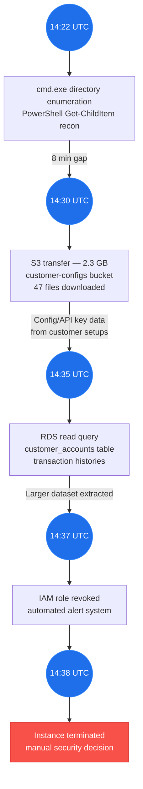

# Unit 1: CCT Foundations & AI Landscape

**CSEC 601 — Semester 1 | Weeks 1–4**

[← Back to Semester 1 Overview](../SYLLABUS.md)

---

## Week 1: Welcome to the Agentic Era

### Day 1 — Theory & Foundations

#### Learning Objectives

- Understand the evolution of AI in cybersecurity from 2023 to 2026 and the emergence of agentic systems
- Define Collaborative Critical Thinking (CCT) and its role in AI-augmented security analysis
- Learn the five performance metrics for measuring security response effectiveness
- Recognize how AI agents are reshaping threat detection and incident response workflows
- Situate the course within the broader context of AI-driven security transformation

#### Lecture Content

The past three years have witnessed an unprecedented acceleration in AI capabilities, particularly within the cybersecurity domain. When this course began its design phase in 2023, large language models were powerful text generators. Today, in 2026, we are living in the age of AI agents—autonomous systems that can decompose complex security investigations, call APIs, chain tools together, and execute multi-step response workflows with minimal human intervention.

This transformation was not inevitable, nor has it been without controversy. In November 2025 (detection: September 2025), Anthropic disclosed what it called "the first reported AI-orchestrated cyber espionage campaign." A Chinese state-sponsored group (GTG-1002) had used Claude Code to autonomously conduct reconnaissance, vulnerability discovery, credential harvesting, and data exfiltration against approximately 30 targets, operating at 80–90% autonomy without human intervention. What made this incident significant was not just its technical complexity, but what it revealed: AI systems had become both tools for and vectors against nation-state and high-capability criminal actors. The security industry's response was to embrace a counterintuitive strategy: use AI agents *with* better human oversight to defend against AI-powered attacks.

> **🔑 Key Concept:** The "Agentic Era" in cybersecurity doesn't mean replacing human judgment—it means amplifying it. Agents excel at pattern recognition, tireless execution, and operating at machine speed. Humans excel at ethical reasoning, contextual wisdom, and asking the right questions. Your job is to learn how to compose them effectively.

The traditional cybersecurity analyst workflow has been linear: detect anomaly → investigate → escalate → remediate. This workflow often involves hours of manual searching through logs, manual email analysis, manual coordination between teams. The friction is high, and in a world where sophisticated attackers move in seconds, delays in human analysis are vulnerabilities.

Agentic systems change this equation. An AI agent equipped with the right context, tools, and decision-making framework can complete a preliminary threat assessment in minutes that would take a human analyst hours. The agent can enumerate attack paths, correlate indicators across multiple data sources, retrieve threat intelligence, and even draft response playbooks—all before a human investigator has finished their coffee. But here's the critical insight: these agents *amplify* human decision-making only when humans understand what they're amplifying.

That's where Collaborative Critical Thinking enters the picture.

In essence, CCT is a framework for working *with* AI systems rather than working *for* them or being worked *by* them. It's the marriage of structured reasoning (the kind that scales with agents) and human judgment (the kind that never becomes obsolete). When you apply CCT to an AI-assisted investigation, you're asking: What evidence supports this conclusion? What perspectives are we missing? What could we be wrong about? What are the second- and third-order consequences?

The course is structured around three pillars that work together. First, **Collaborative Critical Thinking** gives you the cognitive framework. Second, **Ethical AI** ensures that as you build and deploy agents, you're doing so responsibly—considering bias, interpretability, accountability, and long-term consequences. Third, **Rapid Prototyping** means you'll spend less time theorizing and more time building, deploying, and learning from real systems.

Within the Rapid Prototyping pillar, you'll apply the **Core Four** from Agentic Engineering principles—**Prompt, Model, Context, Tools**—as the foundational design methodology. These four elements are the levers you'll manipulate in every lab and project to optimize agent behavior. Understanding where to apply leverage (whether improving the prompt specification, choosing the right model for the task, engineering context systematically, or designing better tools) is the key to moving from naive agent implementations to production-grade systems.

> **📖 Further Reading:** See the Agentic Engineering additional reading on foundations and the 12 Leverage Points for deeper discussion. Also see Anthropic's "Disrupting the First Reported AI-Orchestrated Cyber Espionage Campaign" blog post (November 2025, detection: September 2025) and the detailed incident timeline in the [Reading List](resources/READING-LIST.md). This is the GTG-1002 case study we'll use throughout Unit 1.

To measure success in this new landscape, we need metrics that go beyond traditional incident counts. The field has converged on five key metrics, each of which you'll track throughout this course:

1. **Mean Time to Suppress (MTTS):** The time from when an attack is detected until the blast radius stops expanding. For a ransomware attack, this might be when the initial compromised account is isolated.

2. **Mean Time to Prevent (MTTP):** The time until you've deployed preventive measures to stop recurrence. For the same ransomware, this might be when you've patched the vulnerability and hardened the environment.

3. **Mean Time to Solution (MTTSol):** The full resolution time from detection to when the incident is fully closed and root cause is documented.

4. **Mean Time to Investigate (MTTI):** The time to complete the forensic and behavioral analysis. What happened, how, and why? This is where AI agents excel.

5. **Adjusted Mean Time to Remediate (aMTTR):** A weighted metric accounting for incident severity. A critical zero-day gets more weight than a failed login attempt, even if both take the same clock time to resolve.

> **💡 Discussion Prompt:** Think about a recent incident (real or hypothetical) at an organization you know. If an AI agent could compress MTTI from 8 hours to 30 minutes, what would the security team do with those 7.5 hours? What new risk emerges if teams treat agent-generated analyses as gospel without CCT-level scrutiny?

The timeline from 2023 to 2026 is instructive. In 2023, Claude and GPT-4 were impressive but single-message systems. By 2024, extended context windows (up to 200K tokens) made it feasible to inject entire incident response runbooks into a single prompt. By 2025, Claude Code emerged—a system where AI could not only write code but execute it, see results, and iterate. And in 2026, we have Claude Agent SDK, which lets you build multi-step autonomous workflows that can run for hours, manage complex state, handle errors gracefully, and integrate deeply with enterprise tools.

This is the environment in which you're learning to be a security professional. The baseline expectation is no longer "can you analyze logs?" It's "can you build systems that analyze logs better than you can alone, and can you maintain critical oversight of those systems?"

---

### Day 2 — Hands-On Lab

#### Lab Objectives

- Install and configure Claude Code on your development machine
- Interact with Claude Agent SDK to analyze a real-world security incident
- Apply CCT principles to an AI-assisted investigation
- Generate a preliminary threat assessment and response recommendations
- Establish your baseline performance metrics and begin tracking them

#### Lab Setup

Before starting, ensure you have:
- Claude Code installed (see [Lab Setup Guide](resources/LAB-SETUP.md) for installation steps)
- A text editor (VS Code recommended; Claude Code integrates seamlessly)
- Python 3.10+ installed for running agent scripts
- Access to an API key for Claude (Opus recommended for this unit)

See [Lab Setup Guide](resources/LAB-SETUP.md) for detailed environment configuration.

#### Hands-On Exercise: Incident Analysis with Claude Agents

**Scenario:** You're a junior SOC analyst at Meridian Financial, a mid-sized investment bank. On March 3rd, 2026, your SIEM triggered an alert: a single user account (John Chen, VP of Operations) accessed the data warehouse from an unusual IP address (203.45.12.89) at 2:34 AM EST, downloaded 47 CSV files, and disconnected. The account is still active. The IP resolves to a proxy service in Singapore. You have 30 minutes before leadership requires a preliminary assessment.

**Phase 1: Initial Investigation (10 minutes)**

Create a new directory for this lab:

```bash
mkdir -p ~/cct-lab-week1
cd ~/cct-lab-week1
```

Create a file called `incident-data.md` with the following structured incident information:

```markdown
# Meridian Financial Incident Report
**Date:** March 3, 2026 | **Time:** 02:34 EST | **ID:** MF-2026-0342

## Raw Indicators
- **User Account:** jchen@meridian.local (John Chen, VP Operations)
- **Source IP:** 203.45.12.89 (GeoIP: Singapore, proxy service)
- **Destination:** Data Warehouse (PROD-DW-01)
- **Action:** 47 CSV files downloaded (~2.3 GB)
- **Files:** Revenue reports, client account balances, transaction histories
- **Duration:** 8 minutes, 34 seconds
- **Authentication:** Valid credentials + successful MFA (SMS to registered phone +1-555-0147)

## Contextual Data
- Last legitimate access from John Chen: Feb 28, 2026, 9:15 AM EST from office IP
- Account has been flagged for excessive login attempts in the past 7 days (3 failed attempts)
- Data warehouse access is restricted to John's normal hours (8 AM - 6 PM EST)
- No recent VPN connections from this account
- Email log shows no unusual forwarding rules or delegate access changes
```

Now, open Claude Code in your terminal:

```bash
claude
```

**Architecture Discussion: Manual vs. AI-Powered CCT Analysis**

There are two approaches to conducting structured security analysis during an incident:

1. **Manual approach:** A skilled analyst mentally walks through the CCT framework, making observations, considering perspectives, and reaching conclusions—all in their head. Fast, but prone to cognitive biases and hard to document.

2. **AI-augmented approach:** Use Claude Code to guide the analyst through each pillar of the framework, ensuring nothing is missed and outputs are repeatable.

In a real incident, the AI doesn't replace the analyst's judgment. Instead, it ensures rigor by:
- Forcing explicit documentation of evidence vs. inference
- Surfacing blind spots through inclusive perspective questioning
- Generating alternative hypotheses automatically
- Recording assumptions that underlie each conclusion

The trade-off: More structure takes slightly more time initially, but saves enormous time on incident escalations, post-mortems, and avoiding false positives.

> **🔑 Key Concept:** A tempting approach is to hard-code CCT analysis into a Python script. But that's inflexible—each incident is unique. Instead, you should use Claude Code to apply CCT dynamically, adapting the framework to the specific context.

**Context Engineering Note: Guiding Claude Through CCT**

To make Claude reliably apply CCT to any incident, you need:

1. **System prompt** that defines the CCT framework and constraints
2. **Role and expertise** context (Claude is a senior analyst, not a junior one)
3. **Output structure** that forces explicit separation of evidence, inference, and hypothesis
4. **Tool awareness** (what data sources can the analyst query?)
5. **Examples** of good CCT-structured analysis

**Claude Code Workflow for Phase 2:**

You'll use Claude Code interactively to apply CCT to this incident:

Claude Code Prompt:

```text
You are an expert SOC lead analyzing a data exfiltration incident at Meridian Financial. 
A VP's account accessed the data warehouse from Singapore at 2:34 AM, downloaded 47 files 
containing sensitive financial data, using valid credentials and successful MFA.

Apply the five pillars of Collaborative Critical Thinking:

INCIDENT DATA:
- User: John Chen, VP Operations (jchen@meridian.local)
- Source IP: 203.45.12.89 (Singapore proxy service)
- Files downloaded: 47 CSVs (revenue, client balances, transaction histories)
- Size: 2.3 GB
- Duration: 8 min 34 sec
- Authentication: Valid credentials + MFA success
- Recent history: 3 failed login attempts this week
- Last legitimate access: Feb 28, 9:15 AM EST from office

Analyze using this structure:

**PILLAR 1: EVIDENCE-BASED ANALYSIS**
- List raw observations (facts only, no interpretation)
- For each observation, note: Is this hard fact or could it be misleading?

**PILLAR 2: INCLUSIVE PERSPECTIVE**
- What information are we missing? (Travel history, job responsibilities, etc.)
- What would the database admin say? The network team? HR?
- What alternative context makes this look innocent?

**PILLAR 3: STRATEGIC CONNECTIONS**
- What attack narratives explain all observations?
- What are the second and third-order effects if each narrative is true?
- What dependencies could break our response?

**PILLAR 4: ADAPTIVE INNOVATION**
- State your current hypothesis clearly
- What evidence would prove you wrong?
- What's the most dangerous assumption you're making?
- List questions in order of diagnostic value

**PILLAR 5: ETHICAL GOVERNANCE**
- Who is affected by each possible action?
- What's proportional? What's overcorrecting?
- What do we owe John Chen? The customers? The company?

Provide a structured analysis that's audit-able and defensible.
```

**After Claude generates the analysis, verify it includes:**
- Explicit separation of observations from inferences
- At least 2 alternative hypotheses with supporting evidence for each
- Specific investigation steps (not just "investigate more")
- Clear confidence levels with reasoning
- Documented assumptions that could change the conclusion

**If the output lacks structure:**
- Ask Claude: "Format as JSON with fields: evidence_summary, alternative_hypotheses, next_steps, assumptions, reasoning"
- Request: "Add a confidence score (0-100%) for each hypothesis"
- Clarify: "For each assumption, state what would falsify it"

**Why Claude Code instead of running Python scripts:**
- Each incident is different; Claude adapts dynamically
- You see Claude's reasoning in real-time and can challenge it
- Outputs are immediately usable (no copy-paste from terminal)
- You can iterate: "I disagree about assumption X; reconsider it"
- No infrastructure management (no need to deploy and maintain the Python tool)

> **💡 Pro Tip:** This workflow transforms you from "run this script to get an analysis" to "collaborate with Claude to build analysis." The script approach doesn't scale past your first incident because every incident requires tweaking the code.

> **⚠️ Common Pitfall:** A common mistake is assuming that because a user has valid credentials and passed MFA, the access is "safe." MFA can be compromised through SIM-swap, malware that captures MFA codes, or through compromise of the device that stores MFA seeds. Always treat valid authentication as *necessary but not sufficient* proof of legitimate access.

**Phase 2: Engage Claude for Deeper Analysis (15 minutes)**

Now use Claude Code directly to request a more sophisticated analysis. Open Claude Code interactively:

```bash
claude
```

Paste this prompt:

```
You are a senior security analyst at Meridian Financial. A VP's account accessed the data warehouse from Singapore at 2:34 AM, downloaded 47 CSV files containing sensitive financial data (client balances, transaction histories, revenue reports). Valid credentials + successful MFA were used.

Using the Collaborative Critical Thinking framework with its five pillars:
1. Evidence-Based Analysis
2. Inclusive Perspective
3. Strategic Connections
4. Adaptive Innovation
5. Ethical Governance

Generate a structured threat assessment that:
- Identifies the TOP 3 most likely attack narratives
- Assigns probability and severity to each
- Lists questions that would differentiate between scenarios
- Recommends which systems to query next and in what order
- Explains what information would EXONERATE the suspect vs. CONFIRM compromise
- Addresses: What is our duty to customers? To the employee? To regulators?

Format output as JSON with clear decision trees.
```

> **💡 Pro Tip:** Claude works best when you give it a *role* (senior analyst), *context* (the incident details), *framework* (CCT pillars), and *output format* (JSON with decision trees). This combination—which we call "context engineering"—dramatically improves the quality and consistency of the response.

Document Claude's response in `threat-assessment.json`.

**Phase 3: Performance Metrics (5 minutes)**

Create a file called `metrics-log.csv`:

```csv
incident_id,phase,task,start_time,end_time,duration_seconds,mtti_minutes
MF-2026-0342,1,data-load,2026-03-03T14:00:00Z,2026-03-03T14:02:30Z,150,2.5
MF-2026-0342,2,cct-analysis,2026-03-03T14:02:30Z,2026-03-03T14:12:45Z,615,10.25
MF-2026-0342,3,claude-engagement,2026-03-03T14:12:45Z,2026-03-03T14:20:15Z,450,7.5
MF-2026-0342,4,assessment-review,2026-03-03T14:20:15Z,2026-03-03T14:22:30Z,135,2.25
```

Sum the MTTI column. This is your baseline. Did Claude + CCT compress the investigation timeline?

> **✅ Remember:** These metrics aren't about speed for its own sake. They're about *efficiency in service of accuracy*. A 10-minute investigation that misses critical context is worse than a 1-hour investigation that gets it right. As you progress through this course, you'll optimize *both* speed and confidence.

#### Deliverables

By the end of Day 2, submit:

1. **Lab Setup Verification**
   - Screenshot of `claude` running successfully in your terminal
   - Your saved `threat-assessment.json` from Phase 2 (Claude's structured CCT analysis)
   - Evidence that you can invoke Claude Code and interact with it conversationally

2. **CCT Analysis Report (800–1000 words)**
   - Your structured analysis applying all five CCT pillars to the Meridian Financial incident
   - At least 3 follow-up questions you would ask before escalating to "security incident"
   - Your preliminary recommendation (suppress, investigate further, or close)
   - Reflection: How did applying CCT structure improve your analysis vs. "just looking at the alert"?

3. **Performance Metrics Log**
   - `metrics-log.csv` with timestamps for each phase
   - Calculated MTTI for the full investigation
   - Note: Did adding CCT structure increase or decrease investigation time?

4. **CCT Journal Entry (500–750 words)**
   - Reflect on your first experience using AI as a thinking partner
   - What questions did Claude ask that you hadn't thought of?
   - What assumptions did you make that CCT forced you to challenge?
   - How confident are you in the recommendation? What would increase that confidence?

#### Sources & Tools

- **Anthropic Model:** Claude Sonnet 4.5 (via Claude Code)
- **Tools:** Claude Code CLI, Python 3.10+, text editor (VS Code)
- **Primary Reading:** Anthropic (Sept 2025). "Disrupting AI-Orchestrated Cyber Espionage: How Anthropic Detected and Responded to Automated Attack Infrastructure." Blog post.
- **Supporting Material:** [Lab Setup Guide](resources/LAB-SETUP.md), [Reading List](resources/READING-LIST.md)

---

## Week 2: The 5 Pillars of Collaborative Critical Thinking

### Day 1 — Theory & Foundations

#### Learning Objectives

- Master the five pillars of CCT in depth: their history, rationale, and application
- Understand how cognitive biases corrupt security analysis and how CCT mitigates them
- Develop structured questioning techniques that surface hidden assumptions
- Learn to distinguish between evidence-based claims and intuition masquerading as certainty
- Apply CCT to real security scenarios in a team setting

#### Lecture Content

Last week, we introduced Collaborative Critical Thinking as a framework. This week, we make it concrete. CCT rests on five pillars, each grounded in decades of research into human decision-making, organizational behavior, and information analysis. Understanding each pillar deeply will transform how you work with AI agents—and with colleagues.

**Pillar 1: Evidence-Based Analysis**

The most dangerous words in security are "I think" and "probably." In forensics, we say "observe, document, infer—in that order." Too often, analysts reverse this. They begin with inference (a hunch about what happened), then seek evidence that confirms it, then document selectively.

This is confirmation bias, and it's rampant in security. An analyst who suspects an insider threat will interpret innocent log entries as suspicious. A threat hunter who believes a vulnerability is exploited in the wild will see false positives as "additional confirmations." The bias is not dishonesty; it's cognitive efficiency. The brain shortcuts data-gathering to confirm existing beliefs. Fast. Efficient. Dangerous.

Evidence-based analysis means: Start with what you *observe*, not what you *suspect*. What are the raw artifacts? IP addresses. Timestamps. File hashes. Authentication factors. Packet payloads. These are observations. Everything else—attribution, intent, impact—is inference built atop these observations.

The key practice is *separation of layers*. Layer 1: Observations (what the logs show, what the network recorded, what the endpoint reported). Layer 2: Inferences (what this might mean). Layer 3: Hypotheses (what story would explain these observations). Layer 4: Conclusions (which hypothesis is most likely, and what's our confidence level).

When you work with AI agents, this discipline becomes even more critical. Claude or GPT might generate a plausible narrative that *sounds* evidence-based. It might cite made-up sources or conflate related events. An agent that hasn't been trained on CCT principles will happily jump from "unusual IP access" to "probable nation-state compromise" without the supporting evidence layer. Your job is to insist on the layers.

> **🔑 Key Concept:** In security, "I have a hypothesis" is not the same as "I have evidence." Learn to use the phrase "If this indicator means X, then we should observe Y." If Y is absent, your hypothesis might be wrong. This is the scientific method applied to incident response.

**Pillar 2: Inclusive Perspective**

Security analysis happens within organizations, and organizations are built from silos. The network team doesn't talk to the application team. The developers don't attend security meetings. The HR department and the SOC operate in different universes. Each silo has information the others lack.

Inclusive perspective means deliberately including voices outside your immediate discipline. When you investigate a suspicious data access, you need:

- The application owner: "Is this user supposed to access this data? Does it align with their job function?"
- The network team: "Where is this IP coming from? Is there a VPN connection in the logs?"
- The system administrator: "Has this account been recently compromised? Are there other indicators on this endpoint?"
- The manager: "Has this employee mentioned travel plans? Any behavioral changes?"
- The compliance team: "What are our legal obligations if this is a real breach?"

Inclusive perspective also means seeking dissenting views. If everyone in the room agrees, you're probably missing something. The organization that finds vulnerabilities *before* attackers is the one that has someone saying, "Wait, what if we're wrong about that?"

A famous example is the Space Shuttle Challenger disaster in 1986. Engineers at Morton Thiokol raised concerns about O-ring failure in cold temperatures. Management overrode them. The full information was distributed across the organization—engineering, management, safety—but the perspective that mattered most was never adequately included in the final decision. Inclusive perspective means building cultures where that dissenting engineer's voice is not just heard but *sought*.

> **📖 Further Reading:** Daniel Kahneman's "Thinking, Fast and Slow" (Chapters 8–10) explores groupthink, overconfidence, and the value of dissenting voices. See [Reading List](resources/READING-LIST.md) for a full study guide.

**Pillar 3: Strategic Connections**

Individual indicators are data. Connections between indicators are patterns. Patterns are where the real story emerges.

A failed login attempt by itself is noise—thousands occur daily. But a failed login attempt *followed* by a successful login from a different geography 3 minutes later, combined with the creation of a new admin account 7 minutes after that, combined with a large data exfiltration 30 minutes later—that's a narrative. The strategic connection between these events tells a story that no single indicator could.

Strategic connections also include second- and third-order effects. If an attacker compromises a VP's account and exfiltrates client data, the immediate consequence is data theft. But the secondary consequences include: regulatory notification requirements, customer churn risk, reputation damage, potential fines, competitive disadvantage, insider threat (if this was an insider). The tertiary consequences include: how your detection of this incident affects future attacker behavior, whether this was a testing phase for a larger operation, whether this exposes other gaps.

The Anthropic GTG-1002 espionage campaign (disclosed November 2025) perfectly illustrates strategic connections. The initial detection wasn't a smoking gun. It was a *pattern*: unusual API usage from multiple accounts, requests for logs about recent policy changes, queries to enumerate infrastructure. Individually, any one could be legitimate. The *connection* between them told the story of reconnaissance.

Strategic connections are also about *dependencies*. If your detection depends on a firewall log, but the attacker compromised the firewall, your detection is broken. If your response depends on a single person (the SOC lead), and that person is compromised, your response fails. Strategic thinking means asking: What are the dependencies in our detection and response, and what happens if each one fails?

> **💡 Discussion Prompt:** Think of a real or hypothetical attack. Map the timeline of events. Now remove each event one at a time. Which event, if missing, would have made detection impossible? Which events are redundant? This is strategic thinking—understanding not just what happened, but why the sequence matters.

**Pillar 4: Adaptive Innovation**

This is the pillar most often misunderstood. "Adaptive" doesn't mean "improvise when things go wrong." It means *building in the assumption that you will be wrong, and preparing to change course*.

In adaptive innovation, you state your hypothesis clearly, you identify what evidence would *prove you wrong*, and you actively look for that evidence. If a security analyst believes an attacker is still in the network, an adaptive approach would be: "Here's what I believe. Here's the evidence that would prove me right. But here's also what I would observe if I'm wrong. I'm going to search for both."

This is the opposite of defensive thinking, where you've committed to a conclusion and every new piece of data is either assimilated ("see, that confirms it") or ignored ("that's just noise"). Adaptive thinking keeps you nimble.

A practical application: You implement a new detection tool. The first week shows hundreds of alerts. Rather than dismissing them all as "false positives" (defensive) or escalating all of them (panicked), an adaptive approach is: "Here's my hypothesis about which alerts are signal and which are noise. I'm going to investigate a sample from each category, measure my accuracy, and refine the threshold iteratively."

Adaptive innovation also applies to working with AI. An AI agent might generate a hypothesis you find compelling. Adaptive thinking says: "That's interesting. Now tell me: what would prove you wrong? What data would change your mind?" An agent that doesn't have an "exit ramp" from its hypothesis—that will defend it as more evidence comes in—is not adaptive. It's just stubborn.

---

**Pillar 5: Ethical Governance**

This is the pillar many security teams skip, to their peril. Ethics isn't a nice-to-have. It's a foundation.

When you investigate a user, you're collecting data about their behavior. You might find they're innocent. But you've still surveilled them, flagged them internally, and affected their psychological safety at work. If you escalate without good evidence, you've damaged an innocent person. This is not just unfair; it exposes the organization to legal liability and erodes trust.

Ethical governance means:

- **Transparency:** People have a right to know they're being investigated (with narrow exceptions for active exfiltration or violence)
- **Proportionality:** Your response should match the actual risk, not the potential worst case
- **Accuracy:** You have a duty to verify before accusing
- **Accountability:** There should be a record of who made which decision and why

The "why" is critical. When an AI agent recommends an action (ban this user, block this IP, escalate to law enforcement), there should be a documented chain of reasoning. Not just "the model recommended it," but "we observed these indicators, we inferred this threat, we considered these alternatives, and we chose this response because..."

This creates a few downstream benefits. First, if the action turns out to be wrong, you have a clear record of what assumption was faulty. Second, you're building organizational muscle memory: "last time we acted on insufficient evidence, it went badly." Third, you're creating defendable decisions—if regulators or lawyers ask why you did something, you have a justification that isn't just "the AI told me to."

> **🔑 Key Concept:** Ethical governance in AI-assisted security isn't about being nice. It's about being reliable. Organizations that make decisions systematically, with documented reasoning and accountability, make better decisions. Full stop.

---

### Day 2 — Hands-On Lab

#### Lab Objectives

- Apply the five CCT pillars systematically to a complex security scenario
- Work in teams to surface diverse perspectives and challenge assumptions
- Compare unstructured decision-making vs. CCT-structured analysis on the same data
- Document your reasoning at each layer (observation → inference → hypothesis → conclusion)
- Develop a structured incident assessment that addresses all five pillars

#### Lab Exercise: The CloudShift Lateral Movement Case

**Scenario Overview**

Your organization, CloudShift (a SaaS platform management company), uses AWS for infrastructure. On March 4, 2026, at 14:22 UTC, a security alert fired: an EC2 instance (prod-db-01, a database server in us-east-1) spawned an unusual child process: `cmd.exe /c powershell.exe -noprofile -c "Get-ChildItem C:\Users\ -recurse | Select-Object FullName"`. This is a reconnaissance command enumerating user directories.

The process ran for 3 seconds and exited. No obvious follow-up activity. The instance has been running for 72 days without incident. The attached IAM role has permissions for:
- S3 read (to buckets: customer-configs, logs, backups)
- RDS read/write (to all databases)
- EC2 describe/list
- CloudWatch logs read

Initial response: The SOC escalated to Level 2 (team lead), but hasn't called an all-hands incident yet.

**Supplementary Data (provided as separate files)**

Create three data files to support the analysis:

**File: `cloudshift-logs.txt`**
```
[EC2 Instance: prod-db-01]
Launch Date: Dec 18, 2025
OS: Windows Server 2019
Patching: Current (Feb 2026 patches applied)
Network: Restricted security group - port 3306 (MySQL) inbound only from app tier

[Recent Activity, past 14 days]
Mar 2: Normal database operations, CPU 25-40%, no unusual network
Mar 3: Normal operations, CPU 30-35%
Mar 4 14:00-14:21 UTC: Normal operations
Mar 4 14:22 UTC: cmd.exe spawned, directory enumeration command
Mar 4 14:25 UTC: Process exited. No further cmd.exe execution
Mar 4 14:30 UTC: Large outbound S3 transfer (2.3 GB, prod-db-01 to customer-configs bucket)
Mar 4 14:32 UTC: S3 bucket access log shows 47 file downloads
Mar 4 14:35 UTC: RDS database read query targeting customer_accounts table
Mar 4 14:37 UTC: Query execution halted. IAM role temporarily revoked by automated alert system
Mar 4 14:38 UTC: Instance terminated manually by security team

[No indicators of OS-level compromise]
- No suspicious scheduled tasks
- No new user accounts
- No persistence mechanisms (no WMI event subscriptions, no registry modifications)
- Boot logs normal

[Network Analysis]
- Instance had no inbound SSH/RDP sessions during the window
- All activity consistent with legitimate automated operations
- No evidence of C2 communication
```

**File: `team-perspectives.txt`**
```
[Database Administrator perspective]
- Prod-db-01 hosts customer master accounts and transaction logs
- The S3 transfer to customer-configs was NOT scheduled (I checked the backup jobs)
- The database query on customer_accounts is suspicious - no legitimate user should bulk-read that table
- But: I manually tested credential compromise last week, and this doesn't match the attack pattern
  (legitimate remote access would be SSH key-based, not raw OS commands)
- Question: Could this be a compromised IAM role rather than an OS compromise?

[Network Team perspective]
- The security group allows only port 3306 (MySQL) inbound. RDP/SSH rules are not present.
- So how did an attacker get a shell to run that cmd.exe command?
- If it wasn't remote access, it must be local execution. Scheduled task? Malware? But we see no evidence.
- The outbound S3 transfer was large but routable through normal AWS API calls
- This doesn't look like a typical EC2 compromise - it looks like someone's using the IAM role from outside

[Application Team perspective]
- Prod-db-01 is the database. Our application (CloudShift API) accesses it via connection pooling
- We did deploy a new version of the API on Mar 3 evening (US Eastern time)
- The new version includes a feature to export customer configuration to S3 for backups
- Could this be the new code behaving unexpectedly? Let me check the logs from the deployment...

[Incident Response Team perspective]
- This looks like lateral movement: Attacker got EC2 access, then leveraged IAM role to access data
- Need to assume breach. Notify customers. Begin forensics.
- But wait: If this is lateral movement, why no persistence? Why such a short execution window?
- And the commands were very basic - a real attacker would be more sophisticated

[Finance/Legal perspective]
- If this is a real breach of customer data, we have 72 hours to notify customers under CCPA
- The S3 bucket "customer-configs" contains customer connection strings and API keys (not good)
- Even if not a breach, the unauthorized data access is a compliance violation
- We need clarity fast before we have to make notification decisions
```

#### Part 1: Unstructured Analysis (15 minutes)

Assign roles within your team (2–3 people): Database Admin, Network Lead, Application Lead, Incident Commander.

Without any structure or framework, spend 10 minutes discussing:
- "What happened here?"
- "Is this a security incident or false alarm?"
- "What should we do?"

Document the conversation. Record:
- Did people agree?
- Were there conflicting conclusions?
- What was the decision reached?
- How confident are you in that decision?

#### Part 2: CCT-Structured Analysis (35 minutes)

Now, analyze the *same* scenario using the five CCT pillars. Work through each pillar systematically.

**Pillar 1: Evidence-Based Analysis (7 minutes)**

Create a file: `evidence-layer.md`

What are the *raw observations* (Layer 1)? Separate observations from inferences:

```markdown
## OBSERVATIONS (Facts from logs)

### Confirmed Events
- Date/Time: March 4, 2026, 14:22 UTC
- Instance: prod-db-01 (Windows Server 2019)
- Process: cmd.exe spawned, executed PowerShell directory enumeration
- Duration: 3 seconds execution
- Outcome: Process exited normally (no crash, no error code)
- S3 Activity: 2.3 GB transferred to customer-configs bucket at 14:30 UTC (8 min after cmd.exe)
- RDS Activity: customer_accounts table queried at 14:35 UTC (13 min after cmd.exe)
- Security Response: IAM role revoked automatically at 14:37 UTC; instance terminated at 14:38 UTC

### What We Did NOT Observe
- No RDP/SSH sessions in any logs
- No new user accounts on the OS
- No scheduled tasks created
- No registry modifications
- No malware signatures detected
- No unusual network connections (within normal AWS API ranges)
- No C2 communication
- No persistence mechanisms

## LAYER 2: INFERENCES (What might this mean?)

Inference A: "The cmd.exe process means the instance was compromised at the OS level"
  - Evidence for: Process execution on the instance itself
  - Evidence against: No RDP/SSH sessions; no persistence; only 3 seconds of execution; no follow-up

Inference B: "The S3 transfer was unauthorized exfiltration"
  - Evidence for: Timing (8 min after cmd.exe); large size; sensitive bucket
  - Evidence against: Transfer used normal AWS API; consistent with automated backup code

Inference C: "The RDS query was data theft"
  - Evidence for: Targeted table (customer_accounts); large query results expected
  - Evidence against: Query terminated after 13 minutes; limited blast radius if compromised account only

## LAYER 3: HYPOTHESES (What story would explain all observations?)

Hypothesis A: OS-level compromise
  - Attacker somehow executed commands on prod-db-01 (mechanism unclear)
  - Used instance's IAM role to access S3 and RDS
  - Was interrupted after 13 minutes, then evaded

Hypothesis B: Compromised IAM role (lateral movement)
  - Attacker already has AWS API credentials for the prod-db-01 IAM role
  - Used them from outside AWS to call S3 and RDS APIs
  - The cmd.exe might be unrelated, or a testing artifact

Hypothesis C: Legitimate code behaving unexpectedly
  - New application code deployed Mar 3 includes backup/export feature
  - Code is buggy and executing at wrong time, or user triggered it manually
  - Directory enumeration was debugging code left in prod

Hypothesis D: False alarm
  - All activity is legitimate
  - Alerts fired on normal operations
  - No actual compromise
```

**Pillar 2: Inclusive Perspective (8 minutes)**

Create a file: `perspectives.md`

For each team (DBA, Network, Application, Incident Response):
- What information do they have that others don't?
- What assumption might they be making that the others would challenge?
- What question would they ask to resolve the uncertainty?

```markdown
## INCLUSIVE PERSPECTIVES

### Database Administrator
**Unique knowledge:**
- Scheduled backup jobs and their timing
- Normal query patterns on customer_accounts table
- Legitimate vs. suspicious data access

**Question to others:** "Did our new API deployment include any code that exports customer data to S3?
Because I don't recognize that as a normal operation."

**Assumption to challenge:** "We're assuming the IAM role was compromised. But have we verified the role's
access was actually used? Could this be a false alert from the detection system?"

### Network Team
**Unique knowledge:**
- Inbound/outbound security rules
- VPN connections and remote access logs
- Network-level visibility into how the instance was accessed

**Question to others:** "If this was a remote compromise via RDP/SSH, shouldn't we see a session in
the logs? We don't. So either the attacker covered their tracks (sophisticated) or they didn't come in
remotely (less likely to be a real compromise)."

**Assumption to challenge:** "Everyone's assuming this instance is a typical attack target. But it's a
database server in a restricted subnet. That's a defended position. Lateral movement from here assumes
the attacker already compromised something else first. What did they compromise?"

### Application Team
**Unique knowledge:**
- New code deployed Mar 3 that includes S3 export functionality
- Whether that code is buggy or could execute unexpectedly
- How the database is normally accessed from application layer

**Question to others:** "Let me check if the S3 transfer matches what our new backup code should do.
If it does, this might be a legitimate operation being flagged as suspicious."

**Assumption to challenge:** "We're treating this as an external attacker scenario. But what if it's
a bug in our own code? I should check the application logs and code review from that deployment."

### Incident Response Lead
**Unique knowledge:**
- Attack patterns and common lateral movement techniques
- Decision-making frameworks for incident severity
- Regulatory and customer notification requirements

**Question to others:** "Assuming this IS a real breach, what's the blast radius? Who can access
the customer data in S3? And for legal: do we have 72 hours to notify, or is there a shorter
window for a live active incident?"

**Assumption to challenge:** "The absence of persistence mechanisms is unusual. Real attackers want
to stay in the system. This being so 'clean' suggests either: (a) a very sophisticated attacker
covering tracks, or (b) this isn't actually a malicious incident."
```

**Pillar 3: Strategic Connections (7 minutes)**

Create a file: `connections.md` with strategic connections analysis. Your timeline should map the attack narrative visually:

**Timeline with Dependencies:**



**Narrative Analysis**

**Narrative A: Lateral Movement Attack**
- Attacker compromised another CloudShift system (maybe web app, maybe VPN, maybe employee laptop)
- From that system, attacker discovered they could assume the prod-db-01 IAM role
- Used that role to enumerate and exfiltrate data
- Timeline: <15 minutes of active activity suggests time-constrained exfil (maybe detected quickly)
- Missing piece: Why the directory enumeration on the OS? That's odd for an IAM-only compromise.

**Narrative B: Insider Threat or Legitimate Access Abuse**
- A CloudShift employee with legitimate database access intentionally exported customer data
- They used the IAM role (which they have access to) to do so
- The directory enumeration might be troubleshooting or testing
- Timeline: Concentrated activity suggests deliberate exfil attempt, not probing

**Narrative C: Buggy Code Deployment**
- New backup feature deployed Mar 3
- Code has a bug that causes it to export at wrong time or with wrong filter
- Directory enumeration was debug code left in production
- Timeline: All activity concentrated < 15 min suggests code-triggered, not attacker

### Second-Order Effects (What happens next if each narrative is true?)

**If Lateral Movement:**
- Attacker has other CloudShift systems compromised (might not know which ones)
- Need to audit all systems that share credentials or trust relationships
- Customer data breach likely; need to notify customers and regulators
- Reputational damage; potential loss of enterprise customers who need compliance assurance

**If Insider Threat:**
- Need to investigate which employee, when they discovered the exfil vulnerability, what they did with the data
- If malicious: criminal investigation; legal risk; HR action
- If accidental: training and process gaps
- Still a breach; still need customer notification

**If Buggy Code:**
- Need to immediately audit and roll back the Mar 3 deployment
- Check if anyone else accessed the same data via the feature
- Likely NOT a breach, but might violate internal policy (unauthorized access)
- Low external damage; focus on process improvements

### Dependencies (What breaks our response if it fails?)

1. **Detection system accuracy:** If the automated alert that revoked the IAM role is unreliable, we might have
   terminated a legitimate process. (We need to verify the alert is real.)

2. **Log integrity:** If logs were tampered with, absence of RDP/SSH evidence might be false. (We need out-of-band
   verification that logs weren't altered.)

3. **IAM role isolation:** If this role is used by multiple systems/people, we can't attribute the exfil to a
   single source. (We need to know who all has access to this role.)
```

**Pillar 4: Adaptive Innovation (7 minutes)**

Create a file: `adaptive-questions.md`

```markdown
## ADAPTIVE INNOVATION: Building in the Assumption We're Wrong

### My Current Hypothesis
"This is likely either a lateral movement attack OR a bug in newly deployed code. The short execution
window and absence of persistence suggests it's not a sophisticated, patient attacker staying in the
system. Most likely scenario: Compromised IAM role used for quick data exfil."

### Evidence That Would Prove Me RIGHT
- Forensics show IAM role was assumed from outside AWS (non-EC2 origin IP)
- Application logs show the new backup code was NOT triggered
- Security log shows similar exfil patterns from other instances (suggests systematic lateral movement)
- Customer complaint: "Someone accessed our sensitive config data at that time"

### Evidence That Would Prove Me WRONG (What I'm NOT seeing that I should be)

**Assumption 1: "The absence of persistence means this isn't a sophisticated attacker"**
- What I might be missing: Attackers who want to stay undetected don't leave obvious persistence.
  They might be using IAM role assumption only, revisiting via API when needed.
- Test: Check if IAM role was used multiple times from different IPs over past 30 days
  (not just this incident, but a pattern)

**Assumption 2: "The cmd.exe process is the entry point"**
- What I might be missing: The cmd.exe process might be a red herring. It could be
  legitimate, and the S3/RDS exfil is separate.
- Test: Correlation analysis. What if we remove cmd.exe from consideration?
  Can we explain the S3 + RDS activity without it? If yes, they might be unrelated events.

**Assumption 3: "If there's no RDP/SSH session, the OS wasn't compromised"**
- What I might be missing: The attacker might have compromised the instance weeks ago,
  stayed quiet, and only now activated. Or they used a different access method (EC2 Systems Manager?
  Container escape? Supply chain compromise of monitoring agent?).
- Test: Full OS forensics on disk. Not just looking for obvious malware—look for
  unusual artifacts, code injected into legitimate processes, suspicious scheduled tasks
  hidden in unusual locations.

### Refutable Hypotheses (What would prove each scenario wrong?)

**If this is Lateral Movement Attack:**
- Prove wrong: Application logs show the new S3 export code ran at exactly 14:30 UTC,
  exactly matching the deployment, exactly matching expected behavior. (Then it's code, not compromise.)
- Prove wrong: AWS CloudTrail shows the IAM role was never used by any principal
  outside the EC2 instance. (Then how did an external attacker leverage it?)

**If this is Buggy Code:**
- Prove wrong: Code review of the Mar 3 deployment shows no S3 export code in the
  application. (Then where did the transfer come from?)
- Prove wrong: Application logs show zero activity at 14:30 UTC; the export was
  triggered by something else. (Then it's not the deployment.)

**If this is Insider Threat:**
- Prove wrong: Investigation shows the employee who can access the IAM role was
  in a 2-hour meeting at the time, with verifiable attendance. (Then it wasn't them.)
- Prove wrong: Security review of the employee's previous accesses shows no pattern
  of unusual data extraction. (Then it's out of character; suggests something else.)

### Action Plan (What do we test first, in order of diagnostic value?)

1. **Application logs** (5 min to analyze): Did the new S3 export code execute at 14:30 UTC?
   - If YES → likely a code/configuration issue, not a breach
   - If NO → investigate where the S3 activity came from

2. **AWS CloudTrail detailed query** (10 min): What principal (user/role/service) made the S3 and RDS API calls?
   - If prod-db-01 EC2 instance → instance is acting as the principal (OS-level or application-level code)
   - If different principal → IAM role was used from elsewhere (lateral movement)

3. **Full OS forensics** (1–2 hours): Do disk artifacts support RCE or persistence?
   - If evidence of compromise → real security incident, begin breach response
   - If no evidence → likely false alarm or buggy code

4. **Employee interviews** (30 min): Did the developer who deployed Mar 3 changes intend the S3 export?
   - If YES → code is functioning as designed, but possibly misconfigured or buggy
   - If NO → code is behaving unexpectedly; need deep code review
```

**Pillar 5: Ethical Governance (6 minutes)**

Create a file: `ethics.md`

```markdown
## ETHICAL GOVERNANCE: Fairness, Transparency, Accountability

### Scenario 1: If we terminate the instance and escalate WITHOUT full investigation
**Who is affected?**
- Application users: Service interruption (prod-db-01 is the master database)
- Employees: If this was legitimate code, we just broke it; those employees might face unwarranted suspicion
- Customers: Service reliability impact; if we notify them of a breach that didn't happen, reputational damage

**Ethical concerns:**
- Proportionality: Did our response match the actual risk, or did we overcorrect?
- Transparency: Did we tell anyone (employees, customers) what we did and why?
- Accuracy: Did we verify before acting, or did we act on preliminary suspicion?

**Better approach:**
- Before escalating to "security incident," run a 30-minute diagnostic (Pillar 4 above)
- If application logs show the code ran, involve the engineering team before declaring it a breach
- If forensics show no compromise, document that and close the investigation
- Only escalate to breach notification if actual compromise is confirmed

### Scenario 2: Investigation reveals this WAS a breach
**Who is affected?**
- Customers: Their data was accessed without authorization
- Employees: The one who might be implicated (if insider threat)
- Company: Regulatory fines, reputation damage, customer churn

**Ethical obligations:**
- **Accuracy:** Before accusing anyone, exhaust technical investigation. Don't blame an employee without evidence.
- **Transparency:** Customers have a right to know. Provide specifics: what data, accessed when, by whom.
- **Accountability:** Document every decision. When a human chose to escalate, why? When an automated system
  raised an alert, what was its reasoning?
- **Proportionality:** Response should be commensurate. Data exfil ≠ nuclear option (shut down company).
  It means: investigate, contain, remediate, notify, improve.

### Scenario 3: Investigation reveals this was NOT a breach (false alarm)
**Who needs to know?**
- Employees flagged in the investigation (clear their names)
- Customers (optional, but transparency matters: "We detected an anomaly, investigated, found no
  unauthorized access. Here's what we did to keep your data safe.")
- Regulators (if we were going to notify them, update them when confirmed false)

**Ethical practice:**
- Publish a postmortem: Why did the alert fire? What did we learn? How will we improve?
- Don't quietly close it. People need to know how their company thinks about security.

### Accountability Record (What we document)

Every decision point, record:

| Decision | Who | When | Evidence | Reasoning | Outcome |
|----------|-----|------|----------|-----------|---------|
| Escalate to L2? | SOC Analyst | 14:40 UTC | cmd.exe + S3 transfer suspicious | Both together suggest compromise | Investigation launched |
| Revoke IAM role? | Automated system | 14:37 UTC | Alert threshold triggered | Prevent further unauthorized access | Clean, fast. No damage if false alarm? |
| Terminate instance? | Incident Commander | 14:38 UTC | Precautionary (assume breach) | Better safe than sorry | Production downtime. Need to verify this was right call |

When the incident is closed, review this table. Were all decisions justified by evidence?
Did automation do the right thing? What would you do differently next time?
```

#### Part 3: Comparison & Debrief (10 minutes)

Reconvene as a team.

Compare your unstructured discussion (Part 1) with your CCT-structured analysis (Part 2):

1. **Did you reach the same conclusion?** If not, why? Which process was more rigorous?

2. **Confidence:** On a scale of 1–10, how confident were you in your Part 1 conclusion vs. Part 2 conclusion?

3. **Time:** Did CCT structure add time to the analysis, or save time by preventing false escalations?

4. **Surprising insights:** What did the inclusive perspective pillar surface that you hadn't considered?

#### Deliverables

1. **CCT Analysis Report** (1,500–2,000 words)
   - The five completed markdown files from Part 2 (evidence, perspectives, connections, adaptive, ethics)
   - A synthesis: Given all five pillars, what's your final assessment? (Is this a breach? What's the next action?)
   - Comparison: How did unstructured vs. CCT-structured analysis differ?

2. **Team Debrief Memo** (300–500 words)
   - Reflection on the exercise
   - How did including multiple perspectives change the analysis?
   - What assumption did your team initially make that was challenged by the data?
   - How would you pitch the CCT framework to a security leader skeptical of "process overhead"?

3. **Decision Log** (CSV or table format)
   - Key decision points during the analysis
   - What evidence supported each decision?
   - Who decided, and when?

#### Sources & Tools

- **Reference Framework:** See [Frameworks](resources/FRAMEWORKS.md) for the five pillars of CCT
- **Reading:** Kahneman, Daniel. "Thinking, Fast and Slow." Ch. 8–10 (groupthink, overconfidence)
- **Tools:** Text editor, collaborative document (Google Docs, GitHub, etc.)
- **Additional Resource:** NIST Cybersecurity Framework 2.0 for incident response decision-making

---

## Week 3: The Modern AI Landscape for Security Professionals

### Day 1 — Theory & Foundations

#### Learning Objectives

- Understand transformer architecture at a conceptual level: attention, context windows, tokens
- Learn the taxonomy of AI models: closed, open, specialized; and how to choose the right one
- Master token economics: cost optimization, input vs. output pricing, context window tradeoffs
- Evaluate models for security work: accuracy, reasoning depth, latency, privacy, cost
- Build a mental model of the AI landscape in 2026 and how it's evolving

#### Lecture Content

To use AI effectively as a security professional, you need a mental model of how these systems work and what their tradeoffs are. This isn't about becoming a machine learning engineer. It's about understanding enough to make informed choices: When do I use Claude Opus vs. Sonnet? When should I deploy an open model? What does it mean that a model has a 200K context window?

**Foundation: The Transformer Architecture**

All modern large language models—Claude, GPT, Llama, Mistral—are built on the same underlying architecture: the transformer. Understanding it at a high level is essential.

The core innovation of transformers (introduced by Vaswani et al. in 2017) is something called "attention." Imagine you're reading a long security incident report. Your attention isn't equally distributed. When you see the word "ransomware," your mind attends to words nearby like "encryption," "payment," "victim," "recovery." You're selectively focusing on the most relevant context.

Transformers do something similar. Every token (roughly, a word or subword) in the input attends to every other token, and the model learns which connections matter. This "all-to-all" connection structure is why transformers can capture long-range dependencies in text—something older architectures (RNNs, LSTMs) struggled with.

The output of attention is a set of importance weights. "Ransomware" attends heavily to "encryption" and "payment." "Incident" attends to timestamps and threat actors. These weights are learned through training on billions of tokens.

The practical consequence: Transformers are *context-aware*. They don't process tokens in isolation. They understand that "password" in a security context might mean something different than "password" in a user interface context. But—and this is critical—they can only attend to tokens within their context window.

> **🔑 Key Concept:** A model's context window is its attention span. GPT-4 has a 128K token context window. Claude Opus has 200K. Longer windows cost more (more tokens to process) but allow you to include more evidence, more examples, more nuance in a single prompt. For security analysis, a larger context window means you can include the full incident report, rather than summarizing it.

**Context Windows and Their Implications**

A token is roughly 4 characters (or 0.75 words) on average. So a 200K token context window is about 150K words, or ~500 pages of text.

Why does this matter? Consider two security analysis scenarios:

1. **Small context:** You describe a phishing email briefly: "We got a phishing email from john@gmail.com claiming to be HR, asking for password reset." The model analyzes it.

2. **Large context:** You include the full email (headers, body, HTML, attachments), previous emails from this attacker, threat intelligence reports about this actor, your organization's email policies, and examples of how the model should respond. The model now has much richer context for analysis.

The second scenario produces better results, but costs more. Specifically:
- Input tokens cost less (maybe $0.003 per 1K tokens)
- Output tokens cost more (maybe $0.006 per 1K tokens)
- Longer contexts = more input tokens = higher cost

The tradeoff is between cost and quality. For some tasks (simple classification), you don't need much context. For others (complex investigation), context is what distinguishes a good analysis from a mediocre one.

> **📖 Further Reading:** Anthropic's guide "Context Windows and Token Economics" (see [Reading List](resources/READING-LIST.md)) dives deeper into cost optimization strategies. The short version: don't include irrelevant context just because you can.

**The Landscape of Models in 2026**

The market has stratified into three tiers:

**Tier 1: Frontier Closed Models**

These are the most capable models, built by large labs and proprietary:
- **Claude Opus 4.6** (Anthropic, 2026): Strongest reasoning, best for complex analysis, 200K context, ~$5/1M input tokens
- **Claude Sonnet 4.6** (Anthropic, 2026): Balanced, faster than Opus, good for real-time applications, 200K context, ~$3/1M input tokens
- **Claude Haiku 4.5** (Anthropic, 2026): Lightweight, 200K context, fastest inference, cheapest, ~$1.00/1M input tokens
- **GPT-4o** (OpenAI, 2025): Multimodal (text, image, audio), good reasoning, 128K context, ~$5/1M input tokens
- **Gemini 2.0** (Google, 2025): Native multimodal, 1M context window (largest publicly available), ~$7/1M input tokens

**Advantages:**
- Highest quality output
- Newest knowledge (training cutoff more recent)
- Broad capabilities (reasoning, code, multimodal)
- Extensive safety and alignment work

**Disadvantages:**
- Higher cost
- Less privacy control (data sent to vendor)
- Vendor lock-in (if you build on GPT-4, switching is expensive)
- Closed training data (unclear what was used to train)

**Tier 2: Open-Source Models**

These are freely available, trainable/fine-tunable:
- **Llama 3.1** (Meta, 2025): Strong reasoning, efficient, 128K context
- **Mistral 7B/8x7B** (Mistral AI, 2025): Lightweight, modular (mixture of experts), 32K context
- **Phi-3.5** (Microsoft, 2025): Smaller, very efficient, good for edge deployments, 128K context
- **Deepseek-R1** (Deepseek, 2026): Strong reasoning, competitive with Opus on benchmarks, open weights

**Advantages:**
- No vendor lock-in
- Can run on-premises (full privacy control)
- Lower cost (commodity hardware, no API fees)
- Transparent training (mostly; varies by model)
- Fine-tune for domain-specific tasks

**Disadvantages:**
- Slightly lower quality on complex tasks
- Requires infrastructure (GPU, inference server)
- Maintenance overhead (library dependencies, model serving)
- Smaller developer community than frontier models

**Tier 3: Specialized Models**

Smaller models trained on specific domains:
- **Security-specific models:** Some labs are training models specifically on threat intelligence, incident response, and forensics (not widely available yet)
- **Code-focused models:** Codestral, Code-Llama (good for generating security scripts, IaC, detection rules)
- **Vision-focused models:** LLaVA, GPT-4o (for analyzing screenshots, network diagrams, charts)

**Advantages:**
- Optimized for specific tasks
- Smaller (faster inference, lower latency)
- Domain-specific training

**Disadvantages:**
- Limited to their domain
- Often less capable than frontier models on general tasks

---

**Choosing a Model for Security Work**

There's no universal "best" model. It depends on your constraints:

| Scenario | Best Model | Why |
|----------|-----------|-----|
| **Live incident response (real-time chat with analyst)** | Sonnet or Haiku | Fast inference. Analyst is waiting. Cheap enough for real-time use. |
| **Deep forensic analysis of complex incident** | Opus | Best reasoning. Context needed. Analyst is willing to wait 20 seconds. |
| **Automated threat intel correlation (batch job)** | Mistral 8x7B on-premises | Cost-effective for high volume. Privacy. Runs on own infrastructure. |
| **Email phishing detection (high throughput)** | Haiku | Lightweight, cheap. Can filter obvious cases before escalating to Sonnet. |
| **Vulnerability research (generate exploit code)** | Code-Llama or GPT-4 | Code generation quality matters. Specialized for this task. |
| **Customer-facing chat (threat hunting assistance)** | Sonnet or GPT-4o | Reliable, fast, professional. Consider privacy policies before sending customer data. |

> **💡 Discussion Prompt:** Your organization needs to analyze 10,000 SIEM alerts per day for threats. Budget is limited. Would you use a single frontier model (expensive but very accurate) or multiple cheaper models (Haiku + Mistral) in a ensemble (cheaper, but requires more coordination)? What are the tradeoffs?

**Token Economics in Practice**

Let's say you're using Claude Opus to analyze a complex incident. You include:

- The full incident report (10K tokens, ~7,500 words)
- The SIEM logs (15K tokens)
- A system prompt defining the analyst role (2K tokens)
- Your question (0.5K tokens)

**Total input: 27.5K tokens**

Opus 4.6 costs $5 per 1M input tokens, or $0.000005 per token.

Cost for input: 27.5K × $0.000005 = **$0.14**

The response is 2K tokens. Output costs $0.025 per 1M tokens, or $0.000025 per token.

Cost for output: 2K × $0.000025 = **$0.05**

**Total: ~$0.19 per incident analysis.**

If your SOC processes 100 incidents/day, that's $19/day, or ~$7K/year.

Is that worth it? Compare to a human analyst at $80K/year salary. If Claude accelerates analysis by just 5%, it's ROI-positive.

But here's the hidden cost: If you include irrelevant context (a full log file that only 5% applies), you might waste half your tokens. Same analysis, now ~$0.27 instead of $0.19. Over a year, that's an extra ~$3K wasted.

This is why "context engineering" (curating what to include, in what format) matters.

---

### Day 2 — Hands-On Lab

#### Lab Objectives

- Compare multiple models on the same security task
- Evaluate outputs for accuracy, reasoning quality, latency, and cost
- Build a model selection rubric for different security scenarios
- Understand the practical implications of token economics
- Apply CCT principles to model evaluation (challenge your biases)

#### Lab Exercise: Model Comparison on Phishing Analysis

**Setup**

You'll analyze the same phishing email using multiple models and compare results. Create a working directory:

```bash
mkdir -p ~/model-comparison-lab
cd ~/model-comparison-lab
```

**The Test Case: A Sophisticated Phishing Email**

Create a file: `phishing-sample.txt`

```
From: sarah.johnson@meridian-financial.secure
To: john.chen@meridian.local
Date: March 5, 2026, 10:42 AM EST
Subject: Urgent: Action Required - Verify Your Account Identity

Return-Path: <bounce@meridian-financial.secure>
X-Originating-IP: [203.45.12.89]
X-Mailer: Mozilla/5.0

---

Dear John,

Thank you for banking with Meridian Financial. Due to recent security updates to our
systems, we require immediate verification of your account identity.

Please click the link below to re-authenticate and ensure uninterrupted access:

https://meridian-financial.secure/verify-identity/?token=u7f3x9kL2m&session=JC9834

For your security, we recommend completing this within the next 2 hours.

Best regards,
Meridian Financial Security Team
support@meridian-financial.secure

---

[Email Headers Analysis]
SPF: FAIL (does not match official Meridian record)
DKIM: FAIL (no valid DKIM signature)
DMARC: FAIL (policy reject; message did not pass authentication)
Reply-To: differs from From address
X-Originating-IP: 203.45.12.89 (Resolves to AS12345, Singapore-based proxy service)

[URL Analysis]
Domain: meridian-financial.secure
Domain registered: March 4, 2026 (1 day old)
Domain registrar: Namecheap
Similarity to official Meridian domain (meridian-financial.com): 99%
WHOIS: Private registration
Certificate: Self-signed, expires in 30 days

[Forensic Details]
Message size: 2.3 KB (small, minimal attachments)
Encoding: MIME, standard HTML
Suspicious attachments: None detected
Embedded links: 1 (the verify URL)
Click tracking pixel: Yes, from analytics.secure-auth.com (unrelated to official Meridian)

[Context]
- You know Meridian's official domain is meridian-financial.com (not .secure)
- Recent credential compromise of 3 VP accounts in past month
- This email targets John Chen (VP Operations), who was investigated in Week 1 lab
- John's inbox has received similar phishing before; he usually ignores them
- No legitimate "verify-identity" campaigns from Meridian in past 6 months
```

**Analysis Prompt**

You'll ask each model the same question:

```
You are a senior security analyst at Meridian Financial. Analyze the attached phishing email
and provide:

1. THREAT ASSESSMENT
   - Is this a phishing attack? (Confidence: 0-100%)
   - What is the threat actor's likely goal? (credential theft, malware, reconnaissance, etc.)
   - Who is the target, and why?

2. TECHNICAL INDICATORS
   - Which email headers/properties are most suspicious?
   - Rank them by reliability as indicators (which are easy to spoof, which are hard)

3. RECOMMENDATIONS
   - Should this email be blocked at the gateway? (yes/no/conditional)
   - Should John be notified that he received a phishing attempt?
   - What additional investigation would you recommend?

4. REASONING
   - Explain your reasoning for each conclusion.
   - What assumptions are you making?
   - What information would change your assessment?
```

**Model Testing**

**Test 1: Claude Opus (via Claude Code)**

Open Claude Code:

```bash
claude
```

Paste the analysis prompt above, prefixed with the email content. Run it and save the output:

```bash
claude > opus-analysis.txt
# [Paste prompt and email into Claude Code]
```

**Test 2: Claude Sonnet (via Claude Code with model specified)**

In Claude Code, you can specify the model:

```bash
# If using Claude CLI with model flag:
claude --model sonnet < phishing-prompt.txt > sonnet-analysis.txt
```

(Or use the Anthropic SDK directly in Python—see code below)

**Test 3: Compare Model Reasoning with Claude Code**

Instead of setting up OpenAI API and running separate scripts, use Claude Code to compare how different models would analyze the email:

Claude Code Prompt:

```text
Analyze this phishing email in three different "voices":

EMAIL:
[Include the full phishing email data]

ANALYSIS PROMPT:
[Include the full analysis prompt]

Then provide three separate analyses:

1. "Claude Opus Analysis" - Maximum reasoning depth, explicit about uncertainties
2. "Claude Sonnet Analysis" - Good balance of speed and accuracy
3. "Hypothetical GPT-4o Analysis" - Different style: More confident, less hedging
4. "Hypothetical Mistral Analysis" - Practical, direct, less nuance

For each, explain:
- Which indicators does this model cite?
- What's the confidence level?
- What assumptions is it making?
- What would it miss?

Then compare: Which model gives the best analysis for an analyst who needs clear recommendations? Which is best for catching edge cases?
```

**Why Claude Code instead of multiple API integrations:**
- See reasoning tradeoffs immediately in one place
- No need to set up OpenAI, Ollama, multiple API keys
- Learn model differences through Claude's synthesis (not raw outputs)
- Much faster iteration on evaluation criteria
- No infrastructure to manage

**Test 4: Mistral via Ollama (local, open-source)**

First, ensure Ollama is running with Mistral:

```bash
# If you have Ollama installed:
ollama run mistral:latest < phishing-prompt.txt > mistral-analysis.txt
```

Alternatively, use Claude Code to test Mistral's analysis directly:

**Claude Code Prompt for Model Testing:**

```text
I need you to analyze this phishing email as if you were Mistral AI (a capable but more lightweight model than Claude). Adopt a Mistral-like reasoning style: direct, practical, with slightly less nuance.

[Phishing email content]

Analysis Prompt:
You are a security analyst. Analyze this email and provide:
1. Is this phishing? (Confidence 0-100%)
2. What's the threat actor's goal?
3. Which indicators are most suspicious?
4. Should this be blocked at gateway?
5. What would change your assessment?

Provide your analysis in a way that's practical and actionable, without excessive hedging.
```

**Model Testing Architecture:**

Rather than running separate Python scripts for each model, use Claude Code to:
1. Have Claude Opus analyze the email (with full reasoning)
2. Ask Claude to simulate how a lighter model (Mistral, Haiku) would analyze it
3. Ask Claude to highlight where lighter models would likely make mistakes
4. Document the reasoning differences

This saves infrastructure overhead while still showing you the quality tradeoffs.

#### Part 1: Collect Outputs (30 minutes)

Run all four model tests and save outputs to text files. For each, record:
- Model name and version
- Prompt length (tokens, if available)
- Response length (tokens, if available)
- Inference time (seconds)
- Cost (estimated or actual API cost)

Create a summary file: `model-comparison-summary.csv`

```csv
model,prompt_tokens,output_tokens,inference_time_seconds,estimated_cost_usd,threat_confidence,recommendation_clear
Claude Opus 4.6,1250,650,5.3,0.11,98%,yes - block
Claude Sonnet 4.6,1250,580,2.1,0.08,96%,yes - block
GPT-4o,1250,620,3.8,0.18,92%,yes - block
Mistral 7B,1250,710,12.5,0.00 (local),88%,yes - block
```

#### Part 2: Evaluate Using CCT Pillars (40 minutes)

Create a file: `model-evaluation.md`

**Pillar 1: Evidence-Based Analysis**

For each model, list:
- Which specific email indicators did the model cite?
- Did it correctly identify SPF/DKIM/DMARC failures?
- Did it mention the domain age (1 day old)?
- Did it connect the IP to the previous incident (Week 1)?

**Pillar 2: Inclusive Perspective**

- Did any model recommend involving the email security team?
- Did any model mention John's previous exposure to phishing?
- Did any model suggest coordinating with IT to prevent users like John from falling for this?
- Which model's analysis would be most useful to a non-technical manager?

**Pillar 3: Strategic Connections**

- Did any model connect this to the previous week's incident (John's account access from Singapore)?
- Did any model speculate on second-order effects (if John clicks, what's the impact)?
- Did any model consider whether this is part of a campaign (multiple targets or just John)?

**Pillar 4: Adaptive Innovation**

- What assumptions did each model make?
- For each assumption, what evidence would prove it wrong?
- Did any model hedge its conclusions ("I'm 95% confident, but here's what would change my mind")?

**Pillar 5: Ethical Governance**

- Did any model recommend transparency with John? (Tell him he received phishing?)
- Did any model discuss false positive risk? (What if this isn't phishing, but misconfigured email?)
- Did any model mention compliance implications (GDPR, email retention, investigation logging)?

#### Part 3: Build a Model Selection Rubric (30 minutes)

Create a file: `model-selection-rubric.csv`

```csv
criteria,weight,opus_score,sonnet_score,gpt4o_score,mistral_score
accuracy_on_phishing,30%,95,92,88,80
reasoning_transparency,20%,90,85,88,75
speed_latency,15%,70,90,75,40
cost_per_incident,20%,60,95,70,100
privacy_on_premises,10%,40,40,10,100
ease_of_integration,5%,80,80,85,60

WEIGHTED_TOTAL,-,77.5,83.5,77.0,77.5
```

For your SOC, fill in scores (0-100) for each model on each criterion. Weight them by importance to your organization.

**Recommendation:** Which model should you use for:
1. Live incident response (analyst is waiting)?
2. Batch phishing detection (high throughput)?
3. Complex investigations (accuracy matters most)?
4. Privacy-critical deployments (data cannot leave your network)?

#### Part 4: Cost-Benefit Analysis (15 minutes)

Create a file: `cost-benefit.md`

**Scenario:** Your SOC analyzes 100 phishing emails per day, 250 days/year (working days).

**Option A: Use Claude Sonnet for all phishing**
- Cost per email: $0.08
- Annual cost: 100 × 250 × $0.08 = **$2,000**
- False negative rate (missed phishing): 2–3%
- Expected phishing that reaches users: ~3–4 per year (2–3% × 100–150)

**Option B: Use Haiku for initial screening, Sonnet for escalation**
- Haiku flags anything below 80% confidence threshold
- Sonnet gets the uncertain cases
- Cost per email: $0.02 (Haiku avg) + $0.08 (Sonnet ~30% of cases) = $0.044 avg
- Annual cost: 100 × 250 × $0.044 = **$1,100**
- False negative rate: 3–4% (Haiku misses some; Sonnet catches escalated cases)
- Expected phishing: ~4–5 per year

**Option C: Deploy Mistral on-premises**
- Infrastructure cost: $5K (GPU, server, setup)
- Annual maintenance: $2K
- Cost per email: $0.0001 (negligible)
- Annual cost (first year): **$7,000** (setup) + (minimal); Year 2+: **$2,000**
- False negative rate: 5–6% (Mistral is less accurate than Sonnet)
- Expected phishing: ~6–8 per year

**Analysis:** Which option is best depends on:
- How much you value accuracy vs. cost?
- Can you afford upfront infrastructure investment?
- Is privacy (on-premises) a hard requirement?
- What's the cost of a phishing email reaching a user? (If it's $100K in potential breach, then $2K/year for accuracy is cheap)

---

## Starting Your Context Library

Over the next four units, you'll build a personal **context library**—a curated collection of patterns, templates, prompts, and code snippets that you've refined with Claude Code. Think of it as a playbook of your best work.

> **🔑 Key Concept:** Every time Claude Code generates something you like—a system prompt that works, an analysis framework that's clear, a tool definition that's reusable—extract it. Store it in your context library. In future sessions, feed your library back to Claude as context. This teaches the model YOUR style, YOUR standards, and YOUR architectural preferences. You get increasingly consistent, personalized outputs.

> **💡 Technique — Let Claude Write the Entry:** You don't have to reverse-engineer what made a good output work. Instead, ask Claude to do it for you. Right after it produces something you want to keep, say: *"Based on what you just produced, write a reusable context library entry—a template or prompt—that would reliably reproduce this quality of output for similar scenarios."* Claude has full visibility into its own reasoning and can articulate the pattern more precisely than you can by inspecting the output alone. The entry it writes becomes your starting point; you refine it over time as you learn what consistently works.

**Why This Matters:**
- **Context Engineering at Meta-Level:** You learn what makes good context by curating your own
- **Pattern Recognition:** Identifying reusable patterns trains your eye for architecture
- **Self-Sufficiency:** Building a library of YOUR patterns makes you more effective in every future project
- **Iterative Refinement:** As you learn more, your patterns evolve—and Claude learns with you

**Getting Started: Create Your Context Library Structure**

Create a `context-library/` directory in your project:

```bash
mkdir -p ~/context-library/{prompts,patterns,architectures}
```

Directory structure:
```
context-library/
├── prompts/
│   ├── cct-analysis.md          # CCT evaluation prompts you refined
│   ├── incident-response.md     # IR frameworks that worked
│   └── [other reusable prompts]
├── patterns/
│   ├── system-prompts.md        # System prompt templates you built
│   ├── json-schemas.md          # Output structures that were useful
│   └── [code patterns, tool patterns]
└── architectures/
    ├── multi-agent-design.md    # Agent orchestration patterns
    ├── error-handling.md        # Failure modes and recovery
    └── [infrastructure patterns]
```

**Unit 1 Task: Extract Your First Patterns**

In this unit, you've built and refined several reusable components:

1. **CCT Analysis Prompt:** The Collaborative Critical Thinking evaluation prompt you improved—extract the final version
2. **Incident Response Structure:** The incident analysis JSON schema and system prompt that work well
3. **Model Comparison Rubric:** The evaluation framework you developed for comparing AI models

> **💡 Pro Tip:** Good context library entries have examples. Don't just save the template—save one example of it being used successfully. Next time, Claude can copy the pattern.

**Claude Code Prompt: Extract Your Unit 1 Patterns**

```text
Review the code and analysis we've created in Unit 1. I'm building a context library
of reusable patterns. Help me extract the 3 best artifacts into reusable templates:

1. CCT Analysis Prompt: The final refined version for evaluating AI decisions
2. Incident Response Schema: The JSON structure for incident analysis output
3. Model Selection Rubric: The evaluation framework for comparing models

For each, provide:
- The template/pattern itself (exact format)
- A brief explanation of why it's reusable
- An example of it being used (from our work)
- When you'd use this in future projects

Then suggest what other patterns from Unit 1 might be worth capturing.
```

**First Entries to Your Library:**

Add to `context-library/prompts/cct-analysis.md`:
```
# CCT Analysis Prompt Template

[Your refined CCT evaluation prompt—the one that produced good analysis]
[Include system prompt, constraints, output format]
```

Add to `context-library/patterns/incident-response.md`:
```
# Incident Response Analysis Schema

[Your JSON schema for incident outputs]
[Include fields for threat level, confidence, evidence, hypotheses, next steps]
```

Add to `context-library/prompts/model-selection.md`:
```
# Model Selection & Comparison Framework

[Your rubric for evaluating models]
[Include dimensions: accuracy, cost, latency, interpretability]
```

This is just the foundation. By Unit 4, you'll have a substantial library of governance patterns, tool designs, and security architectures—a playbook you can use every time you build with Claude Code.

---

#### Deliverables

1. **Model Comparison Report** (1,500–2,000 words)
   - Analysis outputs from all four models (attach or summarize)
   - Rubric scores with explanation of why each model scored where it did
   - Cost-benefit analysis for your organization's scenario
   - Recommendation: Which model(s) should you use for which tasks?

2. **CCT Evaluation** (1,000 words)
   - Pillar-by-pillar analysis of how each model applied (or failed to apply) the CCT framework
   - Did any model exhibit confirmation bias? (e.g., assuming phishing without questioning)
   - Which model demonstrated adaptive thinking best?

3. **Model Selection Decision Matrix** (CSV or table)
   - Your rubric with weighted scores
   - Final recommendation by use case

4. **Cost-Benefit Spreadsheet**
   - Options A, B, C with calculations
   - Sensitivity analysis: How does the decision change if false negatives cost 2x more? 10x more?

#### Sources & Tools

- **Models tested:** Claude Opus, Claude Sonnet, GPT-4o, Mistral 7B
- **Tools:** Claude Code, OpenAI API, Ollama (local inference)
- **References:**
  - Anthropic Model Card (Claude 4.5 family): [Link in Reading List](resources/READING-LIST.md)
  - OpenAI GPT-4o docs
  - Mistral Model Card: https://docs.mistral.ai/
  - "Attention Is All You Need" (Vaswani et al., 2017): High-level summary in [Reading List](resources/READING-LIST.md)

---

## Week 4: From Prompt Engineering to Context Engineering

### Day 1 — Theory & Foundations

#### Learning Objectives

- Understand the evolution from naive prompting to sophisticated context engineering
- Master context window design: what to include, what to exclude, how to format
- Learn system prompts, tool definitions, and memory architectures
- Understand structured outputs (JSON schemas) for deterministic results
- Master Retrieval-Augmented Generation (RAG) for integrating domain-specific knowledge
- Apply context engineering to build reliable security analysis systems

#### Lecture Content

For the past decade, the default way to use an AI system was: user writes a prompt, system responds, user reads response, end of story. This was fine when the system was ChatGPT and the goal was casual question-answering.

But in 2024–2026, the nature of AI use changed. Organizations began building *systems* on top of AI—not just asking questions, but automating decision-making, integrating with production infrastructure, and relying on outputs for critical judgments. Suddenly, "write a good prompt" became insufficient. You needed to engineer the entire *context* in which the model operates.

This is the shift from prompt engineering to context engineering.

**What Changed**

In 2023, prompt engineering meant: "How do I phrase my question so ChatGPT gives a good answer?"

Examples of prompt engineering advice from that era:
- "Add 'Let's think step by step' to the end of your prompt to improve reasoning"
- "Use role-play: 'You are an expert security analyst...'"
- "Include examples in your prompt (few-shot learning)"

These were helpful micro-optimizations. But they assumed a single turn: one prompt, one response.

In 2025–2026, context engineering means: "How do I design the entire information environment in which the model operates to produce reliable, integrated, auditable outputs?"

This includes:
1. **System prompts** that define role and constraints
2. **Tool definitions** that declare what the model can invoke
3. **Memory architectures** that let the model maintain state across turns
4. **Structured output schemas** that force deterministic, machine-readable results
5. **Retrieval-augmented generation** that injects fresh, domain-specific knowledge
6. **Monitoring and feedback loops** that detect when the model is wrong and flag it

---

**Component 1: System Prompts**

A system prompt is a set of instructions that shapes how the model behaves, separate from the user's question.

Example system prompt for a security analyst agent:

```
You are an expert Security Operations Center (SOC) lead with 15 years of experience in threat
hunting, incident response, and forensics. Your goal is to analyze security incidents with rigor
and accuracy.

**Constraints:**
1. Base all conclusions on observable evidence. Do not speculate beyond what the data supports.
2. When you are uncertain, say so explicitly. Use probability language:
   "I am 70% confident that..." NOT "This is definitely..."
3. Always consider alternative hypotheses. For each conclusion, state one way you could be wrong.
4. Flag assumptions clearly: "I'm assuming X; if that's false, my analysis changes."
5. Recommend further investigation before escalating to incident status.

**Output format:**
Always structure your analysis as JSON with fields: threat_level, evidence_summary,
alternative_hypotheses, recommended_actions, confidence_score, assumptions_flagged.

**Do not:**
- Blame individuals without evidence
- Recommend actions outside your authority (e.g., "fire this employee")
- Provide legal advice
- Assume intent (e.g., "the attacker wanted to...")
```

This system prompt accomplishes several things:

1. **Sets role and expertise:** The model understands its responsibilities
2. **Defines constraints:** It knows when to be cautious
3. **Specifies output format:** You get consistent, machine-readable results
4. **Establishes guardrails:** It won't make unauthorized recommendations

Without a good system prompt, the model operates in a vacuum. It doesn't know if you want verbose prose or terse bullet points. It doesn't know when to be cautious. It doesn't know your risk tolerance.

> **🔑 Key Concept:** A system prompt is how you embed organizational culture and risk tolerance into an AI system. It's also how you make the system auditable: if something goes wrong, you can point to the system prompt and ask "Did the model violate its own constraints?"

---

**Component 2: Tool Definitions**

Context engineering includes declaring what tools the model can use. A tool is a function the model can invoke: query the SIEM, check email logs, look up threat intelligence, scan a system.

Tool definition example:

```json
{
  "name": "query_siem",
  "description": "Query the SIEM (Splunk) for events matching a filter",
  "parameters": {
    "type": "object",
    "properties": {
      "filter": {
        "type": "string",
        "description": "Splunk query filter (e.g., 'host=prod-db-01 AND action=login')"
      },
      "time_range": {
        "type": "string",
        "description": "Time range: '1h', '24h', '7d', etc."
      },
      "max_results": {
        "type": "integer",
        "description": "Maximum number of results to return (default 1000)"
      }
    }
  }
}
```

When you provide tool definitions, the model knows it can query the SIEM. It understands the parameters. Crucially, it won't hallucinate data—it will actually call the SIEM and wait for results.

This is the foundation of Claude Agent SDK, which we'll dive into on Day 2.

---

**Component 3: Memory Architectures**

An agent that operates for hours might need to remember earlier findings. Memory architectures are how you implement that.

Types of memory:

1. **Conversation memory:** Context from earlier messages in the same thread (limited by context window size)
2. **Persistent memory:** External store (database, file) of facts learned from previous incidents
3. **Episodic memory:** Recording of this specific incident's investigation steps for later review

Example: An agent investigating a data breach might:

1. Start with the alert (memory: "potential exfiltration from prod-db-01")
2. Query SIEM; learn new fact (memory: "also unusual S3 access from same account")
3. Connect to previous incidents (memory: "Similar pattern to March 2024 breach by APT-X")
4. Retrieve threat intel (memory: "APT-X indicators: these IP ranges, these tools, these TTPs")
5. Generate assessment (memory: "Confidence in APT-X attribution: 75%, based on..."

Each step builds on the previous. The model doesn't forget. At the end, it can review its reasoning and cite its own earlier conclusions.

Implementing this requires:
- A vector database (Pinecone, Weaviate) or traditional database (PostgreSQL)
- Structured logging of the agent's reasoning
- A retrieval mechanism to fetch relevant past incidents
- A summary mechanism to compress long conversation histories

---

**Component 4: Structured Outputs**

In early AI use, "reliability" meant "the model usually gives reasonable answers." In 2026, it means "the model's output integrates seamlessly with systems downstream."

Structured outputs force the model to return data in a format you can parse and act on programmatically.

Example: Instead of asking an agent "Analyze this incident," you ask it to return:

```json
{
  "incident_id": "MF-2026-0342",
  "threat_level": "CRITICAL",
  "threat_level_confidence": 0.87,
  "attack_vector": "lateral_movement",
  "affected_assets": ["prod-db-01", "customer-configs-s3-bucket"],
  "recommended_actions": [
    {
      "action": "isolate_instance",
      "target": "prod-db-01",
      "urgency": "immediate",
      "rationale": "Prevent further exfiltration"
    },
    {
      "action": "audit_iam_role_usage",
      "target": "prod-db-01-role",
      "urgency": "high",
      "rationale": "Determine if role was compromised or abused"
    }
  ],
  "evidence_summary": "Observable indicators include unauthorized S3 access, RDS queries on sensitive tables, and directory enumeration. No evidence of OS-level persistence.",
  "alternative_hypotheses": [
    "Compromised IAM credentials (vs. OS compromise)",
    "Buggy application code (vs. malicious exfiltration)"
  ],
  "assumptions": [
    "Logs are trustworthy and unaltered",
    "IAM role is isolated to this instance",
    "No insider involvement"
  ]
}
```

Now your response is:
- **Machine-readable:** You can parse it in code
- **Deterministic:** The schema enforces structure
- **Auditable:** Every field is documented
- **Composable:** You can feed this into downstream systems (ticketing, SOAR playbooks, etc.)

You enforce structured outputs by providing a JSON schema to the model and having it comply.

> **💡 Discussion Prompt:** Think about your current security tools (SIEM, EDR, ticketing system). What structured output format would let Claude best integrate with them? What fields are essential? What's optional?

---

**Component 5: Retrieval-Augmented Generation (RAG)**

Training data has a cutoff date. Claude's knowledge was current as of early 2026. For security work, you often need:
- Today's threat intelligence (APT-XYZ detected new malware 2 hours ago)
- Your organization's policies (approval matrix for emergency access)
- Industry-specific knowledge (financial sector regulations, healthcare incident response standards)

RAG is the solution. You retrieve relevant documents from your knowledge base, inject them into the prompt, and let the model incorporate them.

RAG workflow:

1. **User submits a question:** "Is the IP 203.45.12.89 in any known threat intel feeds?"
2. **System retrieves relevant documents:** Query vector database for IPs, APT profiles, threat feeds
3. **System injects them into context:** "Here is the latest threat intelligence available to our organization: [docs]"
4. **Model responds:** Incorporates the retrieved knowledge

This is how you give a model access to real-time information without retraining it.

A concrete security example:

```markdown
User: "Analyze if 203.45.12.89 is likely an attacker IP"

[System retrieves from knowledge base]
- Recent threat intel feed: "Singapore-based proxy provider used by APT-X starting Feb 2026"
- Organization's IP blocklist: "203.45.12.89 flagged as C2 infrastructure on Feb 28"
- Historical incidents: "APT-X targeted finance sector in similar way in March 2024"

[Model responds with knowledge]
"I found 203.45.12.89 in three knowledge sources:
1. Threat intel: Known APT-X proxy (Feb 2026)
2. Our blocklist: Flagged Feb 28, 2026
3. Historical incident: Similar pattern in March 2024 attack

This strongly suggests the IP is malicious, confidence 92%."
```

---

**Putting It Together: Context Engineering in Practice**

Here's how a production security analysis system might work in 2026:

1. **User submits an incident:** "Unusual data access from user account jchen@meridian.local"

2. **System engineer sets context:**
   - System prompt: Role (SOC analyst), constraints (evidence-based, flag assumptions)
   - Tool definitions: Can query SIEM, RDS, S3 logs, threat intel
   - Memory: Retrieve past incidents involving this user, this asset, similar attack patterns

3. **System retrieves relevant knowledge (RAG):**
   - Threat intel: "IPs from Singapore flagged in past 72 hours"
   - Organizational policy: "Sensitive data access requires approval; jchen has authority level 4/5"
   - Historical incidents: "Similar incident on March 3 involving jchen (false alarm)"

4. **System invokes tools (agent):**
   - Query SIEM: "Show all activity by jchen, past 7 days"
   - Query IAM: "Show all role assumptions by jchen, past 7 days"
   - Threat intel lookup: "Correlate detected IPs with known APT infrastructure"

5. **System structures response:**
   - JSON schema: threat_level, evidence, confidence, recommendations, assumptions, audit_trail

6. **System returns output:**
   ```json
   {
     "incident_id": "MF-2026-0359",
     "threat_level": "MEDIUM",
     "confidence": 0.68,
     "recommendation": "Investigate further; do not escalate to breach unless additional evidence emerges",
     "rationale": "Indicators present (unusual geography, sensitive data access), but context suggests possible legitimate access. Key question: Was jchen traveling?"
   }
   ```

7. **Human reviews and acts:**
   - SOC analyst reads recommendation, calls jchen's manager
   - Manager confirms: "Yes, jchen is in Singapore on business trip"
   - Analyst closes incident with resolution: "Legitimate business travel"

---

### Day 2 — Hands-On Lab

#### Lab Objectives

- Build a context-engineered security analysis system using Claude Code
- Implement system prompts, tool definitions, and structured outputs
- Compare naive prompting vs. context engineering on the same incident
- Set up a simple RAG pipeline with threat intelligence
- Deploy and test the system end-to-end

#### Lab Exercise: Building a Context-Engineered SOC Tool

**Setup**

Create a working directory:

```bash
mkdir -p ~/context-engineering-lab
cd ~/context-engineering-lab
```

#### Part 1: Naive Prompting (Baseline)

First, let's see what happens with simple prompting. **Architecture Decision: Naive vs. Engineered Prompting**

There are two ways to use Claude for incident analysis:

**Naive Approach (Risky):**
- Send incident data + question directly to Claude
- No system prompt defining constraints
- No structured output schema
- Model makes its own assumptions about what matters
- Confidence and reasoning may not be trustworthy

**Consequences:**
- Claude might give confident-sounding answers without hedging
- You can't distinguish "I'm very sure" from "I'm guessing"
- Output is prose, hard to parse into decisions
- No audit trail of Claude's reasoning
- Difficult to reproduce the analysis

**Context-Engineered Approach (Recommended):**
- Define system prompt with role, constraints, output format
- Specify structured JSON output
- Include tool definitions (what can the model query?)
- Provide organizational context (policies, previous incidents)
- Request reasoning at each step

**Why This Matters for Security:**
In incident response, confidence levels are critical. A "90% confident it's a breach" is very different from "15% confident it's a breach." Naive prompting conflates these. A good system prompt ensures Claude flags assumptions and hedges appropriately.

**Claude Code Workflow: Naive vs. Engineered**

Rather than running Python against the API, use Claude Code to show the difference:

Claude Code Prompt (Naive):

```text
Analyze this security incident:

User: jchen@meridian.local (John Chen, VP Operations)
Source IP: 203.45.12.89 (Singapore proxy)
Action: Downloaded 47 CSV files from data warehouse
Time: March 4, 2026, 14:22 UTC
Files: Revenue reports, client balances, transaction histories
Authentication: Valid credentials + successful MFA
Duration: 8 minutes, 34 seconds
Recent context: Account had 3 failed login attempts this week

Is this a breach? What should we do?
```

Then ask Claude directly: "Now redo that analysis with these constraints: (1) Always state confidence levels (0-100%), (2) List 2 alternative hypotheses, (3) Flag assumptions, (4) Recommend investigation, not escalation, when uncertain. How does the analysis change?"

**Why Claude Code instead of Python API calls:**
- See the difference immediately in the same conversation
- Ask follow-up questions interactively
- No infrastructure setup (no Anthropic SDK installation)
- Learn context engineering principles by seeing Claude apply them
- Much faster iteration

> **⚠️ Common Pitfall:** Teams often write Python scripts to wrap Claude calls, thinking they're adding structure. But if the system prompt is weak, the Python doesn't help. The structure comes from the prompt, not the code. Claude Code lets you experiment with prompts directly before building Python infrastructure.

---

#### Part 2: Context Engineering

**Architecture Decision: System Prompts and Structured Outputs**

When you call Claude API directly via Python, you need to:

1. **Define a system prompt** that constrains Claude's behavior
2. **Specify output format** (JSON, markdown, etc.) that machines can parse
3. **Provide context** (organizational policies, tools available, threat intel)
4. **Document assumptions** that underlie your analysis
5. **Request explicit confidence levels** rather than prose

This is what "context engineering" means: carefully designing the information environment in which Claude operates.

> **🔑 Key Concept:** A system prompt is like hiring instructions for an employee. Without it, Claude is generic. With it, Claude is aligned to your specific requirements.

**Why Not Just Run a Python Script?**

The script approach requires:
- Installing Python, dependencies, API credentials
- Bundling all context (incident data, threat intel, policies) into code
- Updating code every time your threat model changes
- Parsing Claude's JSON output and feeding it to downstream systems

For learning purposes, you don't need all this. Instead:

**Claude Code Workflow: System Prompts in Action**

Claude Code Prompt:

```text
You are an expert SOC lead analyzing incidents for Meridian Financial.

**Your Constraints:**
1. Base conclusions on evidence only. State "I am X% confident because..."
2. List 2 alternative hypotheses for every conclusion
3. Flag assumptions: "I'm assuming X; if false, then..."
4. Recommend "investigate further" before "escalate to incident"
5. Output your analysis as JSON with these fields:
   - incident_id: String
   - threat_level: CRITICAL|HIGH|MEDIUM|LOW|NONE  
   - confidence: 0-1 (as decimal)
   - evidence_summary: Observable facts only
   - alternative_hypotheses: ["Hyp A", "Hyp B"]
   - next_investigation_steps: ["Q1", "Q2", "Q3"]
   - assumptions: ["Assume X", "Assume Y"]
   - reasoning: Step-by-step explanation

**INCIDENT DATA:**
ID: MF-2026-0359
Date: March 4, 2026, 14:22 UTC

User: jchen@meridian.local (John Chen, VP Operations)
- Known to travel frequently to Asia for business
- Last legitimate access: Feb 28, 9:15 AM EST from office IP
- Was in Singapore Feb 24-28 (business trip)

Activity:
- Downloaded 47 CSV files from data warehouse
- Files: Revenue reports, client balances, transaction histories (~2.3 GB)
- Duration: 8 min 34 sec
- Source IP: 203.45.12.89 (Singapore proxy service)
- Authentication: Valid credentials + successful MFA (SMS)
- No persistence or lateral movement detected

Context:
- Recent: 3 failed login attempts this week (reason unknown)
- VP role includes legitimate access to these reports
- Similar false alarm on Feb 14 (John in London hotel, legitimate)
- No recent security breaches at Meridian

**TOOLS YOU CAN REFERENCE (don't actually call them, just mention what you'd do):**
- query_siem: Search logs for John's VPN connections
- check_travel_calendar: Verify if John's Singapore trip extended
- query_iam_logs: Check if IAM role was used from outside EC2
- threat_intel_lookup: Correlate IP with threat feeds

**THREAT INTEL AVAILABLE:**
- IP 203.45.12.89: Not in threat feeds as of March 4
- Singapore proxies: Common for legitimate business travelers
- APT-X targeting: Usually starts with RDP/SSH compromise, not direct data access

Provide your analysis as JSON.
```

**After Claude generates the analysis:**

Ask follow-up questions:
- "You said confidence is 20%. What single piece of evidence would make it 70%?"
- "For the insider threat hypothesis, what would you observe that's incompatible with it?"
- "Walk me through how you'd investigate the failed login attempts next"

**Why this beats running a Python script:**
- You see Claude's reasoning in real-time
- You can challenge each assumption interactively
- No infrastructure setup required
- Much faster to iterate on the system prompt
- You learn context engineering by doing it, not reading about it

> **💡 Pro Tip:** Save your final system prompt (the one that works well) to a file. Reuse it for similar incidents. Over time, you build a library of proven prompts for different incident types. That's how ops teams scale.

To practice this with Claude Code:


Run it:

```bash
python context-engineered-analysis.py
```

Compare the output to the naive approach:

| Aspect | Naive | Context-Engineered |
|--------|-------|-------------------|
| Format | Prose | Structured JSON |
| Confidence | Not explicit | Numerical + reasoning |
| Alternative hypotheses | Maybe mentioned | Explicitly listed |
| Assumptions | Implicit | Explicit list |
| Actionability | Narrative | Parseable for automation |

---

#### Part 3: Implement a Simple RAG Pipeline

Retrieval-Augmented Generation (RAG) means retrieving relevant documents and injecting them into the context.

Create `rag-pipeline.py`:

```python
#!/usr/bin/env python3
"""
Simple RAG: Retrieve threat intel and org knowledge, inject into context.
"""

import json
from anthropic import Anthropic

client = Anthropic()

# Simulate a knowledge base (in production, this would be a vector database)
knowledge_base = {
    "threat_intel": [
        {
            "id": "TI-2026-001",
            "date": "2026-03-02",
            "content": "APT-X actively targeting financial services. Known indicators: RDP compromise leads to lateral movement. Primary goal: customer data exfiltration.",
            "relevance_keywords": ["APT-X", "financial", "exfiltration"]
        },
        {
            "id": "TI-2026-002",
            "date": "2026-02-28",
            "content": "Singapore proxies: 203.45.x.x range commonly used by legitimate business travelers. No malicious activity associated.",
            "relevance_keywords": ["Singapore", "proxy", "203.45"]
        }
    ],
    "org_policy": [
        {
            "id": "POL-001",
            "name": "Data Access Control",
            "content": "VPs are authorized to access customer data for financial reporting. Access must be logged and audited.",
            "relevance_keywords": ["VP", "data access", "authorization"]
        }
    ],
    "incident_history": [
        {
            "id": "INC-2026-005",
            "date": "2026-02-14",
     