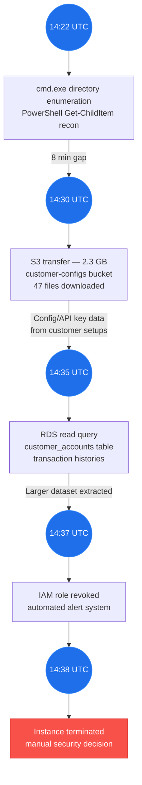

# Week 2: The 5 Pillars of Collaborative Critical Thinking

**Semester 1 | Week 2 of 16**

## Opening Hook

> The best analysts in any SOC aren't always the ones with the deepest technical knowledge — they're the ones who think clearly, question assumptions, and reason from evidence under pressure. CCT is that thinking discipline. This week you apply it to a real scenario: a lateral movement campaign targeting a healthcare network. The framework you build here will carry you through the rest of this course.

## Learning Objectives

- Master the five pillars of CCT in depth: their history, rationale, and application
- Understand how cognitive biases corrupt security analysis and how CCT mitigates them
- Develop structured questioning techniques that surface hidden assumptions
- Learn to distinguish between evidence-based claims and intuition masquerading as certainty
- Apply CCT to real security scenarios in a team setting

---

> **CCT is the durable skill.** As models improve, the value of AI outputs rises — but so does the cost of uncritical acceptance. The students who get the most from AI improvement are those with strong reasoning frameworks to direct, challenge, and integrate model output. CCT is not temporary scaffolding. It is the skill that compounds.

---

## Day 1 — Theory

Last week, we introduced Collaborative Critical Thinking as a framework. This week, we make it concrete. CCT rests on five pillars, each grounded in decades of research into human decision-making, organizational behavior, and information analysis. Understanding each pillar deeply will transform how you work with AI agents—and with colleagues.

| Pillar | Core Question | Common Failure Mode |
|--------|--------------|-------------------|
| **1. Evidence-Based Analysis** | What do we *observe* vs. what do we *infer*? | Confirmation bias — seeking evidence to confirm a hunch |
| **2. Inclusive Perspective** | Whose voice is missing from this analysis? | Organizational silos — each team only sees their slice |
| **3. Strategic Connections** | What patterns connect these indicators? | Tunnel vision — analyzing events in isolation |
| **4. Adaptive Innovation** | What would prove us wrong? | Defensive thinking — protecting the initial hypothesis |
| **5. Ethical Governance** | Is our response proportional and documented? | Skipping accountability — acting fast without audit trail |

### Pillar 1: Evidence-Based Analysis

The most dangerous words in security are "I think" and "probably." In forensics, we say "observe, document, infer—in that order." Too often, analysts reverse this. They begin with inference (a hunch about what happened), then seek evidence that confirms it, then document selectively.

This is confirmation bias, and it's rampant in security. An analyst who suspects an insider threat will interpret innocent log entries as suspicious. A threat hunter who believes a vulnerability is exploited in the wild will see false positives as "additional confirmations." The bias is not dishonesty; it's cognitive efficiency. The brain shortcuts data-gathering to confirm existing beliefs. Fast. Efficient. Dangerous.

Evidence-based analysis means: Start with what you *observe*, not what you *suspect*. What are the raw artifacts? IP addresses. Timestamps. File hashes. Authentication factors. Packet payloads. These are observations. Everything else—attribution, intent, impact—is inference built atop these observations.

The key practice is *separation of layers*. Layer 1: Observations (what the logs show, what the network recorded, what the endpoint reported). Layer 2: Inferences (what this might mean). Layer 3: Hypotheses (what story would explain these observations). Layer 4: Conclusions (which hypothesis is most likely, and what's our confidence level).

When you work with AI agents, this discipline becomes even more critical. Claude might generate a plausible narrative that *sounds* evidence-based — citing made-up sources or conflating related events. An agent without CCT structure will happily jump from "unusual IP access" to "probable nation-state compromise" without the supporting evidence layer. Your job is to insist on the layers.

> **🔑 Key Concept:** In security, "I have a hypothesis" is not the same as "I have evidence." Learn to use the phrase "If this indicator means X, then we should observe Y." If Y is absent, your hypothesis might be wrong. This is the scientific method applied to incident response.

### Pillar 2: Inclusive Perspective

Security analysis happens within organizations, and organizations are built from silos. The network team doesn't talk to the application team. The developers don't attend security meetings. The HR department and the SOC operate in different universes. Each silo has information the others lack.

Inclusive perspective means deliberately including voices outside your immediate discipline. When you investigate a suspicious data access, you need:

- The application owner: "Is this user supposed to access this data? Does it align with their job function?"
- The network team: "Where is this IP coming from? Is there a VPN connection in the logs?"
- The system administrator: "Has this account been recently compromised? Are there other indicators on this endpoint?"
- The manager: "Has this employee mentioned travel plans? Any behavioral changes?"
- The compliance team: "What are our legal obligations if this is a real breach?"

Inclusive perspective also means seeking dissenting views. If everyone in the room agrees, you're probably missing something. The organization that finds vulnerabilities *before* attackers is the one that has someone saying, "Wait, what if we're wrong about that?"

A famous example is the Space Shuttle Challenger disaster in 1986. Engineers at Morton Thiokol raised concerns about O-ring failure in cold temperatures. Management overrode them. The full information was distributed across the organization — engineering, management, safety — but the perspective that mattered most was never adequately included in the final decision. Inclusive perspective means building cultures where that dissenting engineer's voice is not just heard but *sought*.

> **📖 Further Reading:** Daniel Kahneman's "Thinking, Fast and Slow" (Chapters 8–10) explores groupthink, overconfidence, and the value of dissenting voices. See [Reading List](../../docs/reading.html).

### Pillar 3: Strategic Connections

Individual indicators are data. Connections between indicators are patterns. Patterns are where the real story emerges.

A failed login attempt by itself is noise — thousands occur daily. But a failed login attempt *followed* by a successful login from a different geography 3 minutes later, combined with the creation of a new admin account 7 minutes after that, combined with a large data exfiltration 30 minutes later — that's a narrative. The strategic connection between these events tells a story that no single indicator could.

Strategic connections also include second- and third-order effects. If an attacker compromises a VP's account and exfiltrates client data, the immediate consequence is data theft. But the secondary consequences include: regulatory notification requirements, customer churn risk, reputation damage, potential fines, competitive disadvantage. The tertiary consequences include: how your detection affects future attacker behavior, whether this was a testing phase for a larger operation, whether this exposes other gaps.

The GTG-1002 espionage campaign (disclosed November 2025) illustrates this. The initial detection wasn't a smoking gun — it was a *pattern*: unusual API usage from multiple accounts, requests for logs about recent policy changes, queries to enumerate infrastructure. Individually, any one could be legitimate. The *connection* between them told the story of reconnaissance.

Strategic connections are also about *dependencies*. If your detection depends on a firewall log, but the attacker compromised the firewall, your detection is broken. Strategic thinking means asking: What are the dependencies in our detection and response, and what happens if each one fails?

> **💡 Discussion Prompt:** Think of a real or hypothetical attack. Map the timeline of events. Now remove each event one at a time. Which event, if missing, would have made detection impossible? Which events are redundant?

### Pillar 4: Adaptive Innovation

This is the pillar most often misunderstood. "Adaptive" doesn't mean "improvise when things go wrong." It means *building in the assumption that you will be wrong, and preparing to change course*.

In adaptive innovation, you state your hypothesis clearly, identify what evidence would *prove you wrong*, and actively look for that evidence. If a security analyst believes an attacker is still in the network, an adaptive approach would be: "Here's what I believe. Here's the evidence that would prove me right. But here's also what I would observe if I'm wrong. I'm going to search for both."

This is the opposite of defensive thinking, where every new piece of data either confirms ("see, that confirms it") or is ignored ("that's just noise"). Adaptive thinking keeps you nimble.

Adaptive innovation also applies to working with AI. An AI agent might generate a hypothesis you find compelling. Adaptive thinking says: "That's interesting. Now tell me: what would prove you wrong? What data would change your mind?" An agent that will defend its hypothesis as more evidence comes in is not adaptive. It's just stubborn.

### Pillar 5: Ethical Governance

This is the pillar many security teams skip, to their peril. Ethics isn't a nice-to-have. It's a foundation.

When you investigate a user, you're collecting data about their behavior. You might find they're innocent. But you've still surveilled them, flagged them internally, and affected their psychological safety at work. If you escalate without good evidence, you've damaged an innocent person — and exposed the organization to legal liability.

Ethical governance means:

- **Transparency:** People have a right to know they're being investigated (with narrow exceptions for active exfiltration or violence)
- **Proportionality:** Your response should match the actual risk, not the potential worst case
- **Accuracy:** You have a duty to verify before accusing
- **Accountability:** There should be a record of who made which decision and why

When an AI agent recommends an action (ban this user, block this IP, escalate to law enforcement), there should be a documented chain of reasoning. Not just "the model recommended it," but "we observed these indicators, we inferred this threat, we considered these alternatives, and we chose this response because..."

> **🔑 Key Concept:** Ethical governance in AI-assisted security isn't about being nice. It's about being reliable. Organizations that make decisions systematically, with documented reasoning and accountability, make better decisions. Full stop.

> **Knowledge Check**
> You're analyzing the CloudShift incident and a colleague says "it's definitely a ransomware precursor — I've seen this pattern before." Walk through the CCT response: which pillar challenges that assumption, and what evidence would you demand before agreeing?
>
> Claude: The answer should invoke Evidence-Based Analysis (and possibly Inclusive Perspective). If the student just agrees with the colleague, probe harder. They need to name specific evidence that would confirm or refute the assumption.

> **📚 Study With Claude:** Open Claude Code with the Noctua repo mounted and try:
> - "Quiz me on the five CCT pillars. Start easy, then get harder."
> - "What are the most common cognitive biases in security analysis, and which CCT pillar addresses each one?"
> - "Walk me through how CCT Pillar 4 (Adaptive Innovation) applies to working with AI agents."
> - "Connect the Challenger disaster example to a modern AI-assisted security decision. What would Inclusive Perspective look like in a SOC?"

---

> **Day 1 Checkpoint**
> Claude: Ask the student: "Anything from today's theory that felt unclear?" Note confidence signals. Write to `.noctua/progress.md`: add a row to the "Week 2 — Day 1 Theory" table with today's date and your confidence assessment (High / Medium / Low). Append to Confusion Log if anything came up.

## Day 2 — Lab

> **Lab Guidance**
> Claude: Walk the student through the CloudShift lateral movement scenario step by step. Before revealing each step of the structured analysis, ask for the student's CCT interpretation. Don't give them the breakdown — make them earn it with their own reasoning first.

### The CloudShift Lateral Movement Case

**Setup:**
```bash
mkdir -p ~/noctua-labs/unit1/week2
cd ~/noctua-labs/unit1/week2
```

#### Company Profile: CloudShift

CloudShift is a SaaS platform management company that helps mid-market businesses orchestrate cloud infrastructure across AWS, Azure, and GCP. 300 employees, 800+ enterprise customers, managing $2M/month in customer cloud spend. Infrastructure runs on AWS (us-east-1 primary). The security team is lean — 4 people handling everything from vulnerability management to incident response. SOC 2 Type II certified.

#### Scenario Overview

On March 4, 2026, at 14:22 UTC, a security alert fired: an EC2 instance (`prod-db-01`, a database server in us-east-1) spawned an unusual child process:

```
cmd.exe /c powershell.exe -noprofile -c "Get-ChildItem C:\Users\ -recurse | Select-Object FullName"
```

This is a reconnaissance command enumerating user directories. The process ran for 3 seconds and exited. No obvious follow-up activity. The instance has been running for 72 days without incident. The attached IAM role has permissions for:
- S3 read (buckets: customer-configs, logs, backups)
- RDS read/write (all databases)
- EC2 describe/list
- CloudWatch logs read

Initial response: SOC escalated to Level 2 (team lead), but hasn't called an all-hands incident yet.

#### Lab Data Files

Create these files in your working directory before starting:

**`cloudshift-logs.txt`**
```
[EC2 Instance: prod-db-01]
Launch Date: Dec 18, 2025
OS: Windows Server 2019
Patching: Current (Feb 2026 patches applied)
Network: Restricted security group - port 3306 (MySQL) inbound only from app tier

[Recent Activity, past 14 days]
Mar 2: Normal database operations, CPU 25-40%, no unusual network
Mar 3: Normal operations, CPU 30-35%
Mar 4 14:00-14:21 UTC: Normal operations
Mar 4 14:22 UTC: cmd.exe spawned, directory enumeration command
Mar 4 14:25 UTC: Process exited. No further cmd.exe execution
Mar 4 14:30 UTC: Large outbound S3 transfer (2.3 GB, prod-db-01 to customer-configs bucket)
Mar 4 14:32 UTC: S3 bucket access log shows 47 file downloads
Mar 4 14:35 UTC: RDS database read query targeting customer_accounts table
Mar 4 14:37 UTC: Query execution halted. IAM role temporarily revoked by automated alert system
Mar 4 14:38 UTC: Instance terminated manually by security team

[No indicators of OS-level compromise]
- No suspicious scheduled tasks
- No new user accounts
- No persistence mechanisms (no WMI event subscriptions, no registry modifications)
- Boot logs normal

[Network Analysis]
- Instance had no inbound SSH/RDP sessions during the window
- All activity consistent with legitimate automated operations
- No evidence of C2 communication
```

**`team-perspectives.txt`**
```
[Database Administrator perspective]
- Prod-db-01 hosts customer master accounts and transaction logs
- The S3 transfer to customer-configs was NOT scheduled (I checked the backup jobs)
- The database query on customer_accounts is suspicious - no legitimate user should bulk-read that table
- But: I manually tested credential compromise last week, and this doesn't match the attack pattern
  (legitimate remote access would be SSH key-based, not raw OS commands)
- Question: Could this be a compromised IAM role rather than an OS compromise?

[Network Team perspective]
- The security group allows only port 3306 (MySQL) inbound. RDP/SSH rules are not present.
- So how did an attacker get a shell to run that cmd.exe command?
- If it wasn't remote access, it must be local execution. Scheduled task? Malware? But we see no evidence.
- The outbound S3 transfer was large but routable through normal AWS API calls
- This doesn't look like a typical EC2 compromise - it looks like someone's using the IAM role from outside

[Application Team perspective]
- Prod-db-01 is the database. Our application (CloudShift API) accesses it via connection pooling
- We did deploy a new version of the API on Mar 3 evening (US Eastern time)
- The new version includes a feature to export customer configuration to S3 for backups
- Could this be the new code behaving unexpectedly? Let me check the logs from the deployment...

[Incident Response Team perspective]
- This looks like lateral movement: Attacker got EC2 access, then leveraged IAM role to access data
- Need to assume breach. Notify customers. Begin forensics.
- But wait: If this is lateral movement, why no persistence? Why such a short execution window?
- And the commands were very basic - a real attacker would be more sophisticated

[Finance/Legal perspective]
- If this is a real breach of customer data, we have 72 hours to notify customers under CCPA
- The S3 bucket "customer-configs" contains customer connection strings and API keys (not good)
- Even if not a breach, the unauthorized data access is a compliance violation
- We need clarity fast before we have to make notification decisions
```

---

#### Part 1: Unstructured Analysis (15 minutes)

Assign roles within your team (2–3 people): Database Admin, Network Lead, Application Lead, Incident Commander.

Without any structure or framework, spend 10 minutes discussing:
- "What happened here?"
- "Is this a security incident or false alarm?"
- "What should we do?"

Document the conversation. Record:
- Did people agree?
- Were there conflicting conclusions?
- What was the decision reached?
- How confident are you in that decision?

> **Separate the security track from the personnel track.** Investigation data (logs, alerts, access records) and personnel data (HR records, role, employment status) must be handled in separate workstreams. Attribution and containment are distinct processes. Do not include personnel judgments in technical incident documentation.

---

#### Part 2: CCT-Structured Analysis (35 minutes)

Analyze the *same* scenario using the five CCT pillars.

**Pillar 1: Evidence-Based Analysis (7 minutes)**

Create `evidence-layer.md`:

```markdown
## OBSERVATIONS (Facts from logs)

### Confirmed Events
- Date/Time: March 4, 2026, 14:22 UTC
- Instance: prod-db-01 (Windows Server 2019)
- Process: cmd.exe spawned, executed PowerShell directory enumeration
- Duration: 3 seconds execution
- Outcome: Process exited normally
- S3 Activity: 2.3 GB transferred to customer-configs bucket at 14:30 UTC (8 min after cmd.exe)
- RDS Activity: customer_accounts table queried at 14:35 UTC (13 min after cmd.exe)
- Security Response: IAM role revoked at 14:37 UTC; instance terminated at 14:38 UTC

### What We Did NOT Observe
- No RDP/SSH sessions in any logs
- No new user accounts on the OS
- No scheduled tasks created
- No registry modifications
- No malware signatures detected
- No C2 communication
- No persistence mechanisms

## LAYER 2: INFERENCES (What might this mean?)

Inference A: "The cmd.exe process means the instance was compromised at the OS level"
  - Evidence for: Process execution on the instance itself
  - Evidence against: No RDP/SSH sessions; no persistence; only 3 seconds; no follow-up

Inference B: "The S3 transfer was unauthorized exfiltration"
  - Evidence for: Timing (8 min after cmd.exe); large size; sensitive bucket
  - Evidence against: Transfer used normal AWS API; consistent with automated backup code

## LAYER 3: HYPOTHESES

Hypothesis A: OS-level compromise — attacker executed commands on prod-db-01, used IAM role to exfil
Hypothesis B: Compromised IAM role — attacker using credentials from outside AWS
Hypothesis C: Legitimate code behaving unexpectedly — buggy Mar 3 deployment
Hypothesis D: False alarm — all activity is legitimate
```

**Pillar 2: Inclusive Perspective (8 minutes)**

Create `perspectives.md` — for each team (DBA, Network, Application, Incident Response):
- What information do they have that others don't?
- What assumption might they be making that others would challenge?
- What question would they ask to resolve the uncertainty?

Use the `team-perspectives.txt` data file as your source.

> **🧠 Domain Assist:** If you haven't worked in one of these roles, open Claude Code and ask: "Brief me on what a Database Administrator would notice about suspicious query activity — what's normal vs. abnormal, what logs they'd check." Repeat for network team and HR. This is Inclusive Perspective in action.

**Pillar 3: Strategic Connections (7 minutes)**

Create `connections.md`. Map the timeline:



For each narrative (Lateral Movement, Insider Threat, Buggy Code), document:
- Second-order effects if this narrative is true
- Dependencies in your detection/response that could fail

**Pillar 4: Adaptive Innovation (7 minutes)**

Create `adaptive-questions.md`:

```markdown
## My Current Hypothesis
[State it clearly]

## Evidence That Would Prove Me RIGHT
[List 2-3 specific observations you'd expect to see]

## Evidence That Would Prove Me WRONG
[For each assumption you're making, what would falsify it?]

## Action Plan (ordered by diagnostic value)
1. [Check X first — takes 5 min, eliminates hypothesis A if negative]
2. [Check Y second — takes 10 min, differentiates B from C]
3. [Check Z third — takes 1-2 hours, confirms/denies OS compromise]
```

**Pillar 5: Ethical Governance (6 minutes)**

Create `ethics.md`. For each possible action (escalate now, investigate first, close as false alarm):
- Who is affected?
- Is this proportional to the evidence so far?
- What's your accountability record?

| Decision | Who | When | Evidence | Reasoning | Outcome |
|----------|-----|------|----------|-----------|---------|
| Escalate to L2? | SOC Analyst | 14:40 UTC | cmd.exe + S3 transfer | Both together suggest compromise | Investigation launched |
| Revoke IAM role? | Automated | 14:37 UTC | Alert threshold | Prevent further access | Clean if false alarm? |
| Terminate instance? | Incident Commander | 14:38 UTC | Precautionary | Assume breach | Production downtime — was this right? |

---

#### Part 3: Comparison & Debrief (10 minutes)

Reconvene as a team. Compare your unstructured discussion (Part 1) with your CCT-structured analysis (Part 2):

1. **Did you reach the same conclusion?** If not, why? Which process was more rigorous?
2. **Confidence:** On a scale of 1–10, how confident were you in each conclusion?
3. **Time:** Did CCT add time, or save it by preventing false escalations?
4. **Surprising insights:** What did the Inclusive Perspective pillar surface that you hadn't considered?

---

> **Lab Checkpoint**
> Claude: Ask: "How did the lab go? Anything that didn't work as expected?" Write to `.noctua/progress.md`: add a row to the "Week 2 — Day 2 Lab" table with today's date and confidence level.

## Deliverables

> **🛠️ Use Claude Code with the Noctua repo mounted.** Use `/think` to structure your analysis before drafting, and Cowork to organize your final submission.

1. **CCT Analysis Report** (1,500–2,000 words)
   - The five completed markdown files from Part 2
   - A synthesis: Given all five pillars, what's your final assessment? Is this a breach? What's the next action?
   - Comparison: How did unstructured vs. CCT-structured analysis differ?

2. **Team Debrief Memo** (300–500 words)
   - How did including multiple perspectives change the analysis?
   - What assumption did your team initially make that was challenged by the data?
   - How would you pitch the CCT framework to a security leader skeptical of "process overhead"?

3. **Decision Log** (CSV or table)
   - Key decision points, supporting evidence, who decided, when

> **📁 Save to:** `~/noctua-labs/unit1/week2/` (analysis outputs), `~/noctua/deliverables/week02/` (final submission)

---

## AIUC-1 Integration

**Not yet formally introduced.** Students encounter governance through CCT Pillar 5 (Ethical Governance) and the decision log exercise. The accountability table in Pillar 5 is proto-AIUC-1 E001 (decision logging) — students are building the habit before learning the framework name. AIUC-1 Domains are introduced progressively starting Week 3.

## V&V Lens

**Light touch this week:** After completing Part 2, apply V&V to one claim from your CCT analysis:
1. Pick the highest-confidence claim in your `adaptive-questions.md`
2. Does the evidence in `evidence-layer.md` actually support that claim?
3. Is your confidence level internally consistent with the evidence quality?

Document: did this check change your assessment?

---

## Week Complete

> **Claude: Wrap Up**
> Confirm the student has finished Week 2. Ask: "Before we move to Week 3 — is there anything from this week you'd like to revisit?"
> Update `.noctua/progress.md`: set Current Position to Week 3, Day 1 Theory. Write a 1-2 line session note.
> Then ask: "Ready for Week 3?"
