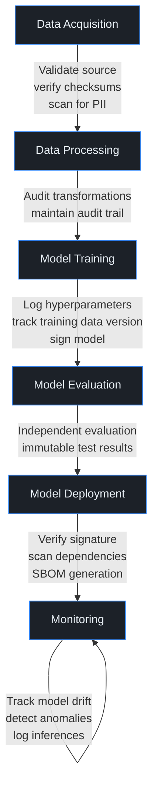
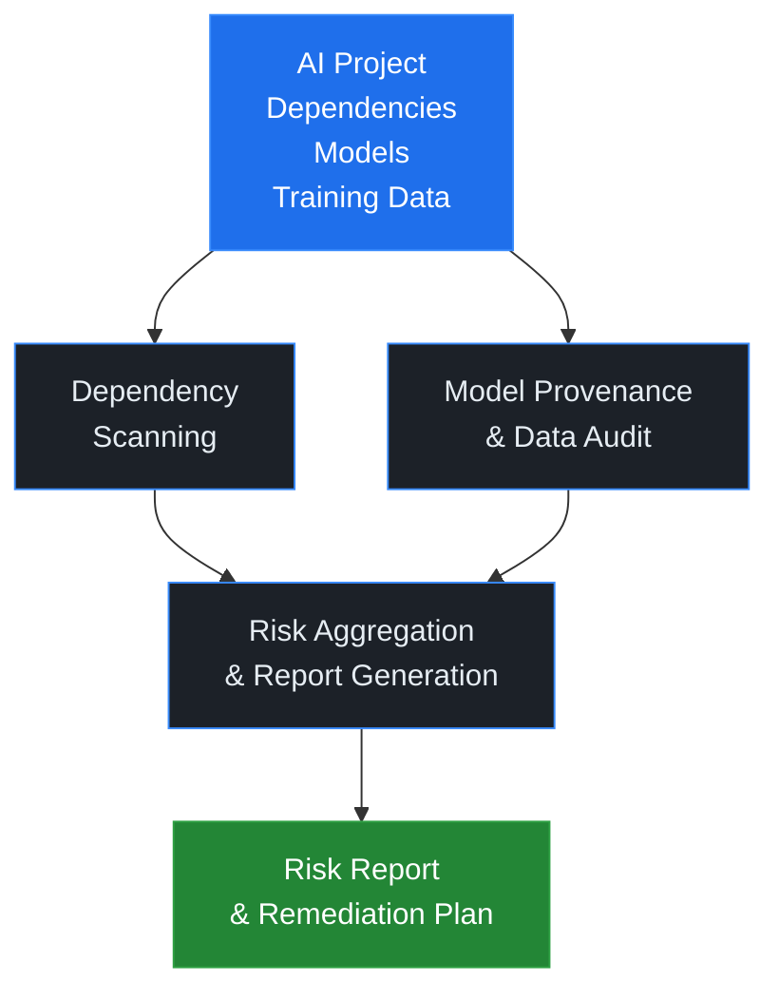
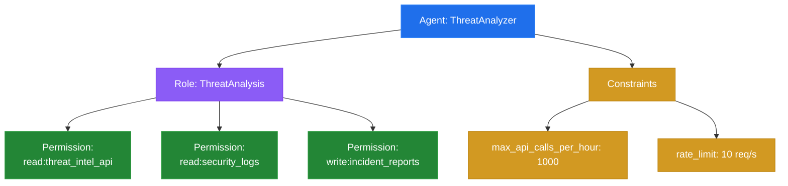
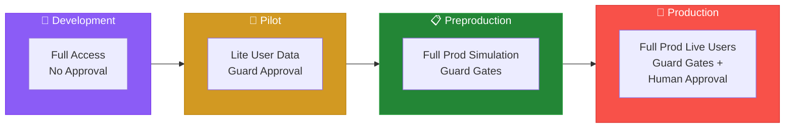
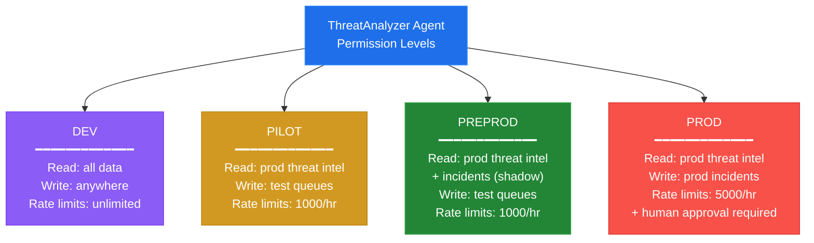
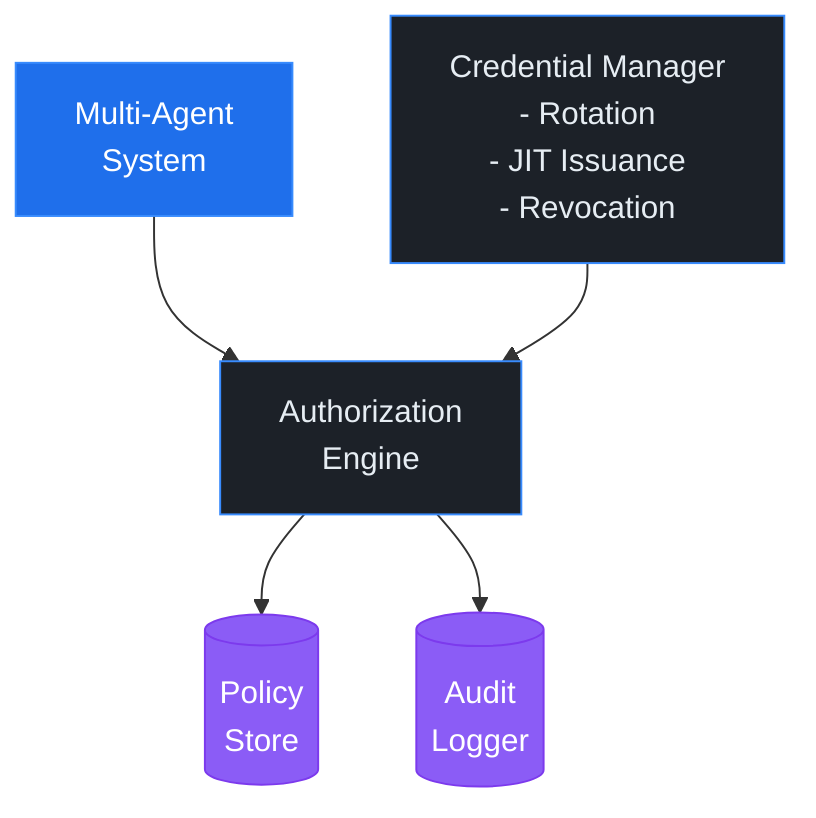
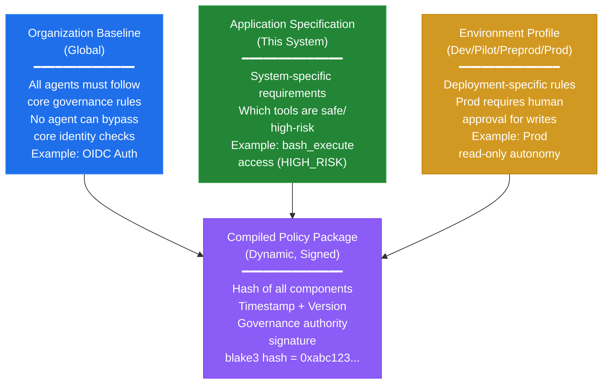
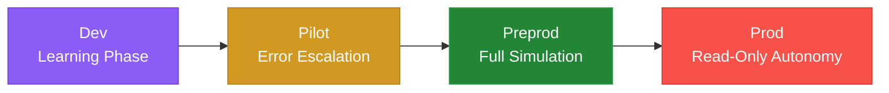

# Unit 7: Production Security Engineering

**CSEC 602 — Semester 2 | Weeks 9–12**

[← Back to Semester 2 Overview](../SYLLABUS.md)

---

## Unit 7 Overview: Taking Agentic Systems to Production

This unit transforms security concepts into **production-ready systems**. You'll move from building AI agents in isolation to deploying them at scale with enterprise controls: supply chain verification, identity governance, operational observability, and deployment automation. Every component you build integrates into a cohesive security posture.

**Unit Learning Outcomes:**
- Audit and secure the AI supply chain from development through deployment
- Implement non-human identity governance in multi-agent environments
- Deploy production observability and cost tracking for agentic systems
- Automate secure deployment with CI/CD, containerization, and runbooks

> **🎯 Prototype-to-Production Pipeline:** This unit is where **selected prototypes become production systems**. If leadership selects your work from Unit 4, Unit 5, or Unit 6 for delivery, Unit 7 is where you transform it from a working proof-of-concept into a hardened, observable, governed, and deployable system. This course's agentic development methodology — including the Think → Spec → Build → Retro cycle — provides the framework for this transformation. The **Pit of Success** principle applies here: design your systems so secure, compliant deployment is the easy path, not the exception.

---

## Week 9: AI Supply Chain Security

### Day 1 — Theory & Foundations

**Learning Objectives:**
- Identify supply chain attack vectors targeting AI systems (model poisoning, dependency compromise, data tampering)
- Understand the role of SBOMs, provenance tracking, and model signing in AI supply chain security
- Analyze real-world supply chain attacks on AI/ML infrastructure
- Apply SLSA framework and MITRE ATLAS supply chain techniques to AI systems
- Design verification checkpoints for each stage of the AI development lifecycle

#### The AI Supply Chain Attack Surface

The AI supply chain is **uniquely complex** because models are data artifacts, not just code. Every component—models, training data, dependencies, checkpoints, evaluation sets—can be poisoned, replaced, or tampered with before deployment.

> **📖 Production Engineering Methodology:** Securing the supply chain requires applying the **Pit of Success** principle (from *Agentic Engineering*): make secure, verified deployment the path of least resistance. Every step in your pipeline—dependency scanning, model signing, SBOM generation—should be automated so teams can't accidentally deploy unverified artifacts. This is not a checklist; it's a system design where security is baked in from the start.

> **🔑 Key Concept:** Unlike traditional software (code → build → binary), AI systems have a data-driven supply chain: **Training Data → Model Artifact → Trained Weights → Evaluation → Deployment Checkpoint**. Each stage is an attack surface.

**Supply Chain Attack Vectors:**

1. **Model Provenance Attacks**
   - Replacing official model weights with compromised versions
   - Distributing models with identical names from unofficial sources
   - "Model theft" via unauthorized redistribution
   - Supply chain attacks targeting popular model repositories (Hugging Face, PyTorch Hub)

   *Real Case:* In 2023, malicious models were uploaded to Hugging Face with names designed to fool users searching for popular models. Without provenance verification, teams could download compromised weights.

2. **Training Data Poisoning**
   - Injecting malicious data into public datasets used for fine-tuning
   - Subtle poisoning: data that causes specific failure modes (e.g., adversarial examples that trigger certain outputs)
   - Data source spoofing: claiming data is from trusted source when it isn't
   - Label flipping in supervised learning datasets

   > **📖 Further Reading:** "Poisoning Attacks on Machine Learning Models" (Li et al., 2019) covers detection strategies for subtle data poisoning.

3. **Dependency Chain Compromise**
   - Vulnerable Python packages: `numpy`, `tensorflow`, `torch` have had CVEs
   - Transitive dependencies: Security flaws in indirect dependencies (library A depends on B, which depends on C)
   - Example: A dependency scanning tool finds 50 packages—but only 5 are direct. The other 45 are transitive risks.
   - Malicious package updates: Typosquatting (`numpyy` instead of `numpy`)

4. **Evaluation and Benchmark Manipulation**
   - Swapping evaluation datasets before model release
   - Overfitting to specific benchmarks without real-world validation
   - Hiding known failure modes in evaluation reports

#### SBOM and Provenance Verification

A **Software Bill of Materials (SBOM)** is a machine-readable list of all components in a system—analogous to ingredient labels on food.

**Why SBOMs Matter for AI:**
- Enabling rapid identification of vulnerable dependencies when CVEs are published
- Providing transparency to customers and compliance auditors
- Enabling automated scanning and vulnerability tracking

**SBOM Generation for AI Systems:**

Using **syft** (CycloneDX format):

```bash
# Generate SBOM for your Python project
syft dir:. -o cyclonedx-json > sbom.json

# Example output:
{
  "specVersion": "1.4",
  "version": 1,
  "metadata": {
    "timestamp": "2026-03-05T10:30:00Z",
    "component": {
      "type": "application",
      "name": "agent-security-system",
      "version": "1.0.0"
    }
  },
  "components": [
    {
      "type": "library",
      "name": "anthropic",
      "version": "0.7.15",
      "purl": "pkg:pypi/anthropic@0.7.15",
      "hashes": [
        {
          "alg": "SHA-256",
          "content": "abc123..."
        }
      ]
    },
    {
      "type": "library",
      "name": "fastapi",
      "version": "0.104.1",
      "purl": "pkg:pypi/fastapi@0.104.1"
    }
  ]
}
```

**Model Signing and Verification:**

Using **cosign** to sign model artifacts (models are stored as files in registries like Docker Hub or OCI artifact repositories):

```bash
# Generate signing keys
cosign generate-key-pair

# Sign a model file (e.g., model weights)
cosign sign-blob --key cosign.key model-weights.safetensors > model-weights.safetensors.sig

# Verify signature before loading
cosign verify-blob --key cosign.pub --signature model-weights.safetensors.sig model-weights.safetensors
# Output: Verified OK

# In Python, verify before loading:
import subprocess
import torch

def load_verified_model(model_path, pub_key):
    # Verify signature
    result = subprocess.run([
        'cosign', 'verify-blob',
        '--key', pub_key,
        '--signature', f'{model_path}.sig',
        model_path
    ], capture_output=True, text=True)

    if result.returncode != 0:
        raise SecurityError(f"Model signature verification failed: {result.stderr}")

    # Only load if verification succeeded
    return torch.load(model_path)
```

> **💡 Pro Tip:** Automate signature verification in your model loading pipeline. Never skip this step in production, even for "trusted" sources.

#### MITRE ATLAS and SLSA Framework for AI

**MITRE ATLAS** (Adversarial Tactics, Techniques, and Common Knowledge for AI) maps supply chain attacks:

| Attack Vector | ATLAS Technique | Defense |
|---------------|-----------------|---------|
| Compromised dependency | T0028: Supply Chain Compromise | SBOM + dependency scanning + pinning |
| Poisoned training data | T0020: Poison Training Data | Data validation, source verification, checksums |
| Model replacement | T0005: Model Access | Model signing, secure distribution, access controls |
| Evaluation tampering | T0022: Model Evaluation Evasion | Immutable evaluation logs, third-party verification |

**SLSA Framework** (Supply-chain Levels for Software Artifacts) provides maturity levels:

- **Level 1:** Version control and signed provenance (commit hashes, authors)
- **Level 2:** Automated build process, dependency tracking
- **Level 3:** Tamper-resistant builds, audit logging
- **Level 4:** Cryptographic isolation, two-person review

For AI systems: Implement **at least Level 2** (automated builds with SBOMs) before production deployment.

> **🔑 Key Concept:** Supply chain security is not "install a scanner." It's **continuous verification**: every input (data, model, dependency) must be validated against known-good sources before use. *Agentic Engineering* (Ch. 5: Tool Restrictions and Security) and (Ch. 7: Practices) emphasize this principle: your deployment pipeline should automatically reject unverified artifacts, not trust humans to remember to verify them.

#### Secure Development Lifecycle for AI

Each stage of AI development has specific security gates:



Each gate is a checkpoint where you answer: **"Can we trust this artifact?"**

#### Vulnerability Management and Dependency Scanning

Tools for continuous dependency security:

| Tool | Function |
|------|----------|
| **Dependabot** | GitHub-native: scans `requirements.txt`, creates PRs for updates |
| **Snyk** | Real-time vulnerability scanning, remediation guidance |
| **Safety** | Python-specific SAST: `safety check < requirements.txt` |
| **Trivy** | Container image scanning (we'll use in Week 12) |

Example workflow:

```bash
# In your project root, every commit:
pip install safety
safety check --json > vulnerability-report.json

# If vulnerabilities found with severity >= HIGH, CI/CD fails
```

> **📖 Further Reading:** NIST AI Security and Governance Resource Center: https://airc.nist.gov

> **💡 Discussion Prompt:** Your organization uses TensorFlow 2.8.0. A critical CVE is announced in a transitive dependency (protobuf 3.19.0). Do you upgrade immediately? What are the risks of each choice?

---

### V&V Lens: Automated Verification in Production

In production, V&V can't be manual — it must be automated. Your supply chain audit scanner is a V&V tool: it automatically verifies that dependencies are safe, models are authentic, and SBOMs are complete.

Apply this pattern everywhere in your production systems:
- **Dependency verification:** Automated scanning on every build (you build this in today's lab)
- **Model verification:** Signature checking on every model load
- **Output verification:** Automated cross-referencing of agent outputs against known-good data
- **Drift verification:** Continuous monitoring for model performance degradation

Production V&V is the engineering realization of the discipline you've been practicing all year. The instinct to verify before trusting — now encoded in pipelines, not just habits.

---

> **🧠 Domain Assist:** Supply chain security, SBOMs, and the SLSA framework come from the DevOps/platform engineering world. If you've never built a CI/CD pipeline or generated an SBOM, the concepts can feel foreign. Get oriented first:
>
> "I'm a security engineer about to build a supply chain audit scanner. I need to understand: 1) What is an SBOM and why would I care about one for an AI project specifically? 2) What does a dependency scanner actually do — what's it checking and against what? 3) What is model provenance and why does it matter if I can't verify where a model came from? 4) What does SLSA Level 2 mean practically — what do I need to implement? 5) What are the real-world supply chain attacks on AI/ML systems that I should understand?"

---

### Day 2 — Hands-On Lab: AI Supply Chain Audit Tool

**Lab Objectives:**
- Build an automated supply chain audit scanner for AI projects
- Implement dependency scanning, model provenance verification, and SBOM generation
- Create a risk report with actionable remediation guidance
- Verify model integrity using cryptographic signatures

#### Lab Setup

**Environment and Tools:**
- Python 3.11+
- `pip install safety snyk-cli syft cosign`
- Git repository with `requirements.txt` and model artifacts

**Conceptual Architecture:**



#### Step 1: Dependency Scanning

**Architecture Decision:**

Your lab needs a module that wraps existing security tools (Safety, Snyk, Syft) to provide unified scanning. The key design choices:

1. **Tool Abstraction Layer:** Different tools have different output formats. Abstract them behind a consistent scanner interface.
2. **Pluggable Reporting:** Risk aggregation must work whether you use Safety alone or multiple tools.
3. **Exit Code Logic:** CI/CD pipelines fail builds based on exit codes. Your scanner must translate vulnerability counts into appropriate exit codes.
4. **Performance:** Scanning takes time (30+ seconds). Cache results where possible or run scans in parallel.

**Context Engineering Note:**

When you ask Claude Code to generate a dependency scanner, provide:
- The list of tools to integrate (Safety, Syft, optional Snyk)
- Expected output format (JSON risk report)
- Risk scoring logic (how many vulns = CRITICAL vs HIGH)
- Integration points (CI/CD pipeline, pre-commit hook)

> **🔑 Key Concept:** Don't just run tools individually. Wrap them in a Python module that normalizes output, aggregates findings, and produces actionable reports. This is where AI solutioning adds value—turning tool outputs into decision support.

**Claude Code Prompt:**

```text
I need a Python module that scans an AI project for supply chain vulnerabilities.

The module should:
1. Scan dependencies in requirements.txt using the 'safety' tool
2. Parse requirements.txt and extract direct dependencies with versions
3. Identify outdated packages (packages not updated in 6+ months)
4. Generate a JSON report with format:
   {
     "timestamp": "...",
     "findings": {
       "dependencies": {...},
       "vulnerabilities": {...},
       "outdated": [...]
     },
     "risk_score": "CRITICAL|HIGH|MEDIUM|LOW"
   }
5. Calculate risk score: 5+ vulns = CRITICAL, 2-4 = HIGH, 1 = MEDIUM, 0 = LOW

The main class should be called DependencyScanner with methods:
- scan_with_safety()
- parse_requirements()
- check_outdated_packages()
- generate_report()

Use subprocess to call external tools (safety, pip). Handle timeouts and errors gracefully.
```

**After Claude generates the code, verify it includes:**
- Exception handling for missing tools (clear error messages)
- Timeout handling for long-running scans
- Proper parsing of requirements.txt with various version specifiers (==, >=, ~=)
- Structured JSON output, not raw tool output

**Iteration guidance:**

If the output doesn't parse Safety JSON correctly, ask: "The Safety tool outputs JSON with structure `{vulnerabilities: [{package, version, advisory}]}`. Make sure you parse this correctly and only count actual vulnerabilities, not metadata."

If risk scoring seems arbitrary, ask: "Add a docstring to _calculate_risk_score explaining the thresholds. Why is 5 vulnerabilities CRITICAL?"

> **⚠️ Common Pitfall:** Don't just scan once. Supply chain attacks happen **after** initial scans. Run dependency checks at commit time (pre-commit hook), CI/CD time, and before deployment.

#### Step 2: Model Provenance Verification

**Architecture Decision:**

Models are data artifacts, not code. They require different verification than dependencies. Your verifier needs to:

1. **Discovery:** Find all model files (various formats: .pt, .h5, .safetensors, etc.)
2. **Documentation:** Check for MODEL_CARD.md with required sections (Intended Use, Training Data, Limitations, Ethical Considerations)
3. **Signature Verification:** Validate cryptographic signatures or checksums to detect tampering
4. **Freshness Check:** Flag models that haven't been updated in months (could indicate abandoned/vulnerable models)

**Why This Matters:**

A model without provenance is like software without version control—you can't audit it, can't roll back, and can't verify it hasn't been tampered with. Plus, old models may have been trained on data with known security issues.

**Context Engineering Note:**

When asking Claude Code to build a model verifier:
- Show it a sample MODEL_CARD.md format with required sections
- Explain that signature verification can be hash-based (for lab) or cosign-based (for production)
- Clarify the freshness thresholds (3 months = warning, 6+ months = critical)

**Claude Code Prompt:**

```text
Create a ModelProvenanceVerifier class that audits model artifacts in an AI project.

The class should:
1. Find all model files by glob patterns:
   - *.pt, *.pth (PyTorch)
   - *.h5 (Keras/TensorFlow)
   - *.onnx (ONNX)
   - *.safetensors (Hugging Face)
   - *.pkl (Pickle)
   Skip venv/ and __pycache__/ directories

2. Verify MODEL_CARD.md documentation:
   - Check file exists in model's directory
   - Verify it contains sections: "Model Details", "Intended Use", "Training Data", "Limitations", "Ethical Considerations"
   - Return: {has_card: bool, status: "OK|INCOMPLETE|CRITICAL", missing_sections: [...]}

3. Verify model signature:
   - Look for {model_path}.sig file containing expected SHA256 hash
   - Compute SHA256 of actual model file
   - Compare: if match, status="OK"; if no .sig file, status="NO_SIGNATURE"; if mismatch, status="VERIFICATION_FAILED"

4. Check model age:
   - Get file modification time
   - Calculate days since last update
   - If > 180 days: status="CRITICAL"
   - If > 90 days: status="WARNING"
   - Otherwise: status="OK"

Return dict format for each check with status and message fields.
```

**After Claude generates the code, verify it includes:**
- Proper path handling (use pathlib.Path)
- Glob pattern with proper directory exclusion
- File I/O error handling
- Checksum computation that works for large files (read in 4KB blocks)
- Clear status field in every return dict

**Iteration guidance:**

If model discovery is slow, ask: "For large projects, finding all models can be slow. Add a parameter to limit search depth or exclude certain directories. Should we cache the model list?"

If signature verification is unclear, ask: "Show me an example of what the .sig file should contain. Is it just the hex hash on one line?"

> **✅ Remember:** A model without provenance is like software without version control—you can't audit it, can't roll back, and can't verify it hasn't been tampered with.

#### Step 3: SBOM Generation

**Architecture Decision:**

The SBOM generator is a thin wrapper around the Syft tool. The key responsibilities:

1. **Tool Execution:** Call syft with project path and output format
2. **Error Handling:** Distinguish between tool errors, parse failures, and missing dependencies
3. **Output Parsing:** Extract component count and metadata
4. **Persistence:** Save SBOM to file for version control and audit trails

This is intentionally simple—Syft does the heavy lifting. Your job is to integrate it into your audit pipeline and fail gracefully.

**Context Engineering Note:**

Ask Claude Code to:
- Handle the case where syft isn't installed (show helpful error message)
- Parse CycloneDX JSON format (standard SBOM format)
- Handle subprocess timeouts (scanning large projects takes 60+ seconds)
- Save output in a way that works with git version control

**Claude Code Prompt:**

```text
Create a SBOMGenerator class that wraps the Syft tool to generate SBOMs.

The class should:
1. Have a generate_sbom(project_root, output_format="cyclonedx-json") method that:
   - Calls: syft dir:{project_root} -o {output_format}
   - Runs with 60 second timeout
   - Parses JSON output from stdout
   - Returns: {status: "success"|"failed", format: str, component_count: int, sbom: dict, error: str}
   - If syft is not installed, catch FileNotFoundError and return helpful error message

2. Have a save_sbom(sbom_data, output_path) method that:
   - Writes JSON to file (pretty-printed, 2-space indent)
   - Suitable for committing to git version control

Handle edge cases:
- Subprocess timeout (return {status: "timeout"...})
- JSON parse error (return {status: "parse_error"...})
- Permission errors (return {status: "permission_denied"...})

Return consistent dict format for all outcomes.
```

**After Claude generates the code, verify it includes:**
- Proper subprocess handling with timeout
- JSON parsing with error handling
- Clear status codes in return values
- File write with appropriate permissions
- Docstrings explaining CycloneDX format

**Iteration guidance:**

If the JSON parsing is fragile, ask: "Add validation to ensure the parsed JSON has 'components' key before trying to count them. What should we do if the structure is unexpected?"

If timeout is too short, ask: "For a large project with 1000+ dependencies, 60 seconds might not be enough. Add a parameter to configure timeout with a sensible default."

#### Step 4: Risk Aggregation and Reporting

**Architecture Decision:**

This is the orchestrator that ties together all three scanners. Its job is to:

1. **Call Each Scanner:** Run dependency scan, model provenance checks, and SBOM generation
2. **Aggregate Results:** Combine all findings into a single report
3. **Calculate Overall Risk:** Determine if project has CRITICAL/HIGH/MEDIUM/LOW risk
4. **Generate Recommendations:** Produce actionable remediation steps

The report is human-readable (summary) and machine-readable (findings array for CI/CD integration).

**Context Engineering Note:**

When asking Claude Code to build the aggregator:
- Show it what each scanner returns so it knows how to extract findings
- Explain the risk score rollup logic (if ANY finding is CRITICAL, overall is CRITICAL)
- Define what a "recommendation" should be (actionable, not vague)

**Claude Code Prompt:**

```text
Create a SupplyChainRiskReport class that aggregates findings from DependencyScanner, ModelProvenanceVerifier, and SBOMGenerator.

The class should:
1. Constructor takes: scanner, verifier, sbom_gen
2. Main method: generate_report(project_root) that:
   - Calls scanner.generate_report() for dependency findings
   - Calls verifier.find_models() and for each model calls verify_model_card() and check_model_age()
   - Calls sbom_gen.generate_sbom(project_root)
   - Aggregates all findings into "findings" array with {category, status, details} format
   - Calculates overall risk_score: if any finding is CRITICAL → report is CRITICAL, else if any HIGH → HIGH, etc.
   - Generates recommendations based on critical findings

3. Method _generate_recommendations(report) that:
   - Iterates findings array
   - For each CRITICAL finding: adds "⚠️ CRITICAL: {category} - Address immediately"
   - For each HIGH finding: adds "⚠️ HIGH: {category} - Address before next release"
   - Returns list of recommendation strings

4. Support outputting to JSON (pretty-printed)

Return format:
{
  "executive_summary": "string",
  "risk_score": "CRITICAL|HIGH|MEDIUM|LOW",
  "findings": [...],
  "recommendations": [...]
}
```

**After Claude generates the code, verify it includes:**
- Proper error handling if any scanner fails
- Risk score rollup logic (any CRITICAL → overall CRITICAL)
- Findings array with consistent structure
- Recommendations that are specific and actionable
- Main execution example that shows how to use it

**Iteration guidance:**

If the report feels incomplete, ask: "Add an 'executive_summary' field that counts total findings by severity and recommends next steps (e.g., 'Project has 3 CRITICAL findings. Do not deploy until resolved.')."

If recommendations are too generic, ask: "For a CRITICAL dependency vulnerability, the recommendation should include: 'Run: safety check --json > vulnerabilities.json to see details. Then update vulnerable packages with: pip install --upgrade {package}==new_version.'"

> **💡 Pro Tip:** Integrate this audit into your CI/CD pipeline so every commit triggers a supply chain check. Fail the build if risk score is CRITICAL.

#### Deliverables

**1. AI Supply Chain Audit Tool**
- Functional Python module with DependencyScanner, ModelProvenanceVerifier, SBOMGenerator
- Automated scanning, risk aggregation, report generation

**2. Audit Report on Sample Project**
- JSON report showing: vulnerable dependencies, model age, SBOM components
- Risk score with remediation recommendations

**3. SBOM Artifact**
- CycloneDX JSON SBOM generated for sample project
- Suitable for version control and compliance audits

**4. Model Signature Verification**
- Demo of cosign (or hash-based) model integrity checking
- Documentation of signing/verification process

**Sources & Tools:**
- NIST AI Security Resource Center: https://airc.nist.gov/
- MITRE ATLAS: https://atlas.mitre.org/
- Syft: https://github.com/anchore/syft (SBOM generation)
- Cosign: https://github.com/sigstore/cosign (Model signing)
- Safety: https://pyup.io/safety/ (Python vulnerability scanning)

---

> **🛠️ Skill Opportunity:** Your supply chain audit scanner wraps three tools (Safety, Syft, model provenance). Package it as a `/supply-chain-audit` skill with the scanner scripts and a reference doc mapping findings to AIUC-1 controls. This is the kind of skill your future employer would value.

---

## Week 10: Non-Human Identity (NHI) Governance

### Day 1 — Theory & Foundations

**Learning Objectives:**
- Understand the NHI explosion and why traditional identity governance fails for agents, service accounts, and API credentials
- Design role-based and attribute-based access control (RBAC, ABAC) for agentic systems
- Implement time-bound credentials, credential rotation, and just-in-time (JIT) access patterns
- Apply Zero Trust principles to non-human identities
- Leverage PeaRL environment hierarchy as a reference for agent governance gates

#### The Non-Human Identity Crisis

**The Numbers:**
- Human identities: ~100 per organization
- Non-human identities: **5,000–50,000 per organization**
- Growth rate: NHIs growing 50–200% year-over-year
- **Challenge:** Most organizations have no inventory of their own NHIs

> **🔑 Key Concept:** Every service account, API key, OAuth token, agent credential, and bot is an **identity that can be compromised, abused, or accidentally exposed**—yet most organizations have zero governance over them.

**Types of Non-Human Identities:**

| Identity Type | Example | Typical Count |
|---|---|---|
| API Keys | Anthropic API key, GitHub token | 100–1000 |
| Service Accounts | `svc-threatanalysis`, `svc-dataingestion` | 50–500 |
| Agent Identities | Autonomous agent in multi-agent system | 10–100 |
| Bot Accounts | Slack bot, Discord bot, automation bots | 20–200 |
| Workload Identities | Kubernetes pod identity, AWS role | 500–5000 |
| Certificates | TLS certs, client certs | 100–1000 |

**Why NHI Governance Matters:**

A compromised API key in a GitHub repo can:
1. Access production databases
2. Trigger CI/CD deployments
3. Exfiltrate customer data
4. Disable security controls

And it can remain undetected for **months** if there's no audit trail.

#### Identity Governance Framework

**Core Principles:**

1. **Least Privilege:** Each identity has minimum required permissions
   - Agent A can call Tool X; deny all others
   - Service B can read database Y; deny writes
   - Bot C can post to channel Z; deny deletes

2. **Time-Bound Credentials:** No credentials are "forever"
   - API keys: rotate every 90 days
   - OAuth tokens: expire in 1 hour
   - Certificates: renew before expiry
   - Credentials always have **max_lifetime** parameter

3. **Continuous Verification:** Don't trust once, verify always
   - Every request checked against policy
   - Real-time permission updates (no caching old policies)
   - Immediate revocation enforcement

4. **Comprehensive Audit:** Every action logged and attributable
   - Agent X called Tool Y at 2026-03-05 10:30:00 UTC
   - Input/output parameters logged
   - Success/failure recorded
   - Audit trail immutable

#### RBAC and ABAC for Agents

**Role-Based Access Control (RBAC):**

Agents are assigned **roles**, roles have permissions:



**Attribute-Based Access Control (ABAC):**

Permissions based on attributes (context):

```
Can Agent "AutoResponse" write to "incident_queue"?

Check attributes:
  - agent.role == "ResponseAutomation" ✓
  - request.time in 09:00-17:00 (business hours) ✓
  - request.resource.severity >= HIGH ✓
  - agent.last_activity < 5_minutes_ago ✓

Result: ALLOW
```

#### Credential Rotation and JIT Access

**Credential Rotation Workflow:**

```python
class CredentialRotation:
    """Automated rotation of non-human identities."""

    def rotate_api_key(self, agent_id: str) -> Dict:
        """Issue new API key, revoke old one."""
        # 1. Generate new key
        new_key = self.generate_api_key()

        # 2. Distribute to agent
        self.vault.set_secret(f"agent/{agent_id}/api_key", new_key)

        # 3. Mark old key for revocation (grace period)
        old_key_id = self.get_current_key_id(agent_id)
        self.revocation_queue.add(
            key_id=old_key_id,
            agent_id=agent_id,
            revoke_at=datetime.now() + timedelta(hours=1)  # Grace period
        )

        # 4. Log rotation
        self.audit_log.record({
            "event": "credential_rotated",
            "agent_id": agent_id,
            "new_key_id": new_key_id,
            "old_key_id": old_key_id,
            "timestamp": datetime.now().isoformat()
        })

        return {"status": "rotated", "effective_at": datetime.now()}

    def automatic_rotation_job(self):
        """Run every 24 hours: rotate credentials older than 90 days."""
        agents = self.get_all_agents()

        for agent in agents:
            cred_age = self.get_credential_age(agent.id)

            if cred_age > timedelta(days=90):
                self.rotate_api_key(agent.id)
```

**Just-in-Time (JIT) Access:**

Instead of long-lived credentials, issue ephemeral tokens:

```python
class JITAccessManager:
    """Issue time-limited credentials on-demand."""

    def request_access(self, agent_id: str, resource: str,
                      duration_minutes: int = 15) -> Dict:
        """Agent requests temporary access to resource."""

        # 1. Check if agent is allowed to access this resource
        policy = self.load_policy(agent_id)

        if not policy.allows(resource, agent_id):
            self.audit_log.record({
                "event": "access_denied",
                "agent_id": agent_id,
                "resource": resource,
                "reason": "not_in_policy"
            })
            raise AccessDenied(f"Agent {agent_id} cannot access {resource}")

        # 2. Issue time-limited credential (token expires in duration_minutes)
        token = self.generate_token(
            agent_id=agent_id,
            resource=resource,
            expires_in=timedelta(minutes=duration_minutes)
        )

        # 3. Log the access request
        self.audit_log.record({
            "event": "jit_token_issued",
            "agent_id": agent_id,
            "resource": resource,
            "token_id": token.id,
            "expires_at": token.expires_at,
            "timestamp": datetime.now().isoformat()
        })

        return {
            "token": token.value,
            "expires_in_minutes": duration_minutes,
            "expires_at": token.expires_at.isoformat()
        }
```

> **📖 Further Reading:** "Just-in-Time Access: Zero Trust for the Cloud" explores JIT patterns for cloud infrastructure and extends naturally to AI agents.

#### PeaRL: Open-Source Governance for Autonomous Agents

**PeaRL** (Policy-enforced Autonomous Risk Layer) is an open-source governance platform built specifically for the problem we're studying: how do you enforce security gates between autonomous AI agents and production systems? Built by this course's creator and available at https://github.com/r33n3/PeaRL, PeaRL demonstrates that governance tooling should be accessible to everyone — security should never be locked behind expensive enterprise licenses when the stakes are this high.

> **📖 Further Reading:** Clone PeaRL and explore its architecture: `git clone https://github.com/r33n3/PeaRL.git`. Study how it implements the patterns we're covering in this unit. You can also explore **MASS** (Model & Application Security Suite) at https://github.com/r33n3/MASS for security assessment approaches. Both are open source — contribute if you find something to improve.

PeaRL's **environment hierarchy** demonstrates how agent permissions should tighten as deployments move toward production:



**Gate 1: Dev → Pilot Transition**
- Automated security checks: SBOM, dependency scanning, policy validation
- No human approval required

**Gate 2: Pilot → Preprod Transition**
- Automated tests passing
- Cost/latency SLOs met
- Human security review required

**Gate 3: Preprod → Prod Transition**
- Full production simulation passed
- Canary deployment plan approved
- Explicit human approval required
- Automated rollback configured

**PeaRL's Autonomous Agent Attack Chain Research:**

PeaRL was red-team tested against a 7-level autonomous agent attack chain (L1–L7), where an AI agent systematically attempted to self-approve governance exceptions. The attack progressed from direct API calls (L1: blocked by RBAC) through social engineering the model (L4: persona-based bypass attempts) to supply chain manipulation (L7: attempting to modify MCP server configurations). Six hard controls were deployed:

1. Reviewer role required for all governance decide endpoints — agents receive 403
2. `PEARL_LOCAL=1` grants only operator role; reviewer requires manual human intervention
3. OpenAPI schema hidden in production
4. Bash guard hooks block governance bypass patterns
5. All 403 AuthorizationErrors emit structured logs for SIEM alerting
6. Six behavioral anomaly patterns (AGP-01 through AGP-06) detected and documented

> **🔑 Key Concept:** PeaRL's attack chain research validates a critical principle: **governance gates must be architecturally enforced, not policy-enforced**. An agent that "promises" not to self-approve is one prompt injection away from breaking that promise. PeaRL makes self-approval *architecturally impossible* — the 403 is not a suggestion, it's a hard boundary in the authorization middleware.

**Mapping PeaRL to AIUC-1 Compliance:**

PeaRL's architecture maps directly to AIUC-1's six certification domains:

| AIUC-1 Domain | PeaRL Implementation | What Students Should Study |
|---|---|---|
| **Data & Privacy** | Audit event ingestion, cost ledger tracking | How PeaRL minimizes data exposure while maintaining audit trails |
| **Security** | JWT/API key auth, RBAC, reviewer-gated endpoints, 7-level attack chain hardening | How architectural controls prevent agent self-approval |
| **Safety** | Environment hierarchy gates, promotion rollback, behavioral anomaly detection | How PeaRL ensures agents can't bypass safety checks through the dev→prod pipeline |
| **Reliability** | Background workers with retry logic, health probes, structured logging | How PeaRL maintains operational reliability under load |
| **Accountability** | Immutable audit trails, approval decision chains, SSE real-time event streams | How every governance decision is attributable and auditable |
| **Society** | Fairness governance scoring, compliance mapping (OWASP, MITRE ATLAS, NIST, EU AI Act) | How PeaRL embeds societal responsibility into the deployment pipeline |

**Scoring Agent Risk with AIVSS:**

When evaluating agent permissions across PeaRL's environment hierarchy, use **OWASP AIVSS** (AI Vulnerability Scoring System) to quantify risk at each gate:

- **Dev environment:** Agent has broad permissions. AIVSS scores are informational — all vulnerabilities are accepted for development speed.
- **Pilot gate:** AIVSS scores above 7.0 (HIGH) block promotion. The agent must demonstrate that high-risk vulnerabilities are mitigated before accessing real user data.
- **Preprod gate:** AIVSS scores above 5.0 (MEDIUM) require documented exception with human approval. PeaRL's `pearl_request_approval` workflow handles this.
- **Prod gate:** All AIVSS findings must be resolved or have approved exceptions. No agent proceeds without human sign-off on the full risk profile.

> **💡 Pro Tip:** AIVSS extends CVSS with AI-specific metrics. A traditional CVSS score of 4.0 (MEDIUM) for an SQL injection might become an AIVSS 7.5 (HIGH) when that same vulnerability exists in an agent's tool-calling pipeline — because the blast radius includes every action the agent can take autonomously.

**Applying PeaRL to Agent Governance:**



> **💡 Discussion Prompt:** If an agent has different permissions in dev vs. prod, how do you prevent it from exploiting the dev → prod transition to escalate privileges?

#### Zero Trust and Audit for NHI

**Zero Trust Model for Agents:**

- **Never trust, always verify:** Every API call checked against live policy
- **Microsegmentation:** Agent A cannot call Agent B's APIs directly; must go through gateway
- **Comprehensive logging:** Every action logged before and after execution
- **Immediate revocation:** Compromised credentials revoked in real-time

**Audit Trail Requirements:**

```json
{
  "event": "tool_call",
  "timestamp": "2026-03-05T10:30:00Z",
  "agent_id": "threat-analyzer-prod-v2",
  "action": "query_threat_intel_api",
  "resource": "threat_intel_api",
  "input": {
    "indicator": "192.0.2.1",
    "type": "ip"
  },
  "output": {
    "reputation_score": 85,
    "threat_level": "HIGH"
  },
  "duration_ms": 234,
  "status": "success",
  "authorization": {
    "policy_version": "v2.1.4",
    "attributes": {
      "agent.role": "ThreatAnalysis",
      "request.time": "2026-03-05T10:30:00Z",
      "request.severity": "prod"
    },
    "decision": "ALLOW"
  }
}
```

---

> **🧠 Domain Assist:** Non-Human Identity governance requires understanding cloud IAM, OAuth flows, API key lifecycle, and credential management — topics that live in the infrastructure/identity engineering space. Most security students have used API keys but haven't managed identity infrastructure.
>
> Before building your NHI governance system, ask Claude Chat:
>
> "I'm building a governance system for AI agent identities. Help me understand: 1) What types of credentials do AI agents typically use? (API keys, OAuth tokens, service accounts, IAM roles) 2) What's the lifecycle of each — creation, rotation, revocation? 3) What does 'least privilege' look like for an AI agent that needs to query a database, read from S3, and call external APIs? 4) What goes wrong when NHI governance is weak? Give me real-world examples. 5) How do NHIs differ from human identities in terms of governance challenges?"

---

### Day 2 — Hands-On Lab: NHI Governance Implementation

**Lab Objectives:**
- Design and implement identity registry for multi-agent system
- Build authorization engine with RBAC/ABAC policy evaluation
- Implement credential rotation and JIT access
- Create audit logging and real-time alerts
- Build monitoring dashboard for NHI governance

#### Lab Setup and Architecture

**Conceptual System:**



#### Step 1: Identity Registry and Classification

**Architecture Decision:**

The identity registry is your source of truth for all non-human identities. It must track:

1. **Identity Metadata:** ID, type (agent/service account/API key), name, tier
2. **Lifecycle:** Created date, last rotated, expiration date
3. **Assignments:** Roles assigned to this identity
4. **Status:** Enabled/disabled flag
5. **Audit Trail:** When identities are registered, modified, rotated

The registry enables:
- Visibility (how many NHIs exist?)
- Compliance (are credentials time-bound?)
- Operations (which credentials expire soon?)
- Audit (who created this identity and when?)

**Context Engineering Note:**

Ask Claude Code to:
- Define a NonHumanIdentity dataclass with the fields above
- Implement an IdentityRegistry that stores and queries identities
- Include a method to export registry to JSON (for audit/compliance)
- Support filtering by tier, status, and expiration date

**Claude Code Prompt:**

```text
Create identity management classes for NHI governance:

1. IdentityTier enum with values: TIER_1="CRITICAL", TIER_2="HIGH", TIER_3="MEDIUM", TIER_4="LOW"

2. NonHumanIdentity dataclass with fields:
   - identity_id: str (unique identifier)
   - identity_type: str ("agent", "service_account", "api_key", "bot", etc.)
   - name: str (human-readable name)
   - tier: IdentityTier (risk classification)
   - created_at: datetime
   - last_rotated: datetime (when credential was last rotated)
   - expires_at: datetime (when credential expires)
   - enabled: bool = True
   - assigned_roles: list[str] = [] (e.g., ["ThreatAnalysis", "DataRead"])

   Methods:
   - is_expired() -> bool
   - days_until_rotation(rotation_days=90) -> int

3. IdentityRegistry class with methods:
   - __init__(): initialize empty registry and audit log
   - register_identity(identity: NonHumanIdentity): add new identity and log event
   - get_identity(identity_id: str) -> NonHumanIdentity
   - list_identities_by_tier(tier: IdentityTier) -> list[NonHumanIdentity]
   - get_expiring_credentials(days_until=30) -> list[NonHumanIdentity]
   - save_registry(filepath: str): persist to JSON with all identities

4. Example usage showing registration of 2-3 sample identities (threat analyzer agent, data pipeline service account)

Output should be JSON-serializable for compliance audits.
```

**After Claude generates the code, verify it includes:**
- Proper datetime handling and timezone awareness
- Dataclass with field defaults where appropriate
- Registry methods that return filters, not mutate state
- JSON export suitable for version control
- Clear audit logging of all operations

**Iteration guidance:**

If tier assignment seems arbitrary, ask: "Add docstrings explaining tier classification: TIER_1 = critical paths (incident response), TIER_2 = sensitive data access, etc. What characteristics put an identity in each tier?"

If the registry feels incomplete, ask: "Add a method disable_identity(identity_id) that marks an identity as disabled and logs the event. This is needed for credential revocation."

> **✅ Remember:** The identity registry is not a set-and-forget artifact. Update it continuously as agents are created, modified, or retired. Use it as your source of truth for NHI governance.

#### Step 2: Policy-as-Code Authorization

**Architecture Decision:**

Policies define what each identity can do. Your policy engine must support:

1. **Action/Resource Matching:** "Agent X can perform action Y on resource Z"
2. **Allow/Deny Logic:** Explicit DENY always wins (deny-first)
3. **Conditions:** Time windows (business hours only), rate limits (max calls/hour), etc.
4. **Flexibility:** Support wildcard resources ("*" = everything)

**Why Policy-as-Code:**

- **Auditable:** Version control your policies like code
- **Testable:** Write tests for policy logic
- **Scalable:** One tool applies to thousands of identities
- **Flexible:** Easy to add new conditions without code changes

**Context Engineering Note:**

Ask Claude Code to:
- Define Rule structure with clear schema (effect, action, resource, conditions)
- Implement policy evaluation logic (check allow/deny, then conditions)
- Support time window conditions (parse "HH:MM-HH:MM" format)
- Support rate limit conditions (track calls per hour per resource)

**Claude Code Prompt:**

```text
Create policy-as-code classes for NHI authorization:

1. Policy class with constructor taking identity_id and rules list.
   Rules are dicts with structure:
   {
     "effect": "ALLOW" or "DENY",
     "action": "call_tool:threat_intel" or "write" or "delete",
     "resource": "threat_intel_api" or "incident_reports" or "*",
     "conditions": {
       "time_window": "09:00-17:00" (optional),
       "max_rate": 1000 (optional)
     }
   }

2. Policy.can_perform_action(action: str, resource: str, context: dict) -> tuple[bool, str]:
   Logic:
   - Find all rules matching (action, resource)
   - If any rule has effect="DENY", return (False, "Explicit DENY")
   - If no rules match, return (False, "No matching policy")
   - For matching ALLOW rules, check conditions:
     - time_window: parse "HH:MM-HH:MM", get current hour, check if within window
     - max_rate: get context["current_rate"], check if < max_rate
   - If all conditions pass, return (True, "ALLOW")
   - If conditions fail, return (False, "reason")

3. PolicyStore class with methods:
   - set_policy(identity_id: str, policy: Policy)
   - get_policy(identity_id: str) -> Policy

4. Example: Create a threat analyzer policy with 3 rules:
   - ALLOW call_tool:threat_intel on threat_intel_api (no time window, max 5000/hr)
   - ALLOW write on incident_reports (max 100/hr)
   - DENY delete on * (all deletes forbidden)

Use datetime.now() to get current time for time window checks.
```

**After Claude generates the code, verify it includes:**
- Clear rule structure with effect, action, resource, conditions
- Proper time window parsing (HH:MM format)
- Rate limit checking using context dict
- Detailed reason messages ("Outside time window 09:00-17:00")
- Example policies that show ALLOW, DENY, and conditional rules

**Iteration guidance:**

If time window parsing is fragile, ask: "Add error handling for malformed time windows (e.g., '25:00-30:00'). What should be the default if time_window is missing?"

If rate limiting seems simplistic, ask: "Right now you just check current_rate vs max_rate. In production, you'd need to track historical rate. For this lab, add a comment explaining how you'd integrate with a real rate limiter."

#### Step 3: Authorization Engine

**Architecture Decision:**

The authorization engine is the gatekeeper. Every agent action goes through it. It must:

1. **Check Policy:** Does the policy allow this action?
2. **Evaluate Conditions:** Time window OK? Rate limit OK?
3. **Track Rate:** Maintain per-agent-per-resource counters
4. **Issue Tokens:** Generate temporary access tokens if allowed
5. **Log Everything:** Record all authorization decisions for audit

**Critical Principle:** Never cache policy decisions. Policies can change in seconds; cached decisions could allow revoked credentials to work for hours.

**Context Engineering Note:**

Ask Claude Code to:
- Implement rate limiting with hourly reset windows
- Generate cryptographically-sound temporary tokens
- Log every authorization decision (success and failure)
- Make policy evaluation real-time (no caching)

**Claude Code Prompt:**

```text
Create an AuthorizationEngine class that gates all agent actions:

Constructor takes:
- policy_store: PolicyStore instance
- audit_logger: AuditLogger instance (see Step 4)

Main method: authorize_action(agent_id, action, resource, context=None) -> dict
Logic:
1. Get policy for agent_id from policy_store
2. If no policy, return {allowed: False, decision: "DENY", reason: "No policy found"}
3. Get current rate via _get_current_rate(agent_id, resource)
4. Add current_rate to context dict
5. Call policy.can_perform_action(action, resource, context) to evaluate
6. Log authorization decision to audit_logger
7. If allowed, generate temporary token via _generate_temp_token()
8. Return {allowed: bool, decision: "ALLOW"|"DENY", reason: str, token: str|None}

Helper methods:
- _get_current_rate(agent_id, resource) -> int:
  Track calls per hour per agent/resource combo
  Use dict with key="agent:resource" and value={count: int, reset_at: datetime}
  Reset count if current time > reset_at
  Reset time should be 1 hour in future
  Return the current count

- _increment_rate(agent_id, resource):
  Increment count for agent:resource combo

- _generate_temp_token(agent_id, resource) -> str:
  Generate token as: f"{agent_id}:{resource}:{timestamp()}"
  Add timestamp so tokens are unique and can be validated against time

Include example usage showing agent authorization attempt.
```

**After Claude generates the code, verify it includes:**
- Rate limiting with hourly windows
- No policy caching (always fetch fresh)
- Temporary token generation with timestamp
- All authorization decisions logged
- Proper dict return format

**Iteration guidance:**

If rate limiting seems wrong, ask: "The rate counter should reset every hour. Show me a concrete example: agent makes 50 calls in first hour (tracked), then at hour boundary the counter resets to 0. Is that what your code does?"

If tokens are too simple, ask: "Right now tokens are just agent:resource:timestamp. In production, we'd need tokens to be signed/encrypted. For now, add a comment explaining what a real token system would look like."

> **⚠️ Common Pitfall:** Don't cache policy decisions. Always evaluate against live policy store. Cached decisions can allow revoked credentials to continue working for hours or days.

#### Step 4: Audit Logging and Alerts

**Architecture Decision:**

All NHI actions must be logged immutably (JSONL format—one JSON object per line). The audit log is your forensic record:

- What actions did this agent attempt?
- Which were denied and why?
- When was the last policy change?
- Who rotated this credential?

You also need to generate alerts on suspicious activity (unauthorized access attempts, rapid policy changes).

**Context Engineering Note:**

Ask Claude Code to:
- Write logs in JSONL format (appending, not overwriting)
- Include timestamp, agent_id, action, resource, decision, reason in every event
- Support querying by agent_id, event_type, or time range
- Generate alerts for denied access and policy changes

**Claude Code Prompt:**

```text
Create an AuditLogger class for NHI audit trail and alerting:

Constructor takes log_file path (default: "nhi_audit.jsonl")

Methods:
1. log_authorization(event: dict): Write authorization event to log. Event should have timestamp, agent_id, action, resource, decision, reason.

2. log_access(agent_id, resource, action, result): Log access attempt (success or failure). Create event with timestamp, event_type="access", agent_id, action, resource, result dict. Write to log. Check for alerts.

3. log_credential_rotation(agent_id, old_key_id, new_key_id): Log credential rotation event with timestamp, event_type="credential_rotated", agent_id, key IDs.

4. _write_log(event): Append event as JSON to log file (JSONL format: one JSON per line). This is immutable—never modify old lines.

5. _check_for_alerts(event): Generate alerts for suspicious activity:
   - If event decision is "DENY": add {severity: "MEDIUM", message: "Unauthorized access attempt by {agent_id}"}
   - If action is "update_policy": add {severity: "HIGH", message: "Policy changed for {agent_id} at {timestamp}"}

6. query_audit_log(agent_id=None, event_type=None, start_time=None) -> list[dict]:
   Read log file line by line, parse JSON
   Filter by agent_id (if provided)
   Filter by event_type (if provided)
   Return list of matching events

Store alerts in self.alerts list.
```

**After Claude generates the code, verify it includes:**
- JSONL format (append-only, not overwriting)
- Timestamp on every event
- Query functionality for forensics
- Alert generation logic
- Proper file I/O error handling

#### Step 5: Monitoring Dashboard

**Architecture Decision:**

The dashboard aggregates data from the identity registry and audit log to show governance health:

- How many NHIs exist, and at what tier?
- Which credentials expire soon?
- What alerts are active?
- What's the compliance score (least privilege adoption)?

This is operational visibility—not for customers, for your ops team.

**Context Engineering Note:**

Ask Claude Code to:
- Calculate compliance metrics (% of identities with time bounds, % with 2 or fewer roles)
- Identify credentials expiring in next 30 days
- Count unauthorized access attempts
- Display as both machine-readable JSON and human-readable text

**Claude Code Prompt:**

```text
Create an NHIGovernanceDashboard class:

Constructor takes:
- registry: IdentityRegistry
- audit_logger: AuditLogger

Methods:
1. generate_dashboard() -> dict: Return dict with:
   {
     "timestamp": "...",
     "summary": {
       "total_identities": int,
       "by_tier": {TIER_1: count, TIER_2: count, ...},
       "expiring_soon": int,
       "disabled": int
     },
     "alerts": {
       "high_severity": int,
       "medium_severity": int,
       "recent_alerts": list of last 5 alerts
     },
     "rotation_schedule": list of 5 next-to-expire credentials,
     "compliance": {
       "identities_with_time_bounds": int or %,
       "least_privilege_adoption": float %,
       "audit_log_entries": int
     }
   }

2. _count_by_tier() -> dict: Count identities in each IdentityTier

3. _count_disabled() -> int: Count disabled identities

4. _count_with_expiry() -> int: Count identities with expires_at field

5. _least_privilege_adoption() -> float:
   Least privilege = identity has <= 2 roles
   Return: (count of least privilege / total identities) * 100

6. _next_rotations() -> list[dict]:
   Get credentials expiring within 30 days
   Sort by expiration date
   Return first 5 with {identity_id, name, expires_at, days_remaining}

7. _audit_log_count() -> int: Count lines in audit log file

8. print_dashboard(): Print human-readable version of dashboard

Include example showing dashboard being generated and printed.
```

**After Claude generates the code, verify it includes:**
- Compliance metrics calculation
- Properly sorted rotation schedule
- Alert aggregation from audit logger
- Both machine-readable (JSON) and human-readable (text) output

> **💡 Pro Tip:** Display this dashboard in a web UI or send it to your team's Slack channel daily. Make NHI governance visible so it stays top-of-mind.

#### Deliverables

**1. Identity Registry Document**
- Catalog of all NHIs in multi-agent system (JSON format)
- Classification by tier
- Rotation schedule

**2. Policy-as-Code**
- YAML or JSON policy definitions for each agent/service account
- RBAC and ABAC rules
- Example: threat analyzer, data pipeline, response automation

**3. Authorization Engine**
- Functional Python module evaluating policies in real-time
- Rate limiting and time-window enforcement
- Temporary token generation

**4. Audit Log and Forensics**
- JSONL audit trail (immutable format)
- Query tools for forensics
- Sample forensics report: "Show all actions by agent X from 2026-03-01 to 2026-03-05"

**5. Governance Dashboard**
- Visual or text-based display of NHI status
- Alerts and compliance metrics
- Next rotations and expiring credentials

**Sources & Tools:**
- Kubernetes RBAC: https://kubernetes.io/docs/reference/access-authn-authz/rbac/
- HashiCorp Vault: https://www.vaultproject.io/
- NIST Zero Trust Architecture: https://csrc.nist.gov/publications/detail/sp/800-207/final
- PeaRL (Policy-enforced Autonomous Risk Layer): https://github.com/r33n3/PeaRL — Open-source governance platform; clone and study the authorization middleware, reviewer gates, and attack chain research
- MASS (Model & Application Security Suite): https://github.com/r33n3/MASS — Open-source security assessment tool; study the 12 analyzers and compliance mapping approach
- AIUC-1 Standard: https://www.aiuc-1.com/ — First AI agent certification standard
- OWASP AIVSS: https://github.com/OWASP/www-project-artificial-intelligence-vulnerability-scoring-system — AI-specific vulnerability scoring

---

## Week 11: Observability, Cost Management, and Operational Excellence

### Day 1 — Theory & Foundations

**Learning Objectives:**
- Distinguish observability (ability to infer state) from monitoring (predefined metrics)
- Instrument agentic systems using OpenTelemetry for end-to-end tracing
- Implement token usage tracking and cost attribution by agent/task
- Design resilience patterns: error compounding, graceful degradation, human escalation
- Build dashboards for system health, cost, and quality metrics

#### Observability: The Three Pillars

Traditional monitoring watches dashboards. **Observability** answers: "Why is the system behaving this way?"

**Pillar 1: Metrics** (quantitative)
- Agent execution duration (histogram)
- Error rate (counter)
- Tokens per task (distribution)
- Cost per request (distribution)

**Pillar 2: Logs** (events)
- Agent started, completed task, encountered error
- Tool called, received result
- Policy updated, credential rotated
- Each with structured context

**Pillar 3: Traces** (request flow)
- User request → Agent A calls Tool X → Agent B processes result → Database write
- Links all events in a single request lifecycle

> **🔑 Key Concept:** Observability matters for AI because agent behavior is **non-deterministic**. Same input can produce different outputs. Without detailed observability, you're debugging blind.

#### OpenTelemetry for AI Agents

**OpenTelemetry (OTel)** is the standard instrumentation framework.

```python
from opentelemetry import trace, metrics
from opentelemetry.exporter.jaeger.thrift import JaegerExporter
from opentelemetry.sdk.trace import TracerProvider
from opentelemetry.sdk.trace.export import BatchSpanProcessor
from opentelemetry.sdk.metrics import MeterProvider
from opentelemetry.exporter.prometheus import PrometheusMetricReader
import time

# Setup Jaeger exporter for traces
jaeger_exporter = JaegerExporter(
    agent_host_name="localhost",
    agent_port=6831,
)

trace.set_tracer_provider(
    TracerProvider(
        resource_attributes={
            "service.name": "agent-security-system",
            "service.version": "1.0.0"
        }
    )
)
trace.get_tracer_provider().add_span_processor(
    BatchSpanProcessor(jaeger_exporter)
)

tracer = trace.get_tracer(__name__)

# Setup Prometheus metrics
metrics.set_meter_provider(MeterProvider(
    metric_readers=[PrometheusMetricReader()]
))
meter = metrics.get_meter(__name__)

# Define metrics
agent_duration = meter.create_histogram(
    name="agent_execution_duration_ms",
    description="Duration of agent execution",
    unit="ms"
)

agent_errors = meter.create_counter(
    name="agent_errors_total",
    description="Total agent errors",
    unit="1"
)

tokens_per_task = meter.create_histogram(
    name="tokens_per_task",
    description="Token usage per task",
    unit="tokens"
)

cost_per_task = meter.create_histogram(
    name="cost_per_task_usd",
    description="Cost per task in USD",
    unit="USD"
)

# Instrument agent execution
class InstrumentedAgent:
    def __init__(self, agent_id: str):
        self.agent_id = agent_id
        self.tracer = tracer
        self.meter = meter

    def execute_task(self, task: str) -> str:
        """Execute task with full observability."""
        with self.tracer.start_as_current_span("agent_execute") as span:
            span.set_attribute("agent.id", self.agent_id)
            span.set_attribute("task", task)

            start_time = time.time()
            error_occurred = False
            tokens_used = 0

            try:
                # Call tool 1
                with self.tracer.start_as_current_span("tool_call") as tool_span:
                    tool_span.set_attribute("tool.name", "lookup_threat_intel")
                    tool_span.set_attribute("tool.input", "192.0.2.1")

                    result1 = self._lookup_threat_intel("192.0.2.1")
                    tokens_used += 150  # Assume tool used 150 tokens

                    tool_span.set_attribute("tool.result", result1)

                # Call tool 2
                with self.tracer.start_as_current_span("tool_call") as tool_span:
                    tool_span.set_attribute("tool.name", "analyze_threat")
                    tool_span.set_attribute("tool.input", result1)

                    result2 = self._analyze_threat(result1)
                    tokens_used += 200  # Assume tool used 200 tokens

                    tool_span.set_attribute("tool.result", result2)

                return result2

            except Exception as e:
                error_occurred = True
                agent_errors.add(1, {"agent": self.agent_id})
                span.record_exception(e)
                span.set_attribute("error", True)
                raise

            finally:
                # Record metrics
                duration_ms = (time.time() - start_time) * 1000
                agent_duration.record(duration_ms, {"agent": self.agent_id})

                tokens_per_task.record(tokens_used, {"agent": self.agent_id})

                # Calculate cost (example: $0.0001 per 1K tokens)
                cost = (tokens_used / 1000) * 0.0001
                cost_per_task.record(cost, {"agent": self.agent_id})

    def _lookup_threat_intel(self, indicator: str) -> str:
        """Simulate tool call."""
        time.sleep(0.1)
        return f"Reputation score for {indicator}: HIGH"

    def _analyze_threat(self, intel: str) -> str:
        """Simulate tool call."""
        time.sleep(0.05)
        return f"Analysis: {intel} - Recommend isolation"

# Usage
agent = InstrumentedAgent("threat-analyzer-prod")
result = agent.execute_task("analyze IP 192.0.2.1")
```

> **📖 Further Reading:** "The Three Pillars of Observability" (O'Reilly) covers metrics, logs, and traces in detail.

#### Token Tracking and Cost Attribution

AI systems are expensive. **$0.0001 per 1000 tokens × 1 million tasks = $100 per day.** Without tracking, you're flying blind.

```python
class TokenTracker:
    """Track token usage by agent, task, user."""

    def __init__(self):
        self.token_log = []  # List of token events

    def log_token_usage(self, agent_id: str, task_id: str,
                       input_tokens: int, output_tokens: int,
                       model: str):
        """Log tokens used for a single API call."""
        event = {
            "timestamp": datetime.now().isoformat(),
            "agent_id": agent_id,
            "task_id": task_id,
            "input_tokens": input_tokens,
            "output_tokens": output_tokens,
            "total_tokens": input_tokens + output_tokens,
            "model": model,
            "cost_usd": self._calculate_cost(model, input_tokens, output_tokens)
        }
        self.token_log.append(event)
        return event

    def _calculate_cost(self, model: str, input_tokens: int,
                       output_tokens: int) -> float:
        """Calculate cost based on model pricing."""
        # Anthropic Claude 4.5 family pricing (as of March 2026)
        pricing = {
            "claude-sonnet-4-5": {
                "input": 0.003 / 1_000_000,      # $3 per 1M tokens
                "output": 0.015 / 1_000_000      # $15 per 1M tokens
            },
            "claude-opus-4-5": {
                "input": 0.015 / 1_000_000,
                "output": 0.075 / 1_000_000
            }
        }

        if model not in pricing:
            return 0.0

        prices = pricing[model]
        return (input_tokens * prices["input"]) + (output_tokens * prices["output"])

    def get_cost_summary(self, groupby: str = "agent") -> Dict[str, float]:
        """Aggregate costs by agent, task, or time."""
        summary = {}

        for event in self.token_log:
            key = event[groupby]
            summary[key] = summary.get(key, 0) + event["cost_usd"]

        return summary

    def detect_cost_anomaly(self, threshold_percentile: float = 0.95) -> List[Dict]:
        """Detect unusually expensive tasks."""
        if not self.token_log:
            return []

        import statistics
        costs = [e["cost_usd"] for e in self.token_log]

        threshold = statistics.quantiles(costs, n=100)[int(threshold_percentile * 100)]

        anomalies = [
            e for e in self.token_log
            if e["cost_usd"] > threshold
        ]

        return anomalies

# Example usage
tracker = TokenTracker()

# Agent calls Claude API
tracker.log_token_usage(
    agent_id="threat-analyzer-prod",
    task_id="incident-2026-03-05-001",
    input_tokens=500,
    output_tokens=1500,
    model="claude-sonnet-4-5"
)

# Another call
tracker.log_token_usage(
    agent_id="threat-analyzer-prod",
    task_id="incident-2026-03-05-002",
    input_tokens=200,
    output_tokens=800,
    model="claude-sonnet-4-5"
)

# Get cost summary
print(tracker.get_cost_summary(groupby="agent"))
# Output: {"threat-analyzer-prod": 0.000435}

# Detect anomalies
anomalies = tracker.detect_cost_anomaly()
print(f"Found {len(anomalies)} anomalous tasks")
```

#### Error Compounding in Multi-Agent Systems

**The Error Math:** If each agent is 95% accurate, and you chain 5 agents, end-to-end accuracy is:

```
0.95^5 = 0.77 (77% accuracy)
```

That's a **23% error rate** despite each agent being quite good individually.

> **🔑 Key Concept:** In multi-agent systems, **errors compound multiplicatively**. Improving the weakest agent has disproportionate impact on overall accuracy.

```python
class ErrorCompoundingAnalyzer:
    """Analyze error propagation through agent chain."""

    def __init__(self):
        self.agent_accuracies = {}  # agent -> accuracy %
        self.failure_cases = []

    def add_agent_accuracy(self, agent_id: str, accuracy: float):
        """Record agent accuracy (0-100%)."""
        self.agent_accuracies[agent_id] = accuracy / 100.0

    def calculate_chain_accuracy(self, agent_chain: List[str]) -> float:
        """Calculate end-to-end accuracy."""
        product = 1.0
        for agent_id in agent_chain:
            if agent_id not in self.agent_accuracies:
                raise ValueError(f"No accuracy data for {agent_id}")
            product *= self.agent_accuracies[agent_id]
        return product * 100

    def identify_bottleneck(self, agent_chain: List[str]) -> Dict:
        """Find weakest agent in chain."""
        accuracies = [
            (agent_id, self.agent_accuracies[agent_id] * 100)
            for agent_id in agent_chain
        ]

        bottleneck_agent, bottleneck_accuracy = min(accuracies, key=lambda x: x[1])

        return {
            "bottleneck_agent": bottleneck_agent,
            "current_accuracy": bottleneck_accuracy,
            "impact": f"Improving to 99% would increase chain accuracy by {self._calculate_improvement(agent_chain, bottleneck_agent)}%"
        }

    def _calculate_improvement(self, agent_chain: List[str], target_agent: str) -> float:
        """Calculate impact of improving target agent to 99%."""
        current = self.calculate_chain_accuracy(agent_chain)

        # Modify accuracy
        original = self.agent_accuracies[target_agent]
        self.agent_accuracies[target_agent] = 0.99
        improved = self.calculate_chain_accuracy(agent_chain)
        self.agent_accuracies[target_agent] = original

        return improved - current

# Example
analyzer = ErrorCompoundingAnalyzer()
analyzer.add_agent_accuracy("threat-analyzer", 95)
analyzer.add_agent_accuracy("response-recommender", 90)
analyzer.add_agent_accuracy("risk-scorer", 94)

chain = ["threat-analyzer", "risk-scorer", "response-recommender"]

end_to_end = analyzer.calculate_chain_accuracy(chain)
print(f"End-to-end accuracy: {end_to_end:.1f}%")  # ~79%

bottleneck = analyzer.identify_bottleneck(chain)
print(f"Bottleneck: {bottleneck['bottleneck_agent']} ({bottleneck['current_accuracy']:.0f}%)")
print(bottleneck['impact'])
```

#### Graceful Degradation and Human Escalation

When an agent fails, the system must decide: **retry, fallback, degrade, or escalate to human?**

```python
from enum import Enum

class EscalationLevel(Enum):
    RETRY = "retry"           # Try again, same agent
    FALLBACK = "fallback"      # Use alternate agent/rule
    DEGRADE = "degrade"        # Reduce functionality
    ESCALATE = "escalate"      # Human takes over

class ResilientAgent:
    """Agent with error recovery and escalation."""

    def __init__(self, agent_id: str, fallback_agent: str = None):
        self.agent_id = agent_id
        self.fallback_agent = fallback_agent
        self.max_retries = 3

    def execute_with_resilience(self, task: str, context: Dict) -> Dict:
        """Execute task with retry, fallback, degrade, escalate."""

        for attempt in range(self.max_retries):
            try:
                result = self._execute_task(task, context)
                return {"status": "success", "result": result}

            except TaskFailure as e:
                # Attempt 1-2: retry
                if attempt < self.max_retries - 1:
                    continue

                # Final attempt failed: fallback or escalate
                if self.fallback_agent:
                    try:
                        result = self._delegate_to_fallback(task, context)
                        return {
                            "status": "degraded",
                            "message": "Using fallback agent",
                            "result": result
                        }
                    except Exception:
                        pass

                # Fallback also failed: escalate to human
                return {
                    "status": "escalated",
                    "message": f"Agent and fallback both failed: {e}",
                    "escalation_level": EscalationLevel.ESCALATE.value,
                    "context": context
                }

    def _execute_task(self, task: str, context: Dict) -> str:
        """Execute task (may raise exception)."""
        # Simulate task execution
        raise TaskFailure("API timeout")

    def _delegate_to_fallback(self, task: str, context: Dict) -> str:
        """Use fallback agent/rule."""
        if self.fallback_agent == "pattern_match":
            return "Using pattern matching rules (degraded mode)"
        return ""

class TaskFailure(Exception):
    pass

# Example escalation workflow
agent = ResilientAgent(
    agent_id="threat-analyzer",
    fallback_agent="pattern_match"
)

result = agent.execute_with_resilience(
    task="analyze IP 192.0.2.1",
    context={"severity": "HIGH"}
)

if result["status"] == "escalated":
    print(f"⚠️ ESCALATE TO HUMAN: {result['message']}")
    # Queue for human review
```

> **💡 Discussion Prompt:** If an agent is in "degraded mode" (using fallback rules), should you notify the user? What if it succeeds anyway—was the notification necessary?

---

> **🧠 Domain Assist:** Observability — metrics, dashboards, alerting, cost management — is the SRE/platform engineering domain. If you've never set up OpenTelemetry or built a Prometheus dashboard, get oriented first:
>
> "I'm a security engineer about to implement observability for a multi-agent AI system. I need to understand: 1) What is OpenTelemetry and how does it differ from traditional logging? 2) What's the difference between traces, metrics, and logs — and when do I need each? 3) What does a useful dashboard for an AI agent system look like — what metrics would an operator actually check? 4) What are SLOs and how do I write ones that are useful vs. ones that are just checkbox compliance? 5) What are the common mistakes engineers make when instrumenting AI systems for the first time?"

---

### Day 2 — Hands-On Lab: Observability and Cost Management

**Lab Objectives:**
- Instrument multi-agent system with OpenTelemetry (traces, metrics, logs)
- Implement token counting and cost attribution
- Build dashboards for system health, cost, and quality
- Design and test escalation workflows
- Create SLO definitions and monitoring

#### Step 1: OpenTelemetry Instrumentation

**Architecture Decision:**

OpenTelemetry is the standard for collecting observability data. Your instrumentation should:

1. **Trace Requests:** End-to-end flow from user request through multiple agents
2. **Record Metrics:** Duration, errors, token counts
3. **Emit Logs:** Structured logs at each step
4. **Export Data:** Send to Jaeger (traces), Prometheus (metrics), logging system

**Why This Matters:**

Without instrumentation, you're debugging blind. With it, you can:
- See exactly where a multi-agent request gets slow
- Understand error propagation (which agent failed first?)
- Track resource usage (tokens, cost) per agent

**Context Engineering Note:**

Ask Claude Code to:
- Set up Jaeger exporter and TracerProvider
- Define key metrics (execution duration, error count, token count)
- Create a StructuredLogger that outputs JSON
- Build an ObservableAgent that wraps agent execution with tracing

**Claude Code Prompt:**

```text
Create OpenTelemetry instrumentation for an agent system:

1. Setup (boilerplate):
   - Create JaegerExporter pointing to localhost:6831
   - Create TracerProvider and add BatchSpanProcessor
   - Create PrometheusMetricReader and MeterProvider
   - Get tracer = trace.get_tracer("agent-system")
   - Get meter = metrics.get_meter("agent-system")

2. Define metrics:
   - execution_duration: histogram in milliseconds
   - tool_call_latency: histogram in milliseconds
   - error_counter: counter for total errors (attribute: error_type)
   - tokens_counter: counter for total tokens (attribute: agent)

3. StructuredLogger class:
   - log(level, event, **kwargs): Create JSON dict with timestamp, level, event, all kwargs
   - Append to self.logs list
   - Print as JSON (could go to stdout or logging system)

4. ObservableAgent class:
   Constructor: agent_id, role, logger

   execute(task, input_data) -> dict:
   - Start span "agent.execute" with attributes: agent.id, agent.role, task
   - Log "agent.started"
   - Try:
     - For each tool (tool_1, tool_2):
       - Call _call_tool() and get tokens
     - Record execution_duration metric with agent and role tags
     - Record tokens_counter with agent tag
     - Log "agent.completed" with duration_ms and tokens_used
     - Return {status: "success", result: "..."}
   - Except:
     - Record error_counter
     - Record exception in span
     - Log "agent.failed"
     - Re-raise

   _call_tool(tool_name) -> int:
   - Start span "tool.call" with attribute tool.name
   - Simulate work (time.sleep(0.05))
   - Record tool_call_latency
   - Return token count (e.g., 200)

Include example showing agent execution with tracing.
```

**After Claude generates the code, verify it includes:**
- Proper TracerProvider and exporter setup
- Metrics with appropriate tags/attributes
- Structured JSON logging
- Spans that capture the call hierarchy
- Error handling with exception recording
- Token counting integrated

**Iteration guidance:**

If spans aren't nested properly, ask: "When agent.execute calls _call_tool, the tool.call span should be a child of agent.execute span. Is your current context preserved across the nested `with` statements?"

If metrics are incomplete, ask: "Right now you record execution_duration and token_counter. We should also track: error rate per agent, p99 latency, tokens per task. Add placeholder metrics for these."

#### Step 2: Cost Dashboard Implementation

**Architecture Decision:**

Cost dashboards give you financial visibility into agent operations. You need to:

1. **Track Costs:** Calculate cost per API call based on token usage
2. **Aggregate:** Sum costs by agent and by task
3. **Forecast:** Extrapolate current hour to estimate daily cost
4. **Detect Anomalies:** Find unusually expensive tasks
5. **Alert:** Flag when forecast exceeds budget

This answers: "Which agents are expensive? Are we on track for budget? Any suspicious cost spikes?"

**Context Engineering Note:**

Ask Claude Code to:
- Integrate with TokenTracker (from Day 1 theory)
- Calculate costs using Anthropic pricing (example: $3/1M input tokens)
- Forecast daily cost by extrapolating current hour
- Detect anomalies using percentile-based thresholds
- Generate cost alerts when forecast exceeds budget

**Claude Code Prompt:**

```text
Create a CostDashboard class for cost tracking and forecasting:

Constructor takes: token_tracker (TokenTracker instance)

Methods:
1. generate_dashboard() -> dict:
   - Get cost_by_agent = token_tracker.get_cost_summary(groupby="agent")
   - Calculate total_cost = sum of all costs
   - Calculate current_hour_cost = sum of costs for events where timestamp.hour == now.hour
   - Calculate daily_forecast = current_hour_cost * 24
   - Get anomalies = token_tracker.detect_cost_anomaly(threshold_percentile=0.95)
   - Return:
     {
       "timestamp": datetime.now().isoformat(),
       "cost": {
         "total_today": float,
         "daily_forecast": float,
         "by_agent": dict
       },
       "anomalies": {
         "count": int,
         "top_5": list of top 5 most expensive anomalies
       },
       "alerts": list of alert strings
     }

2. _generate_cost_alerts(total, forecast) -> list[str]:
   - Define daily_budget = 100.0 (example)
   - If forecast > budget: add alert "⚠️ Forecast exceeds budget: ${forecast:.2f} vs ${budget:.2f}"
   - Return alerts list

3. print_dashboard():
   - Generate dashboard data
   - Print in human-readable format with sections:
     [COST SUMMARY]: total_today, daily_forecast
     [BY AGENT]: agents sorted by cost descending
     [ANOMALIES]: top 5 expensive anomalies
     [ALERTS]: any cost warnings

The TokenTracker.get_cost_summary(groupby="agent") returns dict like {agent_id: total_cost_usd, ...}
The anomaly detection finds tasks with costs > 95th percentile threshold.
```

**After Claude generates the code, verify it includes:**
- Correct cost extrapolation (current hour * 24, not current_minute * 1440)
- Budget alert that's configurable
- Proper sorting of agents by cost (descending)
- Anomaly detection integration
- Both JSON and text output formats

**Iteration guidance:**

If forecasting seems wrong, ask: "If current hour is 3 PM and I've spent $5 so far, the daily forecast should be $5 * 24 = $120. Show me a concrete example of how your forecast calculation works."

If anomaly detection is unclear, ask: "Explain your anomaly threshold: we're looking for tasks in the top 5% most expensive. Use the TokenTracker.detect_cost_anomaly() method and sort by cost_usd descending."

#### Step 3: System Health Dashboard

**Architecture Decision:**

While the cost dashboard watches finances, the health dashboard watches reliability and quality:

1. **Success Rate:** % of requests that completed without error
2. **End-to-End Accuracy:** Multi-agent chain accuracy (remember: accuracy compounds)
3. **Escalations:** How often did tasks escalate to humans?
4. **SLO Tracking:** Are we meeting service level objectives (95% success rate, 80% accuracy)?

This answers: "Is the system healthy? Are agents working well? How often do we need human intervention?"

**Context Engineering Note:**

Ask Claude Code to:
- Query audit log to count total requests and errors
- Use ErrorCompoundingAnalyzer to calculate chain accuracy
- Count escalation events
- Compare against SLOs (95% success, 80% accuracy)

**Claude Code Prompt:**

```text
Create a HealthDashboard class for system reliability monitoring:

Constructor takes:
- audit_logger: AuditLogger instance
- error_analyzer: ErrorCompoundingAnalyzer instance

Methods:
1. generate_dashboard() -> dict:
   - audit_entries = audit_logger.query_audit_log()
   - total_requests = len(audit_entries)
   - error_requests = count of entries where result.decision == "DENY"
   - success_rate = (1 - error_requests / max(total_requests, 1)) * 100
   - sample_chain = ["threat-analyzer", "risk-scorer", "response-recommender"]
   - chain_accuracy = error_analyzer.calculate_chain_accuracy(sample_chain)
   - escalations = count of entries where event_type == "escalation"
   - escalation_rate = (escalations / max(total_requests, 1)) * 100

   Return:
   {
     "timestamp": datetime.now().isoformat(),
     "system": {
       "total_requests": int,
       "success_rate_percent": float,
       "error_count": int
     },
     "quality": {
       "end_to_end_accuracy_percent": float,
       "human_escalations": int,
       "escalation_rate_percent": float
     },
     "alerts": list of alert strings
   }

2. _generate_health_alerts(success_rate, accuracy) -> list[str]:
   - If success_rate < 95: add "⚠️ Success rate below SLO: {success_rate:.1f}%"
   - If accuracy < 80: add "⚠️ End-to-end accuracy degraded: {accuracy:.1f}%"
   - Return alerts

3. print_dashboard():
   - Generate dashboard
   - Print human-readable format with sections:
     [PERFORMANCE]: total_requests, success_rate_percent
     [QUALITY]: end_to_end_accuracy_percent, human_escalations
     [ALERTS]: any warnings

SLO values: 95% success rate, 80% accuracy. Adjust if needed.
```

**After Claude generates the code, verify it includes:**
- Correct success rate calculation (1 - error_ratio)
- Integration with ErrorCompoundingAnalyzer
- SLO-based alerting
- Both JSON and text output formats
- Clear distinction between system health (success rate) and quality (accuracy)

**Iteration guidance:**

If the SLOs seem arbitrary, ask: "Why 95% success and 80% accuracy? These are industry-typical, but for your domain (incident response), should they be higher?"

If escalation tracking is incomplete, ask: "We're counting escalations from the audit log, but we should also track reasons for escalation. Add a breakdown: how many escalations due to errors vs low confidence vs timeouts?"

#### Deliverables

**1. Instrumented Multi-Agent System**
- OpenTelemetry tracing integrated into all agents
- Structured logging in JSON format
- Prometheus metrics exported

**2. Cost Management Report**
- Token usage breakdown by agent and task
- Daily cost trend
- Anomaly detection results
- Recommendations for cost optimization

**3. System Health Dashboard**
- Success rate and error rates
- End-to-end accuracy analysis
- Human escalation metrics
- SLO tracking

**4. Observability Export**
- Sample Jaeger trace showing multi-agent request flow
- Sample metrics export (JSON/Prometheus format)
- Sample logs (JSONL)

**5. Escalation Procedures**
- Document escalation criteria
- SLA definitions for human response
- Escalation workflow example

**Sources & Tools:**
- OpenTelemetry: https://opentelemetry.io/
- Jaeger (distributed tracing): https://www.jaegertracing.io/
- Prometheus (metrics): https://prometheus.io/

---

## Week 12: Deploying Agentic Security Systems

### Day 1 — Theory & Foundations

**Learning Objectives:**
- Design CI/CD pipelines for agentic systems with automated security gates
- Containerize AI agents using Docker best practices
- Implement canary, blue-green, and shadow mode deployments
- Build operational runbooks for production agentic systems
- Apply patterns from PeaRL's environment hierarchy and MASS's compliance mapping approach to design your own deployment governance

#### Deployment Architectures for Agents

Choose based on your operational requirements:

| Architecture | Use Case | Pros | Cons |
|---|---|---|---|
| **Monolithic** | All agents in single container | Simple, single deploy | Single point of failure |
| **Microservices** | Each agent separate | Scalability, isolation | Complex operations |
| **Serverless** | Event-triggered | Cost-efficient, auto-scale | Cold starts, latency |
| **Hybrid** | Persistent agents + serverless tools | Balanced | Operational complexity |

#### The Service Layer: Production Architecture for Agentic Security Systems

The **production pattern** for agentic security tools follows the API-first architecture introduced in Unit 2. This pattern ensures your system is production-ready, scalable, and operationally sound.

**Production Deployment Topology:**

```
CloudFront / API Gateway (Authentication, Rate Limiting)
           ↓
    FastAPI Backend Service (Running in ECS on EC2/Fargate)
           ↓
    ┌──────────────────────────────────────────────────┐
    │                                                  │
    ├── Business Logic (Threat Analysis, Scanning)    │
    ├── Database Layer (RDS, DynamoDB)               │
    ├── Cache Layer (ElastiCache Redis)               │
    └──────────────────────────────────────────────────┘
           ↑
    ┌──────────────┬─────────────────┬──────────────┐
    │              │                 │              │
    ├─ MCP Server  ├─ Web Dashboard  ├─ CLI Tools   │
    │ (Agent)      │ (Web UI)        │ (Ops)        │
    └──────────────┴─────────────────┴──────────────┘
```

**Why This Architecture:**

1. **Separation of Concerns:** Core business logic is isolated from AI integration. The MCP server is a thin translation layer—it calls REST endpoints, nothing more.
2. **Multiple Consumers:** The same FastAPI service serves:
   - Agents via MCP server (calls `/api/v1/scan`, `/api/v1/enrich-alert`, etc.)
   - Dashboards via REST API directly
   - CI/CD pipelines via webhook triggers
   - Future protocols without rewriting core logic
3. **Production Security:** Authentication, rate limiting, audit logging, and compliance are enforced at the API boundary—not scattered across tools.
4. **Observability & Cost:** The containerized FastAPI service becomes your deployable artifact. You push it to ECR, deploy to ECS, and monitoring hooks into CloudWatch and X-Ray automatically.
5. **Rapid Iteration:** When OWASP Top 10 changes or a new threat emerges, you update the business logic in the API. The MCP server continues calling the same endpoints—no agent code changes needed.

**Key Design Pattern: The FastAPI Microservice**

Each agentic security capability becomes a FastAPI microservice:

```python
from fastapi import FastAPI, Depends, HTTPException, RateLimiter
from fastapi.security import HTTPBearer
import structlog

app = FastAPI(title="Threat Analysis Service")
security = HTTPBearer()
logger = structlog.get_logger()

# Rate limiter: agents can't hammer the API
limiter = RateLimiter(calls=100, period=60)

@app.get("/api/v1/threat-intel/{ip_address}")
@limiter
async def get_threat_intel(
    ip_address: str,
    credentials: HTTPAuthorizationCredentials = Depends(security)
):
    """Threat intelligence lookup—callable by agents, dashboards, and CI/CD."""
    # Authentication & authorization
    agent_id = verify_jwt(credentials.credentials)
    if not authz.can_access(agent_id, "threat_intel"):
        raise HTTPException(status_code=403, detail="Access denied")

    # Validate input
    if not is_valid_ip(ip_address):
        raise HTTPException(status_code=400, detail="Invalid IP address")

    # Core business logic (decoupled from MCP)
    result = threat_db.lookup(ip_address)

    # Audit log
    logger.info("threat_intel_queried", ip=ip_address, agent_id=agent_id)

    return result

@app.post("/api/v1/scan")
@limiter
async def start_vulnerability_scan(
    target: ScanRequest,
    credentials: HTTPAuthorizationCredentials = Depends(security)
):
    """Start a security scan—MCP server calls this endpoint."""
    agent_id = verify_jwt(credentials.credentials)

    # Queue the scan for async processing
    scan_job = scanner.enqueue(
        target=target.ip_or_domain,
        requester=agent_id
    )

    logger.info("scan_initiated", target=target.ip_or_domain, job_id=scan_job.id)
    return {"job_id": scan_job.id, "status": "queued"}

@app.get("/health")
async def health_check():
    """Kubernetes uses this for liveness/readiness probes."""
    return {"status": "healthy"}
```

**MCP Server as a Thin Client:**

The MCP server now just calls the REST API:

```python
class ThreatAnalysisMCPServer:
    def __init__(self, api_base_url, agent_id, api_key):
        self.api_base_url = api_base_url
        self.agent_id = agent_id
        self.api_key = api_key

    def query_threat_intel(self, ip_address):
        """MCP tool wrapper—delegates to REST API."""
        response = requests.get(
            f"{self.api_base_url}/api/v1/threat-intel/{ip_address}",
            headers={"Authorization": f"Bearer {self.api_key}"}
        )
        response.raise_for_status()
        return response.json()

    def start_scan(self, target_ip):
        """MCP tool wrapper—delegates to REST API."""
        response = requests.post(
            f"{self.api_base_url}/api/v1/scan",
            json={"ip_or_domain": target_ip},
            headers={"Authorization": f"Bearer {self.api_key}"}
        )
        response.raise_for_status()
        return response.json()
```

**ECS Deployment with IaC:**

The FastAPI service containerizes and deploys as an ECS task:

```yaml
# CloudFormation / Terraform manages infrastructure as code
ECSTaskDefinition:
  Image: "123456789012.dkr.ecr.us-east-1.amazonaws.com/threat-analysis:1.0.0"
  PortMappings:
    - ContainerPort: 8000
  Memory: 2048
  Cpu: 1024
  Environment:
    - Name: DATABASE_URL
      Value: !Sub "postgresql://${RDSEndpoint}/threatdb"
    - Name: LOG_LEVEL
      Value: "info"

ECSService:
  DesiredCount: 3  # 3 instances for high availability
  DeploymentStrategy: rolling  # Update one at a time
  HealthCheck:
    HttpEndpoint: "/health"
    IntervalSeconds: 30
    TimeoutSeconds: 5

CloudWatchLogs:
  LogGroup: "/ecs/threat-analysis"
  RetentionInDays: 90
  Alarms:
    - MetricName: "ErrorRate"
      Threshold: 5%  # Alert if > 5% errors
    - MetricName: "LatencyP99"
      Threshold: 2000ms  # Alert if p99 latency > 2 sec
```

**DevSecOps Pipeline:**

The deployment pipeline ensures security gates:

```yaml
# GitHub Actions / GitLab CI
DeploymentPipeline:
  stages:
    - test: Run pytest, bandit (security linting), and dependency checks
    - build: Build and scan Docker image with Trivy
    - push: Push to ECR with vulnerability check gate
    - deploy_staging: Deploy to staging ECS cluster
    - approval: Human approval required before prod
    - deploy_prod: Blue-green deployment to production ECS
    - observe: CloudWatch alarms monitor error rate and latency
```

**Key Principle:** The FastAPI backend is what gets containerized, deployed, monitored, and scaled. The MCP server is a stateless client that calls it. If the MCP protocol changes in the future, you update the MCP server code—the API and core logic remain untouched. This is the hallmark of production-ready architecture.

#### Docker Best Practices for AI Applications

```dockerfile
# Multi-stage build for minimal image size
FROM python:3.11-slim as builder

# Install build dependencies
RUN apt-get update && apt-get install -y \
    build-essential \
    && rm -rf /var/lib/apt/lists/*

WORKDIR /tmp
COPY requirements.txt .

# Create wheels
RUN pip install --no-cache-dir --user --wheel --no-deps --wheel-dir /tmp/wheels \
    -r requirements.txt

# Final stage
FROM python:3.11-slim

# Security: create non-root user
RUN groupadd -r agent && useradd -r -g agent agent

WORKDIR /app

# Copy only wheels from builder
COPY --from=builder /tmp/wheels /tmp/wheels
COPY --from=builder /tmp/requirements.txt .

# Install dependencies
RUN pip install --no-cache-dir --user --no-index --find-links /tmp/wheels \
    -r requirements.txt && \
    rm -rf /tmp/wheels

# Copy application
COPY --chown=agent:agent . .

# Security: run as non-root
USER agent

# Health check
HEALTHCHECK --interval=30s --timeout=10s --start-period=5s --retries=3 \
    CMD python -c "import requests; requests.get('http://localhost:8000/health')"

# Metadata
LABEL org.opencontainers.image.vendor="SecurityOrg" \
      org.opencontainers.image.version="1.0.0" \
      org.opencontainers.image.title="Agentic Security System"

EXPOSE 8000

ENTRYPOINT ["python", "-m", "agent_system.main"]
CMD ["--config", "/etc/agent/config.yaml"]
```

Key security principles:
- **Multi-stage builds:** Reduce final image size (remove build tools)
- **Non-root user:** Mitigate container escape vulnerabilities
- **Health checks:** Kubernetes can restart unhealthy containers
- **Explicit versions:** Pin all dependencies (no floating tags)

#### CI/CD Pipeline with Security Gates

```yaml
# GitHub Actions example
name: Deploy Agentic System

on:
  push:
    branches: [main, staging]
  pull_request:
    branches: [main]

jobs:
  test:
    runs-on: ubuntu-latest
    steps:
      - uses: actions/checkout@v4

      - name: Set up Python
        uses: actions/setup-python@v4
        with:
          python-version: '3.11'

      - name: Install dependencies
        run: |
          pip install -r requirements.txt
          pip install pytest safety snyk

      - name: Run unit tests
        run: pytest tests/unit/ -v

      - name: Run integration tests
        run: pytest tests/integration/ -v

      - name: Security scanning - Dependency check
        run: |
          safety check --json > safety-report.json
          # Fail if critical vulnerabilities
          if grep -q '"severity": "CRITICAL"' safety-report.json; then
            echo "Critical vulnerabilities found!"
            exit 1
          fi

      - name: Security scanning - SAST
        run: |
          pip install bandit
          bandit -r agent_system/ -f json -o bandit-report.json

      - name: SBOM generation
        run: |
          pip install syft
          syft dir:. -o cyclonedx-json > sbom.json

  build:
    needs: test
    runs-on: ubuntu-latest
    steps:
      - uses: actions/checkout@v4

      - name: Set up Docker buildx
        uses: docker/setup-buildx-action@v3

      - name: Login to Docker registry
        uses: docker/login-action@v3
        with:
          username: ${{ secrets.DOCKER_USERNAME }}
          password: ${{ secrets.DOCKER_PASSWORD }}

      - name: Build Docker image
        run: |
          docker build \
            -t agent-system:${{ github.sha }} \
            -t agent-system:latest \
            .

      - name: Scan Docker image for vulnerabilities
        run: |
          pip install trivy
          trivy image --severity CRITICAL agent-system:${{ github.sha }}

  deploy-staging:
    needs: build
    runs-on: ubuntu-latest
    if: github.ref == 'refs/heads/staging'
    steps:
      - name: Deploy to staging
        run: |
          # Deploy to staging environment
          kubectl set image deployment/agent-system \
            agent=agent-system:${{ github.sha }} \
            --record

  deploy-canary:
    needs: build
    runs-on: ubuntu-latest
    if: github.ref == 'refs/heads/main'
    steps:
      - name: Deploy canary (10% traffic)
        run: |
          # Istio/Flagger canary deployment
          kubectl set image deployment/agent-system-canary \
            agent=agent-system:${{ github.sha }}

  deploy-production:
    needs: deploy-canary
    runs-on: ubuntu-latest
    if: github.ref == 'refs/heads/main'
    environment:
      name: production
      url: https://agent-system.prod.example.com
    steps:
      - name: Manual approval required
        run: echo "Waiting for approval..."

      - name: Deploy to production (100% traffic)
        run: |
          kubectl set image deployment/agent-system \
            agent=agent-system:${{ github.sha }} \
            --record

      - name: Verify deployment
        run: |
          kubectl rollout status deployment/agent-system -n production
```

> **🔑 Key Concept:** Every deployment stage has a security gate. **A vulnerability found in SAST stops the entire pipeline.** This forces security left into development.

#### Canary, Blue-Green, and Shadow Deployments

**Canary Deployment:**

Route small percentage of traffic to new version. If error rate stays normal, gradually increase traffic.

```yaml
# Istio VirtualService for canary
apiVersion: networking.istio.io/v1beta1
kind: VirtualService
metadata:
  name: agent-system
spec:
  hosts:
  - agent-system.example.com
  http:
  - match:
    - uri:
        prefix: /
    route:
    - destination:
        host: agent-system-stable
        port:
          number: 8000
      weight: 90
    - destination:
        host: agent-system-canary
        port:
          number: 8000
      weight: 10
```

**Blue-Green Deployment:**

Two identical prod environments. Route all traffic to "blue" (current). Deploy to "green" (new). If successful, switch traffic.

```bash
# Step 1: Deploy to green
kubectl apply -f agent-system-green.yaml

# Step 2: Run smoke tests against green
./smoke_tests.sh green.agent-system.local

# Step 3: Switch traffic (via load balancer)
kubectl patch service agent-system -p '{"spec":{"selector":{"version":"green"}}}'

# Step 4: Keep blue for quick rollback
# If issues detected, switch back to blue
```

**Shadow Mode:**

Run new version in parallel without serving traffic. Compare outputs with old version.

```python
class ShadowDeployment:
    """Compare new vs. old agent output without affecting users."""

    def process_request(self, request):
        # Primary (old) version
        primary_response = self.old_agent.process(request)

        # Shadow (new) version in parallel
        shadow_response = self.new_agent.process(request)

        # Compare outputs
        divergence = self._compare_outputs(primary_response, shadow_response)

        if divergence > THRESHOLD:
            self.logger.warn(f"Shadow divergence detected: {divergence}")

        # Return primary response (shadow doesn't affect users)
        return primary_response

    def _compare_outputs(self, primary, shadow):
        """Measure difference between responses."""
        # Example: token count difference
        if "tokens" in primary and "tokens" in shadow:
            return abs(primary["tokens"] - shadow["tokens"])
        return 0
```

> **💡 Pro Tip:** Shadow deployments are low-risk way to validate new agent versions before canary. Problems found in shadow don't affect users.

#### MCP Sandboxing & Agentic Deployment Security

When AI agents are deployed to production, they operate within a bounded environment defined by **MCP (Model Context Protocol) server configurations**. These configurations specify what tools the agent can access, what data sources it can reach, and what actions it can take. As demonstrated by MASS and PeaRL's production deployment patterns, this configuration layer is a critical security boundary—and it is frequently misconfigured.

##### MCP Server Security Analysis

Every agent runs within a security perimeter defined by its `.mcp.json` server configuration. MASS's security analysis framework identifies risk categories in these configurations:

**Risk Categories:**

1. **Tool Injection** — Agent can invoke unintended tools or modify tool behavior
2. **Data Exfiltration** — Agent can read sensitive data from storage or memory
3. **Privilege Escalation** — Agent can execute operations it shouldn't have permission for
4. **Rug Pulls** — Configuration changes that silently remove security controls
5. **Resource Abuse** — Agent can consume unlimited compute/storage/bandwidth
6. **Unsafe Execution** — Agent can execute arbitrary code (shell commands, file system access)
7. **Schema Violations** — Tool definitions don't match actual tool capabilities
8. **Shadow Workspaces** — Agent has hidden access paths to tools not listed in config
9. **Cross-Origin Attacks** — Agent can make requests to unintended domains
10. **Supply Chain Risks** — Tools are pulled from untrusted registries or lack signature verification

> **⚠️ Common Pitfall:** Many teams assume MCP server configs are "safe by default" because they're configuration files, not code. In reality, a single misconfigured tool can become an agent's attack surface. For example, an agent with access to `bash_execute` can bypass all application-level controls. **Always audit MCP configurations as security-critical.**

**Security Audit Checklist:**

For each tool in an agent's MCP configuration, ask:
- **Why does the agent need this tool?** Remove it if not essential.
- **What can this tool do?** If it's `bash_execute`, it can do anything the agent's user can do.
- **What data can it access?** Does the tool read files? Can it read sensitive logs, keys, or config?
- **What can it modify?** Can it delete files, change configs, or trigger deployments?
- **Is it rate-limited?** Can an agent spam this tool and cause resource exhaustion?
- **Is it monitored?** Are calls to this tool logged and audited?
- **Is it signed?** Do you verify the tool's integrity before loading it?

##### Agentic Coding Security: PreToolUse Hooks and Governance

PeaRL's deployment architecture demonstrates that **configuration-level security is insufficient**. You also need **execution-time governance**.

**PreToolUse Hooks — The Gate Before Execution:**

Before an agent executes *any* tool call, a governance layer can intercept and evaluate it:

```python
class PreToolUseGate:
    """Intercept and approve/deny tool calls before execution."""

    def evaluate_call(self, agent_id, tool_name, tool_args):
        """
        Returns: APPROVE, DENY, or REQUIRE_APPROVAL
        """
        # Explicit blocklist at the MCP config level
        if tool_name in self.disallowed_commands:
            return DENY, "Tool blocked by policy"

        # Tool-specific guardrails
        if tool_name == "bash_execute":
            for blocked_cmd in self.disallowed_bash_commands:
                if blocked_cmd in tool_args["command"]:
                    return DENY, f"Command contains blocked pattern: {blocked_cmd}"

        # Data access guardrails
        if tool_name == "read_file":
            path = tool_args["file_path"]
            if not self._is_authorized_path(agent_id, path):
                return DENY, f"Agent {agent_id} not authorized to read {path}"

        # Unknown tools default to requiring human approval
        if tool_name not in self.known_tools:
            return REQUIRE_APPROVAL, f"Unknown tool: {tool_name}"

        return APPROVE, None
```

**Configuration-Level Guards:**

In your MCP `.mcp.json`, explicitly declare what commands are forbidden:

```json
{
  "tools": [
    {
      "name": "bash_execute",
      "enabled": true,
      "disallowedBashCommands": [
        "rm -rf /",
        "sudo",
        "dd if=/dev/zero",
        ":(){ :|:& };:",
        "cat /etc/shadow",
        "curl http://attacker.com"
      ]
    }
  ]
}
```

**Agent Identity and Role Separation:**

In multi-agent deployments, enforce strict role separation:

```python
class AgentRoleModel:
    """Agents have roles that constrain their permissions."""

    def __init__(self):
        self.roles = {
            "EXECUTOR": {
                # Can execute approved tasks
                "can_execute": True,
                "can_approve": False,  # Critical: agents cannot self-approve
                "tools": ["bash_execute", "api_call", "write_file"]
            },
            "REVIEWER": {
                # Can review other agents' outputs
                "can_execute": False,
                "can_approve": True,
                "tools": ["read_file", "create_report"]
            },
            "OPERATOR": {
                # Humans manage the system
                "can_execute": False,
                "can_approve": True,
                "tools": ["all"]
            }
        }

    def check_permission(self, agent_id, action):
        role = self.get_agent_role(agent_id)
        return action in self.roles[role].get(f"can_{action}", False)
```

The critical principle: **No agent should be able to approve its own actions.**

**Context Drift Detection:**

PeaRL monitors when governance documents are modified—a sign an agent might be trying to weaken controls:

```python
class ContextDriftDetector:
    """Detect unauthorized changes to governance context."""

    def __init__(self):
        self.baseline_signatures = {
            "CLAUDE.md": hash_file("CLAUDE.md"),
            "system_prompt": hash_content(SYSTEM_PROMPT),
            ".mcp.json": hash_file(".mcp.json")
        }

    def check_integrity(self):
        """Returns list of modified governance documents."""
        drifts = []
        for doc_name, baseline_hash in self.baseline_signatures.items():
            current_hash = hash_file(doc_name)
            if current_hash != baseline_hash:
                drifts.append(doc_name)
        return drifts

    def alert_on_drift(self):
        """Governance changes should trigger alerts and require review."""
        drifts = self.check_integrity()
        if drifts:
            for drift in drifts:
                self.logger.critical(
                    f"GOVERNANCE DRIFT: {drift} was modified. "
                    f"Require manual review before continuing."
                )
```

> **🔑 Key Concept:** **PreToolUse hooks and context receipt attestation** are the two foundational patterns for agentic governance. The first prevents unauthorized tool execution. The second proves the agent consumed the current policy before acting. Together, they create accountability: you can trace every action to a specific policy version and agent authorization state.

##### Production Deployment Security Patterns

PeaRL demonstrates a progression from development to production, with increasing security gates at each stage:

**Environment Progression:**

```mermaid
flowchart LR
    subgraph dev["🔧 dev<br/>Learning Phase"]
        dev1["Agents can fail<br/>No impact"]
        dev2["Agents can attempt<br/>anything (try-catch)"]
    end

    subgraph pilot["🧪 pilot<br/>Error Escalation"]
        pilot1["Agents execute tasks<br/>errors escalate"]
        pilot2["PreToolUse gates<br/>approval workflows"]
    end

    subgraph preprod["📋 preprod<br/>Full Simulation"]
        preprod1["Full production sim<br/>real data volumes"]
        preprod2["All monitoring enabled<br/>IR procedures validated"]
    end

    subgraph prod["🚀 prod<br/>Read-Only Autonomy"]
        prod1["Agents report<br/>don't modify"]
        prod2["Critical actions<br/>require approval"]
        prod3["All actions logged<br/>& immutable<br/>Secrets secured"]
    end

    dev --> pilot
    pilot --> preprod
    preprod --> prod

    classDef devStyle fill:#8b5cf6,stroke:#7c3aed,color:#fff
    classDef pilotStyle fill:#d29922,stroke:#bb8009,color:#fff
    classDef preprodStyle fill:#238636,stroke:#2ea043,color:#fff
    classDef prodStyle fill:#f85149,stroke:#da3633,color:#fff

    class dev devStyle
    class pilot pilotStyle
    class preprod preprodStyle
    class prod prodStyle
```



**Promotion Gate Rules:**

Before an agent progresses to the next environment, verify:

| Gate | Dev → Pilot | Pilot → Preprod | Preprod → Prod |
|------|-------------|-----------------|-----------------|
| **Error rate** | < 50% | < 10% | < 1% |
| **Governance violations** | 0 (warnings logged) | 0 (hard block) | 0 (hard block) |
| **Behavioral anomalies** | Alert only | Alert + require review | Hard block |
| **Context integrity** | Monitored | Enforced | Immutable |
| **Approval chain** | None | Single approver | Multiple approvers + CTO sign-off |

**Read-Only Autonomy in Production:**

In production, even if an agent has access to a tool, consider enforcing read-only semantics:

```python
class ReadOnlyProductionProxy:
    """Agent can read, report, but not write or delete."""

    def execute_tool(self, tool_name, args):
        # Write/Delete operations require human approval
        if tool_name in ["write_file", "delete_file", "update_database"]:
            approval_id = self.request_approval(
                agent_id=self.agent_id,
                tool=tool_name,
                args=args,
                context=self.get_context()
            )
            if not approval_id:
                return DENIED, "Requires human approval"

        # Read operations execute immediately
        if tool_name in ["read_file", "query_database", "create_report"]:
            return self.execute(tool_name, args)

        return DENIED, f"Agent cannot execute {tool_name} in production"
```

**Secrets Management:**

Never store credentials in `.env` files that agents can read:

```python
# WRONG: Agent can read .env and extract credentials
load_dotenv()
api_key = os.getenv("API_KEY")

# CORRECT: Secrets stored in secure vault, agent identity used for access
class SecretProvider:
    def get_secret(self, secret_name):
        # Verify agent has permission for this secret
        if not self.authz.can_access(self.agent_id, secret_name):
            raise PermissionDenied()

        # Retrieve from vault (AWS Secrets Manager, Vault, etc.)
        # Secrets never stored in files agent's process can read
        return self.vault.get(secret_name)
```

**Server User Separation:**

Run agents and governance processes as different OS users:

```bash
# Agent runs as 'agent' user
# Governance runs as 'governance' user (privileged)

# In Kubernetes:
spec:
  serviceAccountName: agent-executor
  securityContext:
    runAsUser: 1000
    fsGroup: 1000
    readOnlyRootFilesystem: true
    allowPrivilegeEscalation: false

# Governance controller runs with different credentials:
spec:
  serviceAccountName: governance-controller
  securityContext:
    runAsUser: 2000
    capabilities:
      add: ["NET_ADMIN"]  # Can see all network traffic for monitoring
```

##### Behavioral Anomaly Detection: AGP Patterns

PeaRL catalogs **Agentic Governance Patterns (AGPs)** — subtle signs that an agent is attempting to circumvent security controls:

**AGP-01: Exception Creation Rate Monitoring**

Alert when an agent creates exceptions (or requests exceptions) at abnormally high rates:

```python
class AGP01Monitor:
    def check_exception_rate(self, agent_id, window_minutes=60):
        exceptions_in_window = self.count_exceptions(agent_id, window_minutes)
        baseline = self.historical_baseline(agent_id)

        if exceptions_in_window > baseline * 3:  # 3x normal rate
            self.alert(
                f"AGP-01: {agent_id} exceeds normal exception creation rate. "
                f"Possible governance bypass attempt."
            )
```

An agent that continuously creates exceptions to bypass gates is revealing its intent.

**AGP-02: Rapid Promotion After Task Completion**

Alert when an agent completes a task and immediately requests promotion to the next environment:

```python
class AGP02Monitor:
    def check_promotion_velocity(self, agent_id):
        time_in_current_env = self.get_time_deployed(agent_id)

        if time_in_current_env < timedelta(hours=24):
            if self.promoted_today(agent_id):
                self.alert(
                    f"AGP-02: {agent_id} promoted too quickly after task. "
                    f"Requires extended validation period."
                )
```

Legitimate agents wait. Compromised agents rush.

**AGP-03: Bulk False-Positive Marking**

Alert when an agent (or approval chain) rapidly marks governance alerts as false positives:

```python
class AGP03Monitor:
    def check_false_positive_rate(self, agent_id, window_hours=24):
        fp_count = self.count_marked_false_positives(agent_id, window_hours)

        if fp_count > 10:  # Threshold varies by organization
            self.alert(
                f"AGP-03: {agent_id} marked {fp_count} alerts as false positives. "
                f"Review approval chain for compromise."
            )
```

This pattern suggests collusion between an agent and its approver.

**AGP-04: Repeated Governance Access Denied**

Alert when an agent repeatedly attempts to call governance APIs and is denied:

```python
class AGP04Monitor:
    def check_governance_api_probing(self, agent_id, window_minutes=60):
        denied_calls = self.count_denied_governance_calls(agent_id, window_minutes)

        if denied_calls > 20:
            self.alert(
                f"AGP-04: {agent_id} probing governance API boundaries. "
                f"Possible privilege escalation attempt."
            )
```

An agent discovering what governance APIs exist and how to bypass them.

**AGP-05: Missing Context Receipt Before Governance Action**

Alert when governance documents are modified but the agent hasn't proven it read the current version:

```python
class AGP05Monitor:
    def check_context_receipt(self, agent_id, action):
        """
        Every governance action must be preceded by:
        1. Agent read current policy (context receipt)
        2. Agent acknowledges policy version hash
        3. Agent executes action under that policy
        """
        policy_hash = hash_current_policy()
        agent_receipt = self.get_context_receipt(agent_id)

        if agent_receipt != policy_hash:
            return DENY, (
                f"Agent {agent_id} attempted action without current context. "
                f"Require context receipt attestation."
            )
```

This ensures agents can't claim "I didn't know the policy changed."

**Detection Calibration:**

During the first 2-4 weeks of production, these detectors should run in **alert-only mode**:

```python
agp_monitors = [AGP01Monitor(), AGP02Monitor(), AGP03Monitor(),
                AGP04Monitor(), AGP05Monitor()]

# Week 1-2: Detection only, no blocking
for monitor in agp_monitors:
    monitor.mode = "ALERT_ONLY"

# Week 3-4: Alert + require review
for monitor in agp_monitors:
    monitor.mode = "ALERT_AND_REVIEW"

# Week 5+: Hard gates
for monitor in agp_monitors:
    monitor.mode = "HARD_GATE"
```

> **💡 Pro Tip:** Don't activate AGP hard gates on day one. Spend 2-4 weeks in "detection-only" mode to calibrate baselines. An agent that looks suspicious during week one might be normal during week three. Gradual hardening prevents legitimate operations from being blocked while you learn the system's baseline behavior.

##### Context Compilation for Governance

The most sophisticated governance approach, demonstrated by PeaRL, compiles governance context into **immutable, signed packages**:

**Multi-Layer Context:**



**Context Receipt Attestation:**

Before executing an action, require the agent to prove it read the current policy:

```python
class ContextReceiptAttestation:
    def require_receipt(self, agent_id, action):
        """
        Step 1: Agent queries current policy
        """
        current_policy = self.compile_policy()
        policy_hash = hash_policy(current_policy)

        """
        Step 2: System returns policy + nonce
        """
        response = {
            "policy": current_policy,
            "hash": policy_hash,
            "nonce": uuid4(),
            "timestamp": now()
        }

        """
        Step 3: Agent acknowledges (includes hash + signature)
        """
        agent_ack = agent.request_policy()
        agent_ack.sign(response.nonce)

        """
        Step 4: System verifies agent read current policy
        """
        if agent_ack.policy_hash == policy_hash:
            self.log_receipt(agent_id, policy_hash, agent_ack.signature)
            return True
        else:
            self.alert(f"Agent {agent_id} using stale policy version")
            return False
```

This approach is **governance through context engineering** — the same skill you learned in Semester 1 for crafting effective prompts, applied to security and compliance.

---

#### Operational Runbooks

A runbook answers: **"What do I do when X happens?"**

Example runbook structure:

```markdown
# Runbook: Agent System

## Table of Contents
1. [Normal Operations](#normal-operations)
2. [Troubleshooting](#troubleshooting)
3. [Incidents](#incidents)
4. [Escalation](#escalation)

## Normal Operations

### Starting the System
```bash
kubectl apply -f agent-system-deployment.yaml
kubectl rollout status deployment/agent-system
```

### Checking System Health
```bash
# Check pod status
kubectl get pods -l app=agent-system

# Check logs
kubectl logs -l app=agent-system -f

# Check metrics
# Open http://prometheus:9090 and query:
# - agent_errors_total
# - agent_execution_duration_ms
# - cost_per_task_usd
```

### Scaling the System
```bash
# If load is high, scale up
kubectl scale deployment agent-system --replicas=10

# Monitor scaling progress
kubectl get hpa agent-system -w
```

## Troubleshooting

### Agent Is Unhealthy (Pod CrashLooping)

1. **Check logs for errors**
   ```bash
   kubectl logs <pod-name> --previous  # Get logs from crashed container
   ```

2. **Common causes:**
   - Missing environment variable: Check ConfigMap/Secret
   - Dependency missing: Check container image
   - Memory issue: Check resource requests/limits

3. **Action:**
   ```bash
   # Edit deployment and fix issue
   kubectl edit deployment agent-system

   # Rollout new version
   kubectl rollout restart deployment/agent-system
   ```

### High Error Rate (> 5%)

1. **Check agent logs**
   ```bash
   kubectl logs -l app=agent-system | grep ERROR
   ```

2. **Check recent changes**
   ```bash
   git log --oneline -10
   ```

3. **If recent deploy caused issue, rollback**
   ```bash
   kubectl rollout undo deployment/agent-system
   kubectl rollout status deployment/agent-system
   ```

### Cost Spike

1. **Check cost dashboard**
   ```bash
   # Open: http://monitoring:3000/cost-dashboard
   ```

2. **Identify expensive tasks**
   ```bash
   # Query logs for high-token tasks
   kubectl logs -l app=agent-system | grep "tokens_used" | sort -k3 -nr | head -10
   ```

3. **Rate limit if needed**
   ```bash
   # Edit ConfigMap with rate limits
   kubectl edit configmap agent-system-config

   # Restart pods to apply
   kubectl rollout restart deployment/agent-system
   ```

## Incidents

### SEV1: System Completely Down

1. **Page on-call engineer immediately**
   ```bash
   pagerduty trigger-incident --severity SEV1
   ```

2. **Switch to manual mode** (if applicable)
   - Open: http://incident-response:8000/manual-mode
   - Enable manual threat assessment

3. **Investigate root cause**
   - Check infrastructure (K8s, database, API services)
   - Check recent deployments
   - Check error logs

4. **Rollback or fix**
   ```bash
   # Option A: Rollback
   kubectl rollout undo deployment/agent-system

   # Option B: Apply hotfix
   kubectl patch deployment agent-system -p '{"spec":{"template":{"spec":{"containers":[{"name":"agent","image":"agent:hotfix"}]}}}}'
   ```

### SEV2: Degraded Performance

1. **Identify degradation type**
   - High latency: Check tool call times, API response times
   - High error rate: Check logs
   - Cost increase: Check token usage

2. **Apply mitigation**
   - If latency: Increase pod replicas
   - If errors: Check if recent changes introduced bugs
   - If cost: Enable rate limiting or use cheaper model

3. **Notify stakeholders**
   - Status page: "Agent System experiencing degraded performance"

## Escalation

**On-Call Escalation Matrix:**

- **Agent health issue**: Oncall Engineer (5 min response)
- **Persistent errors (> 5 min)**: Engineering Manager (15 min)
- **System down (> 15 min)**: Director of Engineering
```

---

> **🧠 Domain Assist:** Infrastructure as Code (Terraform, CloudFormation), container orchestration (ECS, Kubernetes), and CI/CD pipeline design are specialized skills. If you've never written a Dockerfile or a Terraform template, you're not alone — most security professionals haven't.
>
> Get oriented before building:
>
> "I'm a security engineer who needs to containerize and deploy a multi-agent security system. I've never written Terraform or a Dockerfile. Help me understand: 1) What is a Dockerfile — conceptually, what am I doing when I write one? 2) What is Terraform — what problem does it solve and what does a basic template look like? 3) What's the difference between ECS and Kubernetes, and which is simpler for a first deployment? 4) What does a CI/CD pipeline look like for an AI agent system — what steps should it include? 5) What are the security-specific concerns when containerizing AI agents?"

---

### Day 2 — Hands-On Lab: Deployment and Operations

**Lab Objectives:**
- Build production Dockerfile with security best practices
- Create complete CI/CD pipeline with security gates
- Implement canary deployment strategy
- Create comprehensive operations runbook
- Simulate 24-hour production operations with incident response

#### Step 1: Production Dockerfile

**Architecture Decision:**

The Dockerfile is your deployment artifact. It must:

1. **Minimize Size:** Use multi-stage builds (dependencies don't need build tools)
2. **Secure:** Run as non-root user, use slim base image
3. **Reproducible:** Pin all dependencies, explicit versions
4. **Observable:** Include health checks so Kubernetes can monitor

**Why Security Matters:**

If your container runs as root and is compromised, the attacker has full system access. Running as non-root limits blast radius.

**Context Engineering Note:**

When asking Claude Code to generate a Dockerfile:
- Reference the multi-stage pattern from Day 1 theory
- Specify Python 3.11-slim base image
- Explain health check requirements (Kubernetes/Docker Compose need them)
- Ask for .dockerignore file too (exclude .git, __pycache__, etc.)

**Claude Code Prompt:**

```text
Create a production Dockerfile for an agent system in Python 3.11:

Architecture: Multi-stage build (builder stage + final stage)

Builder stage:
- Base image: python:3.11-slim
- Install build-essential and dependencies
- Copy requirements.txt
- Create wheels in /tmp/wheels using pip wheel command
- Don't cache pip packages

Final stage:
- Base image: python:3.11-slim
- Create non-root user: groupadd -r agent && useradd -r -g agent agent
- WORKDIR /app
- Copy wheels and requirements.txt from builder
- Install dependencies from wheels (no index, use local wheels only)
- Clean up /tmp/wheels
- Copy application code with agent user ownership
- USER agent (run as non-root)
- HEALTHCHECK: --interval=30s, --timeout=10s, --start-period=5s, --retries=3
  Health check: python -c "import sys; sys.exit(0)" (simple liveness check)
- EXPOSE 8000
- ENTRYPOINT ["python", "-m", "agent_system"]

Security best practices:
- Multi-stage to reduce final image size (no build tools)
- Non-root user to limit container escape impact
- Explicit --chown when copying files
- Minimal base image (slim variant)
- Health checks for orchestration

Also create .dockerignore file excluding: .git, __pycache__, .pytest_cache, *.pyc, .env, venv/
```

**After Claude generates the code, verify it includes:**
- Multi-stage build with clear separation
- Non-root user creation and switching
- Health check with appropriate timeouts
- Wheel-based installation (reproducible)
- .dockerignore to exclude unnecessary files
- Comments explaining key security choices

#### Step 2: Complete CI/CD Configuration

**Architecture Decision:**

CI/CD is your release gate. It must:

1. **Test:** Run unit and integration tests
2. **Scan:** Check dependencies, code, containers for vulnerabilities
3. **Build:** Create Docker image
4. **Deploy:** Stage → Canary → Production with human approval gates

**Context Engineering Note:**

The GitHub Actions YAML is in the Day 1 theory section. For the lab, ask Claude Code to:
- Create the .github/workflows/deploy.yml file
- Include all security gates (safety check, SAST, container scan)
- Implement staging deployment (automatic)
- Implement canary deployment (manual approval before production)

**Claude Code Prompt:**

```text
Create a complete GitHub Actions CI/CD workflow for an agent system:

File: .github/workflows/deploy.yml

Triggers: push to main or staging, pull requests to main

Jobs:
1. test:
   - Setup Python 3.11
   - Install dependencies (requirements.txt + pytest, safety, bandit, syft)
   - Run pytest tests/unit/ and tests/integration/
   - Run: safety check --json > safety-report.json (fail if CRITICAL found)
   - Run: bandit -r agent_system/ -f json -o bandit-report.json (SAST)
   - Run: syft dir:. -o cyclonedx-json > sbom.json (SBOM generation)

2. build (needs: test):
   - Setup Docker buildx
   - Login to Docker registry
   - Build image: docker build -t agent-system:${{ github.sha }} .
   - Run: trivy image --severity CRITICAL agent-system:${{ github.sha }}

3. deploy-staging (needs: build):
   - Trigger if branch is 'staging'
   - Deploy to staging K8s: kubectl set image deployment/agent-system agent=agent-system:${{ github.sha }}

4. deploy-canary (needs: build):
   - Trigger if branch is 'main'
   - Deploy to canary (10% traffic)
   - Use Istio/Flagger for traffic splitting

5. deploy-production (needs: deploy-canary):
   - Manual approval required (environment: production)
   - Deploy to production (100% traffic)
   - Verify rollout: kubectl rollout status

Each step should be idempotent and include error handling.
```

**After Claude generates the code, verify it includes:**
- All security scanning gates
- Staging deployment (automatic, no approval)
- Canary deployment (10% traffic, monitored)
- Production deployment (requires approval)
- Environment-specific configurations
- Proper dependency ordering between jobs

#### Step 3: Canary Deployment Script

**Architecture Decision:**

Canary deployments reduce risk by releasing to a small percentage first. The workflow:

1. **Deploy Canary:** New version gets 10% traffic
2. **Monitor:** Check error rate and latency
3. **Ramp Traffic:** Gradually increase 10% → 25% → 50% → 100%
4. **Rollback if Needed:** If metrics degrade, automatically rollback
5. **Promote:** Once 100% succeeds, mark as stable

This is safer than "deploy to all servers at once" because you catch issues early.

**Context Engineering Note:**

Ask Claude Code to:
- Implement canary creation (kubectl set image)
- Monitor error rate and latency from Prometheus
- Implement traffic shifting logic (would use Istio/Flagger in production)
- Automatic rollback on health check failure
- Promotion to stable once all traffic levels pass

**Claude Code Prompt:**

```text
Create a CanaryDeployment class that orchestrates safe deployments:

Constructor: service_name, canary_percentage=10 (initial % of traffic)

Main method: deploy(new_image: str) -> bool
Logic:
1. Log "Starting canary deployment"
2. _create_canary(new_image): Deploy canary version
3. _monitor_canary(): Check initial health
   - Get error rate from _get_error_rate("canary")
   - If error_rate > 5%: return False (unhealthy)
   - Log error rate
4. If unhealthy, _rollback_canary() and return False
5. For each traffic level [10, 25, 50, 100]:
   - _set_traffic_weight(traffic)
   - _monitor_health(): Check error_rate and p99_latency
   - If healthy: continue
   - If unhealthy: _rollback_canary() and return False
   - sleep(5) to stabilize metrics
6. _promote_to_stable()
7. return True

Helper methods:
- _create_canary(image): kubectl set image deployment/{service}-canary agent={image}
- _monitor_canary() -> bool: Get error rate, return False if > 5%
- _monitor_health() -> bool: Check error_rate and p99_latency (< 5000ms)
- _get_error_rate(version: "canary"|"stable") -> float: Query Prometheus for error rate
- _get_metrics() -> dict: Return {error_rate, p99_latency_ms, cost_usd_per_hour}
- _set_traffic_weight(percentage): Set Istio VirtualService weight (stubbed for lab)
- _rollback_canary(): kubectl rollout undo deployment/{service}-canary
- _promote_to_stable(): Copy canary image to stable deployment
- _get_canary_image() -> str: Get current canary image from kubectl
- now() -> str: Return formatted timestamp

For lab purposes, _get_error_rate and _get_metrics can return simulated values.
Include example usage showing successful deployment.
```

**After Claude generates the code, verify it includes:**
- Proper deployment orchestration (create, monitor, ramp, promote)
- Health checks at each traffic level
- Automatic rollback on failure
- Proper error handling and logging
- Simulation-friendly for lab environment
- Clear timestamps for understanding progression

**Iteration guidance:**

If the traffic ramping seems too fast, ask: "Each traffic level sleeps for 5 seconds. In production, you'd want longer (5-10 minutes) to collect enough data. Add a parameter for monitoring duration."

If Prometheus integration seems fragile, ask: "In the lab, _get_error_rate returns random values. In production, it would query Prometheus. Show both the real query and the lab stub."

#### Step 4: Operations Runbook (Production Version)

(Already shown in Day 1. Create as markdown file)

#### Step 4: 24-Hour Production Operations Simulation

**Architecture Decision:**

The simulation is a teaching tool—it shows what 24 hours of production operations looks like compressed into minutes. It includes:

1. **Traffic Simulation:** Requests vary by time of day (peak hours vs night)
2. **Error Generation:** Randomized 2% error rate with occasional critical errors
3. **Cost Tracking:** Accumulate costs per token
4. **Incident Injection:** Introduce predetermined incidents (CVE, cost spike, agent failure)
5. **Alerting:** Trigger alerts when metrics exceed thresholds
6. **Metrics Summary:** Final report on requests, errors, cost, incidents

This teaches students what production operations look like without waiting 24 actual hours.

**Context Engineering Note:**

Ask Claude Code to:
- Simulate traffic with time-of-day variation (peak 9am-5pm)
- Generate random errors with configurable rate
- Track costs with token-based pricing
- Inject incidents at specific times (6:30am CVE, noon cost spike, 3:45pm agent down)
- Generate alerts when error_rate > 5% or cost on pace to exceed budget

**Claude Code Prompt:**

```text
Create a ProductionSimulator class for 24-hour operations simulation:

Constructor: speedup_factor=300 (meaning 1 simulated hour = real_time / 300)
- Initialize simulated_time = datetime(2026, 3, 5, 0, 0) (midnight)
- metrics = {request_count: 0, error_count: 0, cost_usd: 0}
- incidents = []

Main method: run_simulation(duration_hours=24):
1. Print simulation header with start time
2. While simulated_time < start + duration_hours:
   - _simulate_traffic()
   - _check_incident_triggers()
   - _check_alerts()
   - _tick_time()
   - sleep(0.1) for real-time display
3. _print_summary()

Helper methods:

_simulate_traffic():
- Base request count varies by hour:
  - 9 AM-5 PM: 100 requests/hour
  - 5 PM-9 PM: 50 requests/hour
  - 9 PM-9 AM: 10 requests/hour
- Add random variation: ±20 to ±50 requests
- For each request:
  - 2% chance of error: increment error_count
  - 10% of errors are critical: report incident with _report_incident()
  - Track cost: random(500, 2000) tokens * $0.003/1M tokens
  - Increment request_count

_check_incident_triggers():
- At 6:30 AM: Report "Critical CVE in TensorFlow", CRITICAL severity
- At 12:00 PM: Multiply cost_usd by 2.5, report "Cost spike", WARNING
- At 3:45 PM: Report "Threat analyzer agent unresponsive", CRITICAL

_check_alerts():
- Calculate error_rate = (error_count / max(request_count, 1)) * 100
- If error_rate > 5%: report "High error rate", WARNING
- If cost_usd > 50 AND hour < 12: report "Cost on pace to exceed budget", WARNING

_report_incident(message, severity, details):
- Create incident dict with timestamp, severity.name, message, details
- Append to incidents
- Print with emoji (🚨 for CRITICAL, ⚠️ for WARNING)

_tick_time():
- Advance simulated_time by timedelta(seconds=3600/speedup_factor)
- This makes 1 simulated hour = speedup_factor real seconds

_print_summary():
- Print header "24-HOUR OPERATIONS SUMMARY"
- Total requests, errors, error rate %
- Total cost USD, cost per request
- Number of incidents detected
- Incident log with timestamps and severity

Include example usage: simulator = ProductionSimulator(speedup_factor=300)
```

**After Claude generates the code, verify it includes:**
- Time-of-day traffic variation (peak/off-peak)
- Realistic error rates and error distribution
- Cost calculation with token-based pricing
- Scheduled incident injection at specific times
- Alert triggering based on thresholds
- Both real-time output (emoji alerts) and summary report
- Simulation time advancement logic

**Iteration guidance:**

If the simulation feels too scripted, ask: "Right now incidents happen at fixed times. Add randomization: incidents should have a probability of occurring in a time window rather than at exact times. This feels more realistic."

If cost tracking is incomplete, ask: "We're tracking total cost, but we should also track cost by agent. Add cost_by_agent dict and attribute costs to the agents processing requests."

---

## Context Library: Production Engineering Patterns

Over Unit 7, you've built everything a production security system needs: CI/CD pipelines, container orchestration, observability dashboards, incident response runbooks. These aren't one-off artifacts—they are **reusable production patterns** that define your professional standard.

### What to Capture

By end of Unit 7 Week 12, extract and save:

1. **CI/CD Pipeline Template**
   - Your GitHub Actions YAML (test → security scan → build → deploy staging → canary → production)
   - Security gates: safety check, SAST (bandit), container scan (Trivy), SBOM generation
   - Approval workflows (manual gates before production)
   - Save as: `context-library/devops/cicd-pipeline.yml` (ready to copy-paste into new projects)

2. **Production Dockerfile Template**
   - Multi-stage build with builder + final stage
   - Non-root user configuration
   - Health checks and monitoring hooks
   - Save as: `context-library/devops/Dockerfile.prod` (your standard base image, best practices locked in)

3. **Canary Deployment Script**
   - Traffic shifting logic (10% → 25% → 50% → 100%)
   - Health monitoring and automatic rollback conditions
   - Metrics collection (error rate, latency, cost)
   - Save as: `context-library/devops/canary-deployment.py` (reusable orchestration logic)

4. **Operations Runbook**
   - Common incidents and how to respond
   - Deployment troubleshooting flowchart
   - Cost optimization procedures
   - Disaster recovery steps
   - Save as: `context-library/ops/runbook.md` (your operational playbook)

5. **Observability Configuration**
   - Prometheus metrics you monitor
   - Alert thresholds (what triggers warning vs. critical?)
   - Dashboard definitions (Grafana, DataDog, or similar)
   - Logging format and sampling strategy
   - Save as: `context-library/observability/metrics-and-alerts.md`

### The New Level: Team Sharing

**In Semester 1, your library was personal.** You built patterns for yourself.

**In Semester 2 Unit 7, your library becomes shareable.** Production patterns are meant to be team tooling.

Your context library should now have a structure that supports team use:

```mermaid
flowchart TD
    A["📁 context-library/"]

    B["📄 README.md<br/>HOW TO USE"]
    C["📄 CHANGELOG.md<br/>VERSION HISTORY"]

    D["📁 personal/"]
    D1["📝 Individual notes<br/>& drafts"]

    E["📁 team/"]

    F["📁 devops/"]
    F1["📝 cicd-pipeline.yml"]
    F2["📝 Dockerfile.prod"]
    F3["📝 canary-deployment.py"]
    F4["📝 DEPLOYMENT-GUIDE.md"]

    G["📁 ops/"]
    G1["📝 runbook.md<br/>INCIDENT RESPONSE"]
    G2["📝 troubleshooting.md<br/>COMMON ISSUES"]
    G3["📝 cost-optimization.md<br/>REDUCE SPEND"]

    H["📁 observability/"]
    H1["📝 metrics-and-alerts.md<br/>WHAT TO MONITOR"]
    H2["📝 dashboard-templates.json"]
    H3["📝 log-schema.md"]

    I["📁 security/"]
    I1["📝 hardening-checklist.md"]
    I2["📝 threat-model-template.md"]
    I3["📝 testing-procedures.md"]

    A --> B
    A --> C
    A --> D
    A --> E

    D --> D1

    E --> F
    E --> G
    E --> H
    E --> I

    F --> F1
    F --> F2
    F --> F3
    F --> F4

    G --> G1
    G --> G2
    G --> G3

    H --> H1
    H --> H2
    H --> H3

    I --> I1
    I --> I2
    I --> I3

    classDef root fill:#1f6feb,stroke:#388bfd,color:#fff
    classDef folder fill:#8b5cf6,stroke:#7c3aed,color:#fff
    classDef doc fill:#238636,stroke:#2ea043,color:#fff

    class A root
    class D,E,F,G,H,I folder
    class B,C,D1,F1,F2,F3,F4,G1,G2,G3,H1,H2,H3,I1,I2,I3 doc
```



**Key difference:** Items in `team/` are documented, tested, and ready for teammates to use without modification (or with minimal customization).

### Production Patterns as Competitive Advantage

The difference between a junior engineer and a senior engineer is often just **the quality of their reference patterns.**

A junior engineer asks: "How do I set up CI/CD?"
A senior engineer says: "Here's my vetted CI/CD template. It includes security gates we've found effective, deployment stages that work for our stack, and troubleshooting guides from real incidents."

**Your context library is becoming that senior engineer's toolkit.**

When you capture:
- Dockerfile best practices → ensures every system is built securely
- CI/CD pipeline → ensures consistent deployment quality
- Canary strategy → ensures safer rollouts
- Runbook → ensures incident response is repeatable
- Observability config → ensures you catch problems early

...you're locking in standards that scale across projects and teams.

### Iterating on Your Library

Production patterns improve over time:

**Week 12 Version (Initial):**
- Your first CI/CD pipeline works
- Your canary deployment handles basic cases
- Your runbook covers common scenarios

**Week 13-16 (Capstone):**
- You discover edge cases and refine your patterns
- You add troubleshooting steps based on real incidents
- You optimize deployment speed, cost, and safety

**Future Projects:**
- You reuse and refine these patterns
- You version your library (`v1.0` → `v1.1` → `v2.0`)
- Your patterns get better with each deployment

Save your version history. Document what changed and why. This creates an audit trail and learning record.

### Documentation Matters

Production patterns only work if teammates can use them. Your library README should answer:

- **What problem does each pattern solve?** (Why use the Dockerfile template vs. writing your own?)
- **How do I use it?** (Copy-paste these files to your project, then customize X and Y)
- **What assumptions does it make?** (Assumes Python 3.11, Kubernetes, GitHub Actions, etc.)
- **What are the tradeoffs?** (Canary deployment is safer but slower. When is it worth it?)
- **How do I customize it?** (This section handles X, modify if you need Y behavior instead)
- **How do I report issues or suggest improvements?** (Feedback loop for library evolution)

A well-documented library is reused. Undocumented patterns are ignored.

### Real-World Application

After this course, when you deploy AI security systems:

- **Your CI/CD pipeline** prevents bad code from reaching production
- **Your Dockerfile** ensures every container follows security best practices
- **Your canary strategy** reduces risk of deployments
- **Your runbook** ensures incidents are handled consistently
- **Your observability setup** catches problems before they become crises

The patterns you document now become the foundation of your organization's production standards.

---

### Dark Factory Gradient: Decision Authority Spectrum

Not every decision should be automated, and not every decision needs a human. The art of production deployment is drawing the line:

| Decision Type | Autonomy Level | Example | Rationale |
|---|---|---|---|
| **Informational** | Full autonomy | Log enrichment, alert classification | Low consequence; wrong answer wastes analyst time, doesn't cause harm |
| **Protective — reversible** | Autonomy + notification | Add firewall rule, increase monitoring | Easily reversed; notification ensures human awareness |
| **Protective — hard to reverse** | Human approval required | Quarantine production server, disable user account | Business impact if wrong; human judgment needed |
| **Destructive** | Human approval required | Wipe compromised system, terminate instance | Irreversible; must verify before acting |
| **External communication** | Human only | Notify regulators, contact law enforcement, issue customer disclosure | Legal/reputational consequences; AI cannot own this decision |

Your capstone should explicitly document where on this spectrum each agent decision falls and what the override mechanism is. This IS your dark factory governance policy.

---

#### Deliverables

**1. Production Dockerfile**
- Multi-stage build
- Non-root user
- Health checks
- Security best practices

**2. CI/CD Pipeline Configuration**
- GitHub Actions YAML
- Test, security scanning, build, deploy stages
- Approval workflows

**3. Canary Deployment Script**
- Automated traffic shifting
- Health monitoring
- Automatic rollback on failure

**4. Operations Runbook**
- Normal operations procedures
- Troubleshooting guide for 5+ scenarios
- Incident response procedures
- Escalation matrix

**5. After-Action Report (24-Hour Simulation)**
- Incidents encountered and response
- Metrics: requests, errors, cost
- Lessons learned
- Recommendations for improvement

**6. Security Artifacts**
- SBOM (CycloneDX JSON)
- Vulnerability scan report
- Container image scan results

**Sources & Tools:**
- Docker: https://docs.docker.com/
- Kubernetes: https://kubernetes.io/docs/
- GitHub Actions: https://github.com/features/actions
- Istio (service mesh): https://istio.io/
- Prometheus: https://prometheus.io/

---

## Week 12 Addendum: The DevSecOps Promotion Pipeline

### The Path from Prototype to Production

In Unit 4, you learned to containerize prototypes from Day 1. In Units 7, you're hardening those containers with security gates and Infrastructure as Code (IaC). This section ties them together: the **DevSecOps promotion pipeline** is how prototypes become production systems.

**The Promotion Path:**

```
Local Dev                  CI/CD Security Gates         Container Registry      Production
(Prototype)                                             (Signed Images)         (Observed)
━━━━━━━━━━━━━━━━━━━━━━━━━━━━━━━━━━━━━━━━━━━━━━━━━━━━━━━━━━━━━━━━━━━━━━━━━━━━━━━━━━━━━
Dockerfile        PR Review        Container Image      ECR                     ECS + IaC
docker-compose    SAST Scan        Scanning            Verification            (CloudFormation)
GitHub Commit     Build Scanning   Supply Chain         Image Signing           PeaRL Gates
SBOM Gen          SBOM Upload      Attestation         Registry Policy         Observability
```

**Security Gates at Each Stage:**

| Stage | Gate | Purpose | Enforcement |
|-------|------|---------|-------------|
| **Pre-Commit** | Secrets detection (TruffleHog), linting | Prevent creds in repo | Local hook, blocks commit |
| **PR Review** | GitHub security scanning, SAST (Bandit/Semgrep), dependency audit | Code quality + vuln scanning | PR status check, blocks merge |
| **Build** | Unit/integration tests, container image scan (Trivy), SBOM generation | Catch CVEs before registry | Pipeline stage, blocks promotion |
| **Registry** | Image signing (Cosign), SLSA provenance, supply chain policy | Prove image integrity | ECR access control, blocks pull |
| **Deploy** | PeaRL promotion gates (dev → pilot → preprod → prod), approval workflows | Governance enforcement | Manual approval, audit logging |
| **Production** | Observability + anomaly detection (AGP patterns), alerting, incident IR | Runtime governance | Hard gates, auto-escalation |

> **🔑 Key Concept:** In DevSecOps, security is **embedded in the pipeline, not bolted on after deployment.** A vulnerability found in SAST stops the entire pipeline. An agent exhibiting AGP-03 (approval chain bypass) triggers automatic rollback in production. The goal: fail fast in dev, not in production.

**Environment Promotion Stages (from Unit 7):**



**Containerized Artifacts & IaC:**

When your prototype is selected for production (Week 14-15), you push the container to ECR and deploy using ECS with CloudFormation/Terraform:

```yaml
# CloudFormation example: ECS task definition for containerized agent
AWSTemplateFormatVersion: '2010-09-09'
Description: 'Agent System - Production Deployment'

Resources:
  AgentTaskDefinition:
    Type: AWS::ECS::TaskDefinition
    Properties:
      Family: agent-system
      NetworkMode: awsvpc
      RequiresCompatibilities:
        - FARGATE
      Cpu: '512'
      Memory: '1024'
      ExecutionRoleArn: !GetAtt AgentTaskExecutionRole.Arn
      TaskRoleArn: !GetAtt AgentTaskRole.Arn
      ContainerDefinitions:
        - Name: agent-system
          Image: !Sub '${AWS.AccountId}.dkr.ecr.${AWS.Region}.amazonaws.com/agent-system:latest'
          Essential: true
          LogConfiguration:
            LogDriver: awslogs
            Options:
              awslogs-group: !Ref AgentLogGroup
              awslogs-region: !Ref AWS.Region
              awslogs-stream-prefix: agent
          Environment:
            - Name: ENVIRONMENT
              Value: production
            - Name: OTEL_EXPORTER_OTLP_ENDPOINT
              Value: https://otel-collector.prod.example.com

  AgentService:
    Type: AWS::ECS::Service
    DependsOn: LoadBalancerListener
    Properties:
      ServiceName: agent-system-svc
      Cluster: prod-cluster
      TaskDefinition: !Ref AgentTaskDefinition
      DesiredCount: 3
      DeploymentConfiguration:
        MaximumPercent: 200
        MinimumHealthyPercent: 100
      NetworkConfiguration:
        AwsvpcConfiguration:
          Subnets:
            - !Ref PrivateSubnet1
            - !Ref PrivateSubnet2
          SecurityGroups:
            - !Ref AgentSecurityGroup
      LoadBalancers:
        - ContainerName: agent-system
          ContainerPort: 8000
          TargetGroupArn: !Ref TargetGroup
```

**GitHub Actions CI/CD Example:**

The CI/CD pipeline implements all the security gates:

```yaml
name: DevSecOps Pipeline

on:
  push:
    branches: [main]
  pull_request:
    branches: [main]

jobs:
  security-gates:
    runs-on: ubuntu-latest
    steps:
      # Pre-commit: secrets detection
      - name: Secrets Detection
        uses: trufflesecurity/trufflehog@main

      # PR: SAST scanning
      - name: SAST - Bandit
        run: bandit -r . -f json -o bandit-report.json || exit 1

      # Build: Container scanning
      - name: Build & Scan Container
        run: |
          docker build -t agent-system:${{ github.sha }} .
          trivy image --severity CRITICAL agent-system:${{ github.sha }} || exit 1

      # Registry: Generate SBOM
      - name: Generate SBOM
        run: syft dir:. -o cyclonedx-json > sbom.json

      # Registry: Sign image
      - name: Sign & Push to ECR
        run: |
          cosign sign --key ${{ secrets.COSIGN_KEY }} \
            ${{ secrets.ECR_REGISTRY }}/agent-system:${{ github.sha }}

      # Deploy: Approval gate (manual)
      - name: Request Approval for Production
        if: github.ref == 'refs/heads/main'
        uses: trstringer/manual-approval@v1

      # Deploy: Push to ECS
      - name: Deploy to ECS
        if: success()
        run: |
          aws ecs update-service --cluster prod \
            --service agent-system-svc \
            --force-new-deployment
```

> **💡 Pro Tip:** Each security gate is a **decision point** where humans can intervene. In dev/pilot, gates are "warnings." In production, gates are "hard blocks." This graduated enforcement prevents developer frustration while ensuring production safety.

**Connection to PeaRL's Promotion Gates:**

PeaRL's environment hierarchy (dev → pilot → preprod → prod) mirrors the DevSecOps pipeline:

- **dev:** Agents can fail; try-catch everywhere. No production impact.
- **pilot:** Agents execute; errors escalate to humans. PreToolUse gates enforce policies.
- **preprod:** Full production simulation. All monitoring enabled, IR playbooks tested.
- **prod:** Read-only autonomy by default. Write operations require multi-approval. All actions logged immutably.

The DevSecOps pipeline ensures agents can only promote to the next environment if they pass governance gates. An agent with AGP-01 violations (exception creation spike) cannot move from pilot to preprod.

---

## Unit 7 Capstone: Deploying a Production-Ready Agentic Security System

After completing all four weeks, you will have built:

**1. Supply Chain Security Audit Tool** (Week 9)
- Scans dependencies, models, data provenance
- Generates risk report with SBOM
- Integrates into CI/CD

**2. Non-Human Identity Governance Framework** (Week 10)
- Identity registry with classification
- Policy engine with RBAC/ABAC
- Credential rotation and JIT access
- Audit logging and dashboard

**3. Observability and Cost Management System** (Week 11)
- OpenTelemetry instrumentation (traces, metrics, logs)
- Token tracking and cost attribution
- System health and quality dashboards
- Escalation workflows

**4. Production Deployment Pipeline** (Week 12)
- Dockerized, hardened containers
- Complete CI/CD with security gates
- Canary deployment strategy
- Operations runbook and incident playbook

**Integrated System Workflow:**

```
Developer commits code
    ↓
[Git] CI/CD pipeline triggered
    ├─ Unit tests ✓
    ├─ Dependency scan ✓
    ├─ SAST scan ✓
    ├─ SBOM generation ✓
    ├─ Build Docker image ✓
    ├─ Container image scan ✓
    └─ Deploy to staging ✓

Automated testing in staging
    ├─ Integration tests ✓
    ├─ Security policy validation ✓
    ├─ Cost baseline validation ✓
    └─ Canary deployment readiness ✓

Manual approval
    ↓
[Production] Canary deployment (10% traffic)
    ├─ Monitor error rate, latency, cost ✓
    ├─ Gradual traffic shift: 10% → 25% → 50% → 100% ✓
    ├─ OpenTelemetry traces flowing to Jaeger ✓
    ├─ Metrics to Prometheus ✓
    └─ Logs to central logging ✓

Running system with full observability
    ├─ NHI governance enforced on every agent action ✓
    ├─ Token usage tracked and costs attributed ✓
    ├─ Errors escalated to humans when necessary ✓
    ├─ Audit trail maintained for compliance ✓
    └─ Health dashboards show system state ✓
```

---

## Resources and References

**Supply Chain Security (Week 9):**
- [Reading List](resources/READING-LIST.md)
- [SBOM and Provenance Tools](resources/FRAMEWORKS.md)
- [Lab Setup Guide](resources/LAB-SETUP.md)

**Identity Governance (Week 10):**
- HashiCorp Vault documentation
- Kubernetes RBAC documentation
- PeaRL governance paper (arXiv:2310.18688)

**Observability (Week 11):**
- OpenTelemetry documentation
- "The Three Pillars of Observability" (O'Reilly)
- SRE best practices (Google)

**Deployment (Week 12):**
- Docker best practices
- Kubernetes deployment strategies
- CI/CD patterns and anti-patterns

---

**End of Unit 7: Production Security Engineering**
